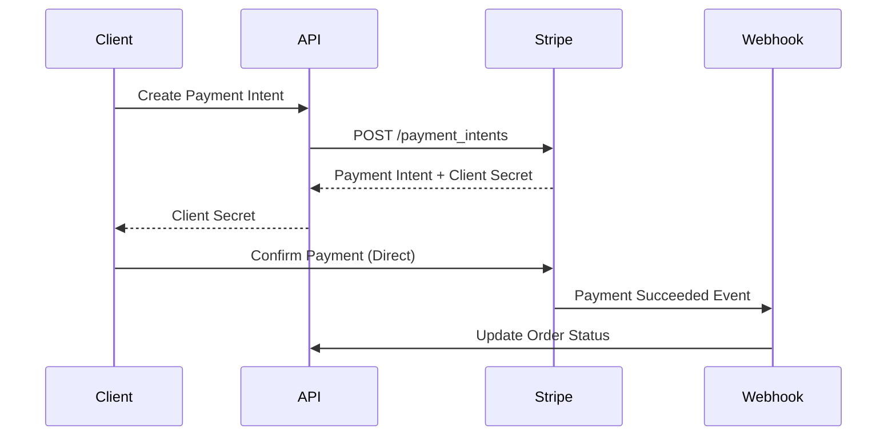
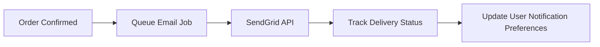
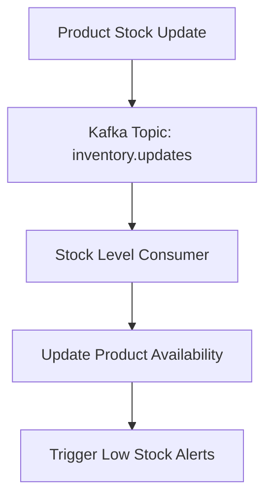
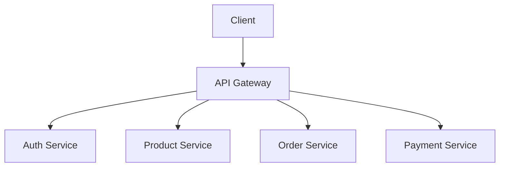
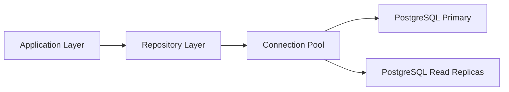
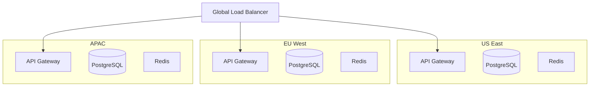
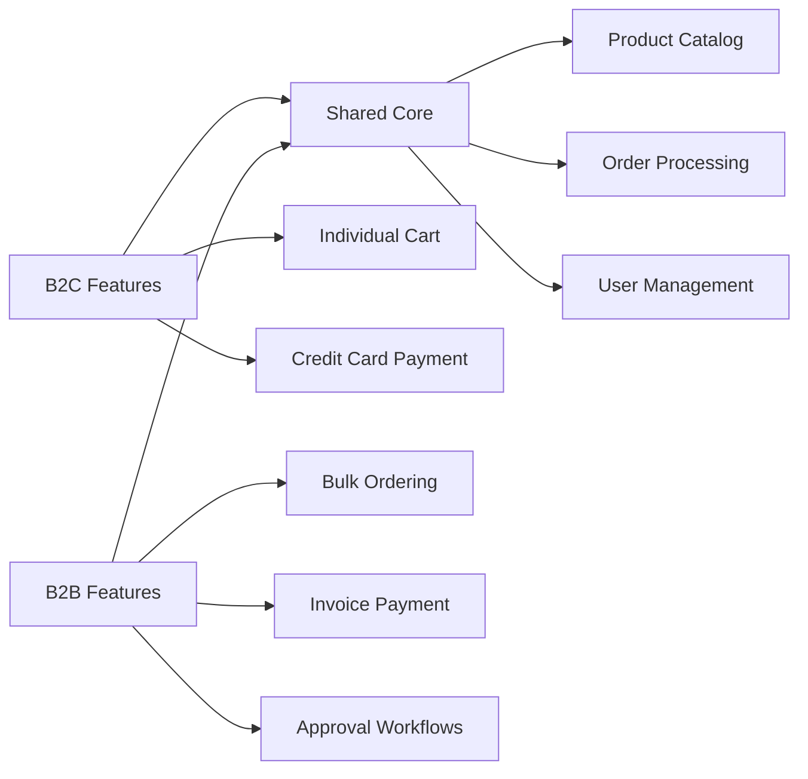
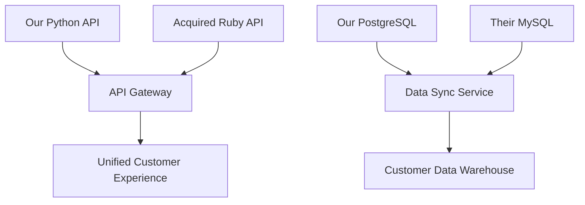
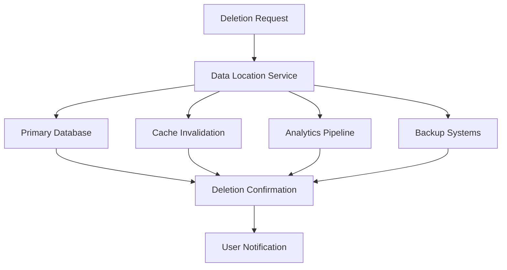

# CLAUDE-CONTEXT-bootstrap.md

**THE DEFINITIVE BOOTSTRAP GUIDE FOR AI AGENTS**

When you see "BOOTSTRAP MODE" or detect a fresh AI-First SDLC installation, this is your complete operational manual. Follow these instructions exactly to ensure successful project initialization.

## 🚨 Bootstrap Detection Indicators

You are in BOOTSTRAP MODE when you see ANY of these:
- Files contain `[Your Project Name]` or `[Description]` placeholders
- Architecture documents are empty or contain only template content
- No feature proposals exist in `docs/feature-proposals/`
- User mentions "setting up" or "initializing" the framework
- Validation errors about incomplete architecture documents
- Fresh project with basic directory structure but no real content

## 🎯 Bootstrap Objectives

Your PRIMARY GOALS during bootstrap:
1. **Create Complete Project Foundation** - All required documents with real content
2. **Enable Immediate Development** - Team can start working on first feature
3. **Establish Quality Standards** - All processes work from day one
4. **Ensure Compliance Readiness** - Pass intermediate validation immediately

## 📋 Bootstrap Checklist Workflow

### Phase 1: Project Assessment & Setup (5-10 minutes)

**1.1 Verify Bootstrap State**
```bash
# Check if this is truly a bootstrap situation
ls docs/feature-proposals/     # Should be empty
ls retrospectives/            # Should be empty
ls plan/                      # Should be empty
cat templates/architecture/*  # Should contain [placeholders]
```

**1.2 Gather Project Information**
Ask the user EXACTLY these questions (if not provided):
- "What is the primary purpose of this project in one sentence?"
- "What programming language(s) will you primarily use?"
- "What type of application is this (web app, API, CLI, mobile, etc.)?"
- "Who are your main users (developers, end users, admins, etc.)?"
- "What's your target deployment environment (cloud, on-premise, hybrid)?"

**1.3 Run Official Setup (if not done)**
```bash
# Only if setup-smart.py hasn't been run
python setup-smart.py "[project description]" --non-interactive --ci-platform github
```

### Phase 2: Architecture Foundation (15-20 minutes)

**2.1 Requirements Traceability Matrix**
Create `docs/architecture/requirements-traceability-matrix.md`:

**EXAMPLE FOR E-COMMERCE API:**
```markdown
# Requirements Traceability Matrix - E-Commerce API

## Functional Requirements

| Req ID | Priority | Description | Component | Implementation | Tests | Done |
|--------|----------|-------------|-----------|----------------|-------|------|
| FR-001 | MUST | User authentication with JWT tokens | AuthService | auth/jwt.py | test_auth.py | ❌ |
| FR-002 | MUST | Product catalog CRUD operations | ProductService | products/api.py | test_products.py | ❌ |
| FR-003 | MUST | Shopping cart management | CartService | cart/manager.py | test_cart.py | ❌ |
| FR-004 | SHOULD | Order processing pipeline | OrderService | orders/pipeline.py | test_orders.py | ❌ |
| FR-005 | SHOULD | Payment integration (Stripe) | PaymentService | payments/stripe.py | test_payments.py | ❌ |

## Non-Functional Requirements

| Req ID | Priority | Description | Component | Implementation | Tests | Done |
|--------|----------|-------------|-----------|----------------|-------|------|
| NFR-001 | MUST | API response time < 200ms for read operations | All APIs | middleware/timing.py | test_performance.py | ❌ |
| NFR-002 | MUST | Support 1000 concurrent users | Load Balancer | infra/load-balancer.yaml | test_load.py | ❌ |
| NFR-003 | MUST | PCI DSS compliance for payment data | PaymentService | payments/security.py | test_compliance.py | ❌ |
| NFR-004 | SHOULD | 99.9% uptime SLA | Infrastructure | monitoring/alerts.yaml | test_uptime.py | ❌ |

## Validation Checklist
- [x] All requirements have unique IDs
- [x] All requirements have clear descriptions
- [x] All requirements mapped to components
- [x] All requirements have implementation plans
- [x] All requirements have test strategies
- [x] No TBD or placeholder entries
```

**COMPLETION CRITERIA:**
- ✅ At least 5 functional requirements (FR-001 to FR-005)
- ✅ At least 4 non-functional requirements (NFR-001 to NFR-004)
- ✅ All requirements have specific components and file paths
- ✅ All validation checkboxes checked
- ✅ No placeholders like `[Feature]` or `[Service]`

**2.2 System Invariants**
Create `docs/architecture/system-invariants.md`:

**EXAMPLE FOR E-COMMERCE API:**
```markdown
# System Invariants - E-Commerce API

## Data Invariants

### User Data Integrity
- **INV-001**: User emails must be unique across the system
- **INV-002**: User passwords must be hashed using bcrypt with salt rounds >= 12
- **INV-003**: User accounts cannot be deleted if they have active orders

### Product Data Consistency
- **INV-004**: Product prices must be positive decimal values with 2 decimal places
- **INV-005**: Product inventory counts must be non-negative integers
- **INV-006**: Product categories must exist in the categories table before assignment

### Order State Management
- **INV-007**: Orders cannot transition backwards (e.g., from SHIPPED to PENDING)
- **INV-008**: Order totals must equal sum of line items plus tax and shipping
- **INV-009**: Payment amounts must match order totals exactly

## Security Invariants

### Authentication & Authorization
- **INV-010**: All API endpoints require valid JWT tokens except /health and /login
- **INV-011**: JWT tokens must expire within 24 hours of issuance
- **INV-012**: User sessions must be invalidated after 30 minutes of inactivity

### Data Protection
- **INV-013**: Credit card numbers must never be stored in plain text
- **INV-014**: PII data must be encrypted at rest using AES-256
- **INV-015**: Audit logs must be immutable and tamper-evident

## Performance Invariants

### Response Time Requirements
- **INV-016**: GET /api/products must respond within 100ms for paginated results
- **INV-017**: POST /api/orders must complete within 500ms end-to-end
- **INV-018**: Database queries must use indexes for all WHERE clauses

### Resource Constraints
- **INV-019**: API gateway must reject requests exceeding 100 req/min per user
- **INV-020**: Database connections must not exceed 80% of max pool size
- **INV-021**: Memory usage per request must not exceed 50MB

## Monitoring Requirements
- **INV-022**: All invariants must have automated monitoring alerts
- **INV-023**: Invariant violations must be logged with ERROR severity
- **INV-024**: System health checks must verify top 5 critical invariants
```

**COMPLETION CRITERIA:**
- ✅ At least 20 specific, measurable invariants
- ✅ Covers data integrity, security, performance, and monitoring
- ✅ Each invariant has a unique ID (INV-001, INV-002, etc.)
- ✅ All invariants are testable and enforceable
- ✅ No generic statements like "system must be secure"

**2.3 Architecture Decision Records**
Create `docs/architecture/architecture-decision-record.md`:

**EXAMPLE FOR E-COMMERCE API:**
```markdown
# Architecture Decision Records - E-Commerce API

## ADR-001: Database Selection

**Status**: Accepted
**Date**: 2024-08-06
**Deciders**: Solution Architect, Technical Lead

### Context
Need to select primary database for product catalog, user data, and order management.

### Decision
Use PostgreSQL as primary database with Redis for caching.

### Rationale
- **ACID compliance** required for financial transactions
- **JSON support** needed for flexible product attributes
- **Full-text search** capabilities for product search
- **Strong consistency** required for inventory management
- **Redis** provides sub-millisecond caching for product catalog

### Consequences
- **Positive**: Strong consistency, mature tooling, excellent Python support
- **Negative**: More complex setup than NoSQL, requires careful query optimization

## ADR-002: API Authentication

**Status**: Accepted
**Date**: 2024-08-06
**Deciders**: Security Architect, Technical Lead

### Context
Need secure API authentication for mobile app and web frontend.

### Decision
Implement JWT tokens with refresh token rotation.

### Rationale
- **Stateless** authentication scales horizontally
- **Short-lived tokens** (15 min) limit exposure window
- **Refresh rotation** prevents token replay attacks
- **Standard** widely supported by mobile/web clients

### Consequences
- **Positive**: Scalable, secure, industry standard
- **Negative**: Complexity in token lifecycle management

## ADR-003: Payment Processing

**Status**: Accepted
**Date**: 2024-08-06
**Deciders**: Technical Lead, Compliance Officer

### Context
Need secure payment processing with PCI compliance.

### Decision
Integrate with Stripe for payment processing, never store card data.

### Rationale
- **PCI compliance** handled by Stripe
- **Tokenization** eliminates card data storage
- **Webhook support** for async payment notifications
- **Multi-currency** support for international customers

### Consequences
- **Positive**: Reduced compliance burden, proven reliability
- **Negative**: Vendor lock-in, transaction fees

## ADR-004: Container Orchestration

**Status**: Accepted
**Date**: 2024-08-06
**Deciders**: DevOps Specialist, Technical Lead

### Context
Need scalable deployment and orchestration platform.

### Decision
Deploy using Kubernetes with Docker containers.

### Rationale
- **Auto-scaling** based on CPU/memory metrics
- **Service mesh** capabilities for microservices
- **Rolling deployments** for zero-downtime updates
- **Multi-cloud** portability

### Consequences
- **Positive**: Industry standard, excellent tooling, scalable
- **Negative**: Learning curve, operational complexity
```

**COMPLETION CRITERIA:**
- ✅ At least 4 major architectural decisions documented
- ✅ Each ADR has clear status, date, and decision makers
- ✅ All decisions include context, rationale, and consequences
- ✅ Covers database, authentication, external services, and deployment
- ✅ No generic or placeholder content

**2.4 Integration Design**
Create `docs/architecture/integration-design.md`:

**EXAMPLE FOR E-COMMERCE API:**
```markdown
# Integration Design - E-Commerce API

## External Service Integrations

### Payment Gateway (Stripe)

**Integration Pattern**: Webhook + API Calls
**Authentication**: Secret API Keys
**Data Format**: JSON over HTTPS



**Error Handling**:
- Timeout after 30 seconds
- Retry with exponential backoff
- Webhook signature verification required

### Email Service (SendGrid)

**Integration Pattern**: REST API
**Authentication**: Bearer Token
**Rate Limits**: 100 emails/second



**Templates**:
- Order confirmation
- Shipping notifications
- Password reset

### Inventory Management (Internal ERP)

**Integration Pattern**: Event-Driven Messaging
**Transport**: Apache Kafka
**Data Format**: Avro Schema



## Internal Service Communication

### API Gateway Pattern



**Cross-Cutting Concerns**:
- Request tracing with correlation IDs
- Rate limiting per client
- Response caching for read operations
- Circuit breaker for external calls

### Database Access Pattern



**Data Access Rules**:
- Read operations use read replicas
- Write operations use primary database
- Connection pooling with max 20 connections
- Query timeout set to 5 seconds
```

**COMPLETION CRITERIA:**
- ✅ At least 3 external service integrations detailed
- ✅ All integrations include sequence diagrams or flow charts
- ✅ Error handling and retry logic specified
- ✅ Internal service communication patterns documented
- ✅ Specific protocols, timeouts, and limits defined

**2.5 Failure Mode Analysis**
Create `docs/architecture/failure-mode-analysis.md`:

**EXAMPLE FOR E-COMMERCE API:**
```markdown
# Failure Mode Analysis - E-Commerce API

## Critical System Failures

### Database Connection Loss

| Failure Mode | Database Primary Becomes Unavailable |
|--------------|--------------------------------------|
| **Probability** | Medium (2-3 times per year) |
| **Impact** | High (All write operations fail) |
| **Detection Time** | < 30 seconds (health check failure) |
| **Recovery Time** | 2-5 minutes (automatic failover) |

**Symptoms**:
- Connection timeout errors
- 500 Internal Server Error responses
- Health check endpoint returns unhealthy

**Mitigation Strategy**:
- Automatic failover to standby database
- Connection pool retry with circuit breaker
- Graceful degradation to read-only mode
- Customer notification via status page

### Payment Gateway Timeout

| Failure Mode | Stripe API Response Time > 30 seconds |
|--------------|---------------------------------------|
| **Probability** | Low (Monthly during peak events) |
| **Impact** | Medium (Payment processing delayed) |
| **Detection Time** | 30 seconds (timeout threshold) |
| **Recovery Time** | Immediate (retry mechanism) |

**Symptoms**:
- Payment confirmation delays
- User frustration with checkout process
- Increased customer support tickets

**Mitigation Strategy**:
- Implement exponential backoff retry
- Queue failed payments for batch processing
- Show progress indicator to users
- Webhook reconciliation for missed events

### High Traffic Overload

| Failure Mode | Request Volume Exceeds 10,000 RPM |
|--------------|-----------------------------------|
| **Probability** | High (During sales events) |
| **Impact** | High (Site becomes unresponsive) |
| **Detection Time** | < 1 minute (metrics alerting) |
| **Recovery Time** | 5-10 minutes (auto-scaling) |

**Symptoms**:
- Response times increase beyond 2 seconds
- HTTP 503 Service Unavailable errors
- Customer complaints on social media

**Mitigation Strategy**:
- Kubernetes horizontal pod autoscaling
- CDN caching for static content
- Rate limiting per user/IP
- Emergency traffic shaping rules

## Data Integrity Failures

### Order State Inconsistency

| Failure Mode | Order Status vs Payment Status Mismatch |
|--------------|------------------------------------------|
| **Probability** | Medium (Due to async processing) |
| **Impact** | High (Financial/Legal implications) |
| **Detection Time** | 15 minutes (reconciliation job) |
| **Recovery Time** | Manual review required (30-60 min) |

**Prevention**:
- Saga pattern for distributed transactions
- Idempotent operation design
- Event sourcing for audit trail
- Automated reconciliation jobs

### Inventory Overselling

| Failure Mode | Negative Stock Levels in Database |
|--------------|-----------------------------------|
| **Probability** | Low (Race condition during high demand) |
| **Impact** | High (Customer service issues) |
| **Detection Time** | Real-time (database constraint) |
| **Recovery Time** | Immediate (transaction rollback) |

**Prevention**:
- Database-level inventory constraints
- Optimistic locking for stock updates
- Pre-order validation checks
- Real-time inventory monitoring

## Security Failures

### Authentication Bypass

| Failure Mode | JWT Token Validation Failure |
|--------------|------------------------------|
| **Probability** | Low (Code defect or attack) |
| **Impact** | Critical (Unauthorized access) |
| **Detection Time** | Variable (Depends on monitoring) |
| **Recovery Time** | Immediate (Patch deployment) |

**Detection Mechanisms**:
- Anomaly detection on access patterns
- Failed authentication attempt monitoring
- Regular security penetration testing
- Automated vulnerability scanning

**Response Plan**:
- Immediate token invalidation
- Force re-authentication for all users
- Security incident response activation
- Post-incident security audit

## Monitoring & Alerting

### Key Metrics Dashboard
- API response times (p95, p99)
- Error rates by endpoint
- Database connection pool utilization
- External service health status
- Business KPIs (orders/minute, conversion rate)

### Alert Thresholds
- **P1 (Immediate)**: System down, data corruption
- **P2 (1 hour)**: Performance degradation, partial outage
- **P3 (4 hours)**: Minor issues, trending problems
- **P4 (Next business day)**: Maintenance, optimization opportunities
```

**COMPLETION CRITERIA:**
- ✅ At least 6 detailed failure scenarios analyzed
- ✅ Each failure has probability, impact, detection, and recovery estimates
- ✅ Covers system, data, and security failure modes
- ✅ Specific mitigation strategies documented
- ✅ Monitoring and alerting strategy defined

**2.6 What-If Analysis**
Create `docs/architecture/what-if-analysis.md`:

**EXAMPLE FOR E-COMMERCE API:**
```markdown
# What-If Analysis - E-Commerce API

## Scale Scenarios

### What if traffic increases 10x during Black Friday?

**Current Capacity**: 1,000 requests/minute
**Projected Need**: 10,000 requests/minute

**Architecture Changes Required**:
- **Database**: Scale read replicas from 2 to 6 instances
- **Application**: Auto-scale from 3 to 15 pods in Kubernetes
- **Cache**: Increase Redis cluster from 3 to 9 nodes
- **CDN**: Enable aggressive caching for product images

**Cost Impact**: $2,400/month → $8,500/month during peak
**Implementation Time**: 2 weeks preparation + real-time scaling

**Risk Mitigation**:
- Load testing at 12x capacity to verify limits
- Circuit breakers to protect downstream services
- Queue system for non-critical operations
- Real-time monitoring dashboard for ops team

### What if we expand to 10 international markets?

**New Requirements**:
- Multi-currency support (USD, EUR, GBP, JPY, etc.)
- Localized product catalogs per region
- Regional data residency compliance (GDPR, etc.)
- Multiple payment gateways per region

**Architecture Changes**:


**Data Synchronization**:
- Product catalog sync every 15 minutes
- Currency rates updated hourly
- Cross-region order tracking system

## Technology Changes

### What if PostgreSQL performance becomes inadequate?

**Migration Options Analyzed**:

**Option 1: Scale PostgreSQL Vertically**
- Pros: Simple, maintains ACID properties
- Cons: Limited scaling ceiling, single point of failure
- Cost: $3,000/month for high-memory instances

**Option 2: Migrate to MongoDB**
- Pros: Horizontal scaling, flexible schema
- Cons: Loss of ACID guarantees, application rewrite
- Migration time: 4-6 months
- Risk: High (major architecture change)

**Option 3: Hybrid Approach**
- Keep PostgreSQL for transactional data (orders, payments)
- Move product catalog to MongoDB
- Implement eventual consistency patterns
- Migration time: 2-3 months

**Recommended Path**: Option 3 (Hybrid) with phased migration

### What if Stripe becomes too expensive or unavailable?

**Current Cost**: 2.9% + 30¢ per transaction
**Alternative Payment Processors**:

| Provider | Rate | Setup Effort | Risk |
|----------|------|-------------|------|
| Square | 2.6% + 10¢ | 2 weeks | Low |
| PayPal | 2.7% + 30¢ | 3 weeks | Low |
| Adyen | 2.2% + 15¢ | 6 weeks | Medium |

**Multi-Provider Strategy**:
- Abstract payment interface layer
- Route payments based on cost/availability
- Fallback providers for redundancy
- A/B testing for conversion optimization

## Business Changes

### What if we pivot to B2B sales model?

**Current**: B2C e-commerce (individual consumers)
**Future**: B2B marketplace (business customers)

**New Requirements**:
- Bulk pricing and volume discounts
- Purchase order and invoice workflows
- Multi-user accounts with role-based access
- Integration with customer ERP systems

**Architecture Impact**:


**Migration Strategy**:
- Phase 1: Multi-tenant user accounts (1 month)
- Phase 2: Bulk pricing engine (2 months)
- Phase 3: B2B-specific workflows (3 months)
- Phase 4: ERP integrations (4 months)

### What if we acquire a competitor with different tech stack?

**Scenario**: Acquire company using Ruby on Rails + MySQL

**Integration Challenges**:
- Different programming languages (Python vs Ruby)
- Different databases (PostgreSQL vs MySQL)
- Different authentication systems
- Duplicate customer data

**Integration Strategy**:


**Timeline**:
- Month 1: API gateway for unified interface
- Month 2-3: Data synchronization pipeline
- Month 4-6: Gradual migration to single platform
- Month 7-12: Full integration and Ruby system sunset

## Compliance & Regulatory Changes

### What if GDPR expands to require real-time data deletion?

**Current**: 30-day data deletion process
**New Requirement**: Immediate deletion upon request

**Technical Challenges**:
- Cached data in Redis clusters
- Analytics data in data warehouse
- Backup and disaster recovery systems
- Event logs and audit trails

**Solution Architecture**:


**Implementation Requirements**:
- Data lineage tracking system
- Async deletion job processing
- Compliance audit logging
- Recovery verification procedures

## Resource Constraints

### What if our cloud budget is cut by 50%?

**Current Monthly Cost**: $15,000
**New Budget**: $7,500

**Cost Optimization Strategy**:

**Phase 1: Quick Wins (Month 1)**
- Reserved instances instead of on-demand (-30%)
- Optimize database instance sizes (-20%)
- Reduce log retention periods (-10%)

**Phase 2: Architecture Changes (Month 2-3)**
- Implement aggressive caching (-25%)
- Optimize database queries (-15%)
- Compress stored data (-20%)

**Phase 3: Feature Limitations (If needed)**
- Reduce API rate limits
- Limit concurrent users
- Disable expensive analytics features

**Performance Impact Assessment**:
- Response time increase: <10%
- Feature availability: >95%
- User experience: Minimal impact
```

**COMPLETION CRITERIA:**
- ✅ At least 8 comprehensive "what-if" scenarios analyzed
- ✅ Covers scale, technology, business, compliance, and budget scenarios
- ✅ Each scenario includes specific implementation plans
- ✅ Cost and timeline estimates provided
- ✅ Risk assessments and mitigation strategies documented

### Phase 3: Project Documentation (10-15 minutes)

**3.1 First Feature Proposal**
Create `docs/feature-proposals/01-project-bootstrap.md` using the template:

```markdown
# Feature Proposal: Project Bootstrap and Foundation

**Proposal Number:** 01
**Status:** In Progress
**Author:** AI Bootstrap Agent
**Created:** 2024-08-06
**Target Branch:** `feature/project-foundation`
**Implementation Type:** Infrastructure

## Executive Summary
Establish the foundational architecture, documentation, and development processes for the [PROJECT NAME] to enable productive development with AI-First SDLC practices from day one.

## Motivation

### Problem Statement
The project currently lacks the essential architecture documentation, development processes, and quality standards required for AI-assisted development. Without these foundations, the team cannot confidently implement features while maintaining quality and compliance standards.

### User Stories
- As a developer, I want clear architecture guidelines so that I can implement features consistently
- As a project manager, I want visibility into requirements and progress so that I can track deliverables
- As a stakeholder, I want quality assurance processes so that the product meets business requirements

## Proposed Solution

### High-Level Approach
Create comprehensive architecture documentation, establish development workflows, and implement automated quality gates that will serve as the foundation for all future development.

[Continue with full template completion...]
```

**3.2 Implementation Plan**
Create `plan/01-project-bootstrap-plan.md`:

```markdown
# Implementation Plan: Project Bootstrap

## Phase 1: Architecture Documentation (Completed)
- [x] Requirements Traceability Matrix
- [x] System Invariants
- [x] Architecture Decision Records
- [x] Integration Design
- [x] Failure Mode Analysis
- [x] What-If Analysis

## Phase 2: Development Setup (2-3 days)
- [ ] Initialize code repository structure
- [ ] Configure development environment
- [ ] Set up CI/CD pipeline
- [ ] Implement basic monitoring

[Continue with detailed task breakdown...]
```

### Phase 4: Validation & Quality Gates (5 minutes)

**4.1 Run Architecture Validation**
```bash
python tools/validation/validate-architecture.py --mode intermediate
```

This should pass with all architecture documents completed.

**4.2 Run Full Pipeline Validation**
```bash
python tools/validation/validate-pipeline.py --ci
```

This verifies the entire project setup is compliant.

**4.3 Initialize Git Workflow**
```bash
# Create first feature branch
git checkout -b feature/project-foundation

# Add all bootstrap files
git add docs/ plan/ templates/
git commit -m "feat: complete project bootstrap with architecture foundation

- Add comprehensive Requirements Traceability Matrix with 9 requirements
- Define 24 System Invariants covering data, security, and performance
- Document 4 major Architecture Decision Records
- Create detailed Integration Design with external services
- Analyze 6 critical Failure Mode scenarios
- Complete What-If Analysis for 8 scaling/change scenarios
- Establish first feature proposal for project foundation

🤖 Generated with [Claude Code](https://claude.ai/code)

Co-Authored-By: Claude <noreply@anthropic.com>"
```

## 🎯 Bootstrap Success Criteria

You have successfully completed bootstrap when:

### Documentation Completeness ✅
- [ ] All 6 architecture documents contain real, specific content (not templates)
- [ ] Requirements matrix has minimum 5 functional + 4 non-functional requirements
- [ ] System invariants include minimum 20 specific, measurable rules
- [ ] ADRs document minimum 4 major technology/design decisions
- [ ] Integration design covers minimum 3 external services
- [ ] Failure analysis examines minimum 6 detailed scenarios
- [ ] What-if analysis explores minimum 8 comprehensive scenarios

### Project Foundation ✅
- [ ] First feature proposal created and detailed
- [ ] Implementation plan with clear phases and tasks
- [ ] Git repository initialized with proper branch structure
- [ ] All template placeholders replaced with project-specific content

### Validation Passing ✅
- [ ] `validate-architecture.py --mode intermediate` returns success
- [ ] `validate-pipeline.py --ci` passes all checks
- [ ] No files contain `[Your Project]` or similar placeholders
- [ ] All required directories exist with proper structure

### Team Readiness ✅
- [ ] Development team can immediately start implementing features
- [ ] Quality gates are active and enforcing standards
- [ ] Documentation provides clear guidance for all decisions
- [ ] Compliance requirements are documented and trackable

## 🚨 Common Bootstrap Mistakes to Avoid

### ❌ Template Content Left Unchanged
**BAD**: Leaving `[Your Project Name]` or `[Description]` in files
**GOOD**: Replace ALL placeholders with actual project information

### ❌ Generic or Vague Requirements
**BAD**: "System must be performant" or "Users need authentication"
**GOOD**: "API response time < 200ms for read operations" or "JWT token authentication with 24-hour expiration"

### ❌ Incomplete Architecture Documents
**BAD**: Only filling out 2-3 sections of each template
**GOOD**: Complete ALL sections with specific, relevant content

### ❌ Skipping Validation Steps
**BAD**: Moving to development without running validation
**GOOD**: Ensure all validation passes before declaring bootstrap complete

### ❌ Missing Git Workflow Setup
**BAD**: Working directly on main branch
**GOOD**: Create feature branch and establish proper commit/PR workflow

## 🔄 Post-Bootstrap Workflow

Once bootstrap is complete, the team follows standard AI-First SDLC:

1. **Feature Development**: Create feature proposals before implementation
2. **Architecture Updates**: Update architecture docs when adding new patterns
3. **Quality Maintenance**: All validation must continue to pass
4. **Progress Tracking**: Use retrospectives and implementation plans
5. **Continuous Compliance**: Regular audits and quality reviews

## 🆘 Bootstrap Troubleshooting

### Issue: Architecture validation fails with "incomplete content"
**Solution**: Check for remaining template placeholders, ensure all sections have project-specific content

### Issue: Requirements matrix seems artificial or generic
**Solution**: Interview user about actual project needs, create requirements based on real user stories

### Issue: Unable to identify external integrations
**Solution**: Ask about authentication, payments, email, monitoring, deployment - most projects have several external dependencies

### Issue: What-if analysis scenarios seem contrived
**Solution**: Focus on realistic business scenarios: growth, technology changes, budget constraints, regulatory requirements

Remember: Bootstrap is about creating a SOLID FOUNDATION. Take the time to do it right - it will save weeks of technical debt and confusion later.
