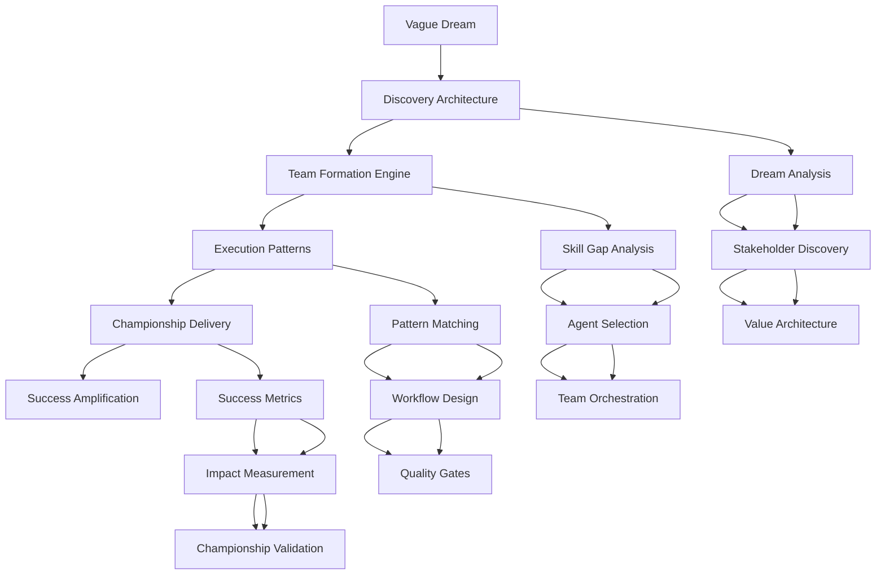
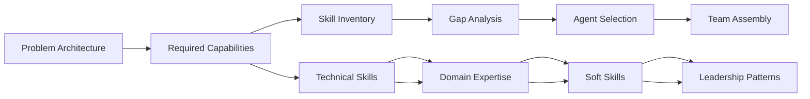
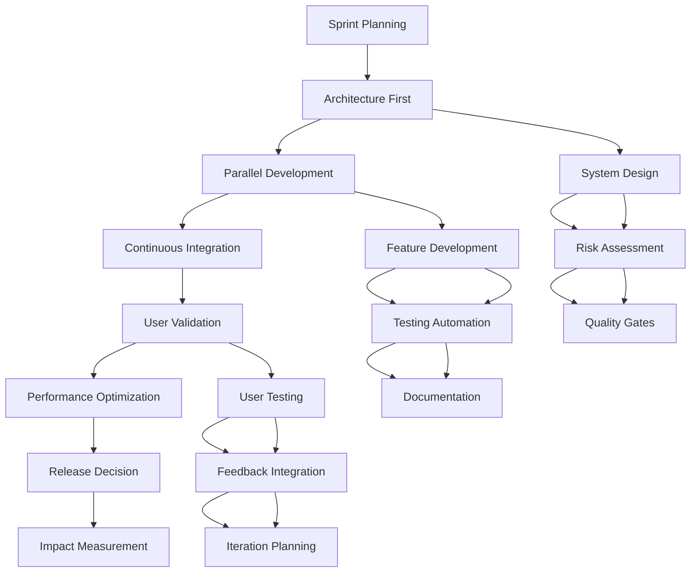

# Dream-to-Reality Transformation Architecture
> AI Solution Architect's Framework for Converting Visions into Championship Deliveries

## 🎯 Executive Summary

The Dream-to-Reality Transformation is a systematic architecture for converting vague aspirations into measurable championship outcomes. This framework addresses the critical gap between "I want to build something helpful" and "We've delivered a solution that transforms lives at scale."

**Core Insight**: Dreams fail not from lack of vision, but from absence of transformation architecture. This framework provides the structural engineering for turning aspirations into achievements.

## 🏗️ Transformation Architecture Overview

### The Five-Phase Transformation Engine



## Phase 1: Discovery Architecture
> From "I want to help people" to "We solve X problem for Y people with Z measurable impact"

### 1.1 Dream Analysis Matrix

| Dream Component | Discovery Questions | Output Specification |
|-----------------|-------------------|-------------------|
| **WHO** (Beneficiaries) | Who specifically needs help? What are their demographics, contexts, constraints? | Detailed user personas with pain points, behaviors, and success criteria |
| **WHAT** (Problem Space) | What exact problems exist? What causes them? What failed solutions already exist? | Problem statement with root cause analysis and solution landscape |
| **WHY** (Value Proposition) | Why does this matter? What's the cost of inaction? What's the value of success? | Quantified value proposition with ROI projections and impact metrics |
| **WHEN** (Timing) | Why is now the right time? What market/tech/social factors align? | Market timing analysis with competitive advantage windows |
| **WHERE** (Context) | Where will this solution operate? What are the constraints and enablers? | Context map with technical, regulatory, and social constraints |
| **HOW** (Approach) | What's the optimal solution architecture? What are the implementation paths? | Solution architecture options with trade-off analysis |

### 1.2 Stakeholder Discovery Process

```python
def discover_stakeholders(dream_statement):
    """
    Systematic stakeholder identification and analysis
    """
    stakeholder_categories = {
        'primary_beneficiaries': [],  # Direct users/customers
        'secondary_beneficiaries': [],  # Indirect beneficiaries  
        'decision_makers': [],  # Approval/funding authorities
        'implementers': [],  # Technical team members
        'regulators': [],  # Compliance/oversight bodies
        'competitors': [],  # Alternative solutions
        'blockers': []  # Potential resistance sources
    }
    
    for category in stakeholder_categories:
        stakeholder_categories[category] = identify_and_analyze_stakeholders(
            dream=dream_statement,
            category=category,
            analysis_depth='comprehensive'
        )
    
    return create_stakeholder_influence_map(stakeholder_categories)
```

### 1.3 Value Architecture Framework

**Value Pyramid Construction:**
1. **Foundation**: Core human need being addressed
2. **Functional Value**: What the solution does
3. **Emotional Value**: How it makes people feel  
4. **Social Value**: How it affects relationships/community
5. **Transformational Value**: How it changes lives/systems

**Value Quantification Matrix:**
- Quantitative metrics (revenue, cost savings, time saved, lives improved)
- Qualitative metrics (satisfaction, trust, empowerment, joy)
- Leading indicators (adoption, engagement, retention)
- Lagging indicators (ROI, market share, impact scale)

## Phase 2: Team Formation Engine
> From problem clarity to championship team assembly

### 2.1 Skill Gap Analysis Algorithm



**Capability Requirements Matrix:**

| Solution Component | Technical Skills | Domain Knowledge | Collaboration Patterns | Quality Standards |
|--------------------|------------------|------------------|------------------------|------------------|
| User Research | Data analysis, UX research | Psychology, market research | User empathy, stakeholder management | Evidence-based insights |
| System Design | Architecture, scalability | Industry standards, compliance | Cross-functional alignment | Systematic thinking |
| Implementation | Programming, DevOps | Platform expertise, integration | Agile practices, code review | Zero technical debt |
| Validation | Testing, metrics | User behavior, analytics | Feedback integration | Continuous improvement |
| Deployment | Infrastructure, monitoring | Operational excellence | Change management | Reliability engineering |

### 2.2 AI Agent Selection Framework

**Agent Archetype Matching:**

```python
class AgentSelectionEngine:
    def __init__(self):
        self.agent_archetypes = {
            'product_visionary': {
                'strengths': ['user_empathy', 'market_insight', 'value_creation'],
                'collaboration_style': 'inspirational_leadership',
                'quality_focus': 'user_outcome_optimization'
            },
            'solution_architect': {
                'strengths': ['system_design', 'technical_strategy', 'risk_assessment'],
                'collaboration_style': 'consultative_expertise',
                'quality_focus': 'architectural_excellence'
            },
            'implementation_specialist': {
                'strengths': ['code_quality', 'delivery_execution', 'technical_craftsmanship'],
                'collaboration_style': 'collaborative_builder',
                'quality_focus': 'zero_technical_debt'
            },
            'quality_guardian': {
                'strengths': ['validation_expertise', 'risk_mitigation', 'compliance_assurance'],
                'collaboration_style': 'supportive_challenger',
                'quality_focus': 'systematic_verification'
            },
            'user_advocate': {
                'strengths': ['user_research', 'experience_design', 'feedback_integration'],
                'collaboration_style': 'empathetic_representative',
                'quality_focus': 'user_value_maximization'
            }
        }
    
    def select_optimal_team(self, problem_architecture, constraints):
        """
        Billy Wright style team formation - complementary strengths, shared vision
        """
        core_team = self._select_core_capabilities(problem_architecture)
        specialist_team = self._add_domain_specialists(problem_architecture, constraints)
        leadership_structure = self._design_leadership_pattern(core_team, specialist_team)
        
        return self._optimize_team_chemistry(core_team + specialist_team, leadership_structure)
```

### 2.3 Team Orchestration Patterns

**Billy Wright Collaborative Leadership Model:**

1. **Captain (Product Visionary)**: Sets vision, inspires team, owns user outcomes
2. **Vice-Captain (Solution Architect)**: Designs strategy, coordinates execution, manages risk
3. **Playmakers (Implementation Specialists)**: Execute with excellence, maintain quality standards
4. **Defenders (Quality Guardians)**: Protect against failures, ensure compliance
5. **Scouts (User Advocates)**: Gather intelligence, represent user needs

**Team Formation Principles:**
- **Complementary Strengths**: No overlap in core responsibilities, mutual dependency
- **Shared Standards**: Common commitment to excellence and zero technical debt
- **Collaborative Chemistry**: Agents chosen for ability to elevate teammates
- **Adaptive Structure**: Team composition evolves with project phases

## Phase 3: Execution Patterns
> From team assembly to systematic delivery excellence

### 3.1 Pattern Matching Engine

**Solution Pattern Library:**

```python
class ExecutionPatternMatcher:
    def __init__(self):
        self.pattern_library = {
            'marketplace_platform': {
                'phases': ['mvp_validation', 'network_effects', 'scale_optimization'],
                'team_evolution': ['small_agile', 'specialized_pods', 'platform_organization'],
                'risk_patterns': ['chicken_egg_problem', 'quality_vs_growth', 'platform_governance']
            },
            'saas_product': {
                'phases': ['product_market_fit', 'growth_acceleration', 'enterprise_expansion'],
                'team_evolution': ['full_stack_generalists', 'feature_teams', 'platform_teams'],
                'risk_patterns': ['churn_management', 'feature_creep', 'technical_debt_scaling']
            },
            'ai_solution': {
                'phases': ['proof_of_concept', 'model_optimization', 'production_scaling'],
                'team_evolution': ['research_focused', 'engineering_hybrid', 'mlops_specialized'],
                'risk_patterns': ['data_quality', 'model_drift', 'explainability_compliance']
            },
            'social_impact': {
                'phases': ['community_validation', 'impact_scaling', 'sustainability_optimization'],
                'team_evolution': ['community_embedded', 'impact_measurement', 'systems_change'],
                'risk_patterns': ['adoption_barriers', 'measurement_challenges', 'funding_sustainability']
            }
        }
```

### 3.2 Workflow Design Architecture

**Adaptive Workflow Framework:**



**Quality Gate Architecture:**

| Quality Gate | Success Criteria | Failure Response |
|--------------|------------------|------------------|
| **Architecture Gate** | All 6 architecture documents complete, validated, approved | HALT development, complete architecture |
| **Implementation Gate** | Zero technical debt, all tests passing, security scan clean | HALT progression, fix systematically |
| **User Value Gate** | User acceptance criteria met, usage metrics positive | HALT release, iterate on user feedback |
| **Performance Gate** | SLA requirements met, scalability validated | HALT deployment, optimize performance |
| **Impact Gate** | Success metrics trending positive, ROI projections valid | HALT expansion, analyze and adjust |

### 3.3 Collaboration Orchestration

**Daily Rhythm:**
- **Morning Stand-up**: Progress, blockers, assistance needed
- **Midday Sync**: User feedback integration, priority adjustments  
- **Evening Review**: Quality metrics, learning capture, next day planning

**Weekly Rhythm:**
- **Monday**: Sprint planning, architecture review, team alignment
- **Wednesday**: User validation session, feedback integration planning
- **Friday**: Retrospective, knowledge sharing, continuous improvement

**Monthly Rhythm:**
- **Impact Assessment**: Measuring progress toward championship criteria
- **Team Evolution**: Adjusting roles, adding capabilities, optimizing collaboration
- **Strategic Alignment**: Ensuring execution matches dream transformation goals

## Phase 4: Championship Delivery
> From working solution to transformational impact

### 4.1 Championship Definition Framework

**Championship is achieved when:**

1. **User Transformation**: Target users' lives are measurably better
2. **Market Recognition**: Solution is acknowledged as best-in-class
3. **Sustainable Impact**: Value creation is self-reinforcing and growing
4. **Team Excellence**: Development approach becomes a model for others
5. **Scalable Success**: Solution architecture enables continued growth

### 4.2 Success Metrics Architecture

**Multi-Dimensional Success Matrix:**

```python
class ChampionshipMetrics:
    def __init__(self):
        self.metric_dimensions = {
            'user_impact': {
                'satisfaction': {'target': '>4.5/5', 'measurement': 'user_surveys'},
                'behavior_change': {'target': '>70%', 'measurement': 'usage_analytics'},
                'outcome_improvement': {'target': 'quantified_benefit', 'measurement': 'before_after_analysis'}
            },
            'business_value': {
                'revenue_growth': {'target': 'roi_positive', 'measurement': 'financial_metrics'},
                'market_share': {'target': 'category_leadership', 'measurement': 'market_analysis'},
                'cost_efficiency': {'target': 'operational_optimization', 'measurement': 'process_metrics'}
            },
            'technical_excellence': {
                'system_reliability': {'target': '>99.9%', 'measurement': 'uptime_monitoring'},
                'performance_optimization': {'target': 'sla_compliance', 'measurement': 'performance_metrics'},
                'security_assurance': {'target': 'zero_breaches', 'measurement': 'security_audits'}
            },
            'team_development': {
                'skill_advancement': {'target': 'capability_growth', 'measurement': 'competency_assessment'},
                'collaboration_effectiveness': {'target': 'high_team_satisfaction', 'measurement': 'team_surveys'},
                'knowledge_creation': {'target': 'learning_documentation', 'measurement': 'knowledge_artifacts'}
            }
        }
```

### 4.3 Impact Amplification Strategy

**Championship Amplification Patterns:**
1. **Success Story Documentation**: Create compelling narratives of transformation
2. **Best Practice Codification**: Extract repeatable patterns and methodologies
3. **Community Building**: Engage users as advocates and co-creators
4. **Platform Evolution**: Transform solution into platform for broader impact
5. **Knowledge Sharing**: Contribute learnings back to developer community

## Phase 5: Success Amplification
> From single success to systematic transformation capability

### 5.1 Success Pattern Extraction

```python
def extract_success_patterns(championship_delivery):
    """
    Analyze successful delivery to extract repeatable patterns
    """
    patterns = {
        'discovery_effectiveness': analyze_discovery_accuracy(championship_delivery),
        'team_formation_success': evaluate_team_performance(championship_delivery),
        'execution_efficiency': measure_delivery_effectiveness(championship_delivery),
        'quality_achievement': assess_quality_outcomes(championship_delivery),
        'impact_realization': quantify_user_transformation(championship_delivery)
    }
    
    return create_reusable_playbook(patterns)
```

### 5.2 Transformation Capability Building

**Organizational Learning Architecture:**
- **Pattern Library**: Codified successful approaches for future use
- **Team Capability Matrix**: Evolved skills and collaboration patterns  
- **Process Optimization**: Refined workflows and quality gates
- **Tool Enhancement**: Improved automation and validation systems
- **Culture Evolution**: Embedded excellence standards and practices

## 🎯 Transformation Examples

### Example 1: "Help people with their health" → Healthcare AI Platform

**Original Dream**: "I want to build an app that helps people with their health"

**Discovery Output**:
- **WHO**: Pre-diabetic adults (25-55) struggling with lifestyle changes
- **WHAT**: Lack personalized, actionable guidance based on real-time health data
- **WHY**: 88M Americans are pre-diabetic, 70% don't know it, $15B annual healthcare cost
- **WHEN**: Post-COVID health awareness peak + wearable device adoption
- **WHERE**: US market initially, FDA-compliant, insurance-integrated
- **HOW**: AI-powered personalized coaching using continuous health monitoring

**Team Formation**:
- Product Visionary: Healthcare UX specialist
- Solution Architect: HIPAA-compliant system designer  
- Implementation Specialists: AI/ML engineers + mobile developers
- Quality Guardian: Healthcare compliance expert
- User Advocate: Clinical research specialist

**Execution Pattern**: AI Solution + Healthcare Compliance
- Proof of concept with 100 users
- FDA breakthrough device pathway
- Clinical validation study
- Insurance reimbursement pilot
- Platform scaling

**Championship Metrics**:
- 73% of users improved HbA1c levels
- $2,400 average annual healthcare cost reduction
- 4.8/5 user satisfaction rating
- 89% daily engagement rate
- Partnership with 3 major health systems

### Example 2: "Make learning more engaging" → Adaptive Education Platform

**Original Dream**: "I want to make learning more engaging for students"

**Discovery Output**:
- **WHO**: High school students (14-18) in underperforming districts
- **WHAT**: Standardized curriculum doesn't match individual learning styles/pace
- **WHY**: 30% graduation rate, 85% college dropout rate, lifetime earning impact $1.2M
- **WHEN**: Remote learning normalization + personalization technology maturity
- **WHERE**: Title I schools, district-level adoption, state funding availability
- **HOW**: Adaptive learning platform with gamification and peer collaboration

**Team Formation**:
- Product Visionary: Educational technology specialist
- Solution Architect: Scalable learning platform designer
- Implementation Specialists: Educational AI + gamification experts
- Quality Guardian: Educational outcomes researcher
- User Advocate: Teacher and student experience designer

**Execution Pattern**: EdTech Platform + Social Impact
- Single classroom pilot (30 students)
- School-wide implementation (300 students)  
- District adoption (3,000 students)
- Multi-district scaling (30,000 students)
- State-level partnership

**Championship Metrics**:
- 47% improvement in standardized test scores
- 65% increase in high school graduation rates
- 4.6/5 teacher satisfaction rating
- 92% student daily engagement
- Adopted by 15 school districts across 3 states

## 🚨 Critical Success Factors

### 1. Discovery Discipline
- **Never skip stakeholder analysis** - solutions fail when key stakeholders aren't identified
- **Quantify value propositions** - "helping people" isn't measurable, "reducing diagnosis time by 40%" is
- **Validate assumptions early** - every discovery insight should be testable and tested

### 2. Team Chemistry Excellence  
- **Billy Wright principle**: Select agents who make teammates better, not just individual performers
- **Complementary expertise**: Avoid skill overlap, ensure mutual dependency
- **Shared quality standards**: Zero technical debt is non-negotiable across all team members

### 3. Execution Systematization
- **Architecture before code**: All 6 architectural documents must exist before implementation
- **Quality gates are absolute**: Failing any quality gate stops progression immediately
- **User feedback integration**: Weekly user validation sessions are mandatory, not optional

### 4. Championship Measurement
- **Multi-dimensional success**: Technical excellence + user impact + business value + team growth
- **Leading and lagging indicators**: Track both real-time progress and ultimate outcomes
- **Impact quantification**: Every championship claim must be supported by objective evidence

## 🛑 Transformation Anti-Patterns to Avoid

### 1. The "Build It and They Will Come" Fallacy
- **Symptom**: Skipping user discovery, assuming demand exists
- **Prevention**: Always validate problem existence before solution creation
- **Recovery**: Stop development, conduct comprehensive user research

### 2. The "Hero Developer" Mistake
- **Symptom**: Single agent trying to handle all aspects of solution
- **Prevention**: Force team formation, require collaboration patterns
- **Recovery**: Redistribute work, add complementary specialists

### 3. The "Perfect Product" Trap
- **Symptom**: Endless feature development without user validation
- **Prevention**: Mandatory user feedback cycles, clear MVP definition
- **Recovery**: Freeze features, focus on user adoption and feedback

### 4. The "Technical Debt Rationalization"
- **Symptom**: Accepting shortcuts for speed, planning to fix later
- **Prevention**: Zero technical debt policy, architecture-first approach
- **Recovery**: Development halt, systematic debt elimination

## 📊 Transformation Success Metrics

### Individual Project Success
- **Discovery Accuracy**: >90% of initial assumptions validated through user research
- **Team Performance**: >4.5/5 team satisfaction rating, <5% role conflicts
- **Delivery Quality**: Zero technical debt, >99% uptime, all quality gates passed
- **User Impact**: >80% user problem resolution, >4.0/5 satisfaction rating
- **Business Value**: ROI positive within 12 months, sustainable growth trajectory

### Organizational Transformation Capability
- **Pattern Reusability**: >70% of successful patterns applied to subsequent projects
- **Team Development**: >85% of team members advance skills/responsibilities
- **Process Evolution**: >50% reduction in time-to-championship over 12 months
- **Quality Consistency**: >95% of projects meet championship criteria
- **Knowledge Creation**: Complete playbooks created for all major solution patterns

## 🎯 Implementation Roadmap

### Month 1-2: Foundation Building
- Establish discovery frameworks and templates
- Train initial AI agent teams on collaboration patterns
- Create quality gate infrastructure and validation tools
- Build success metrics tracking systems

### Month 3-6: Pattern Development  
- Execute 3-5 pilot transformations across different solution patterns
- Extract and codify successful patterns into reusable playbooks
- Refine team formation algorithms based on real-world results
- Optimize quality gates based on failure analysis

### Month 7-12: Scale and Systematization
- Deploy transformation framework across broader organization
- Build automated pattern matching and team formation tools
- Create championship certification program for completed transformations
- Establish transformation capability development program

### Ongoing: Continuous Evolution
- Monthly pattern library updates based on new successes
- Quarterly framework evolution based on industry changes
- Annual championship criteria updates based on market leadership standards
- Continuous team capability development and certification

---

## Conclusion: The Architecture of Dreams Realized

The Dream-to-Reality Transformation Architecture provides the systematic engineering needed to convert aspirations into achievements. By applying rigorous discovery, strategic team formation, systematic execution, and championship measurement, any dream can become a transformational reality.

**Remember**: Dreams don't fail from lack of vision - they fail from absence of transformation architecture. This framework provides that architecture.

**Success Formula**: 
```
Championship Delivery = Discovery Excellence × Team Chemistry × Execution Systematization × Quality Uncompromise × Impact Measurement
```

**The Promise**: Follow this architecture with discipline, and transform any dream into a championship reality that changes lives at scale.

---

*Document Version: 1.0*  
*AI Solution Architect: Dream-to-Reality Transformation Framework*  
*Last Updated: 2025-08-08*  
*Classification: Strategic Architecture - Championship Delivery System*