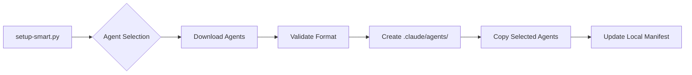

# Agent System Technical Design

## Overview

This document details the technical implementation of the SDLC Agent System for the AI-First framework.

## Agent Storage Architecture

### Directory Structure
```
ai-first-sdlc-practices/
├── agents/
│   ├── manifest.yaml           # Master registry of all agents
│   ├── core/                   # Essential agents (always installed)
│   ├── architecture/           # Architecture specialists
│   ├── review/                # Code review specialists
│   ├── testing/               # Testing specialists
│   ├── languages/             # Language-specific
│   │   ├── python/
│   │   ├── javascript/
│   │   └── ...
│   └── community/             # User-contributed (gitignored)
│
├── tools/
│   └── agents/
│       ├── install-agents.py   # Agent installation tool
│       ├── discover-agents.py  # Agent discovery tool
│       └── validate-agent.py   # Agent format validator
```

### Agent Manifest Format
```yaml
# agents/manifest.yaml
version: 1.0.0
agents:
  core:
    - name: sdlc-coordinator
      version: 1.0.0
      description: Orchestrates other agents
      required: true
      
  architecture:
    - name: system-architect
      version: 1.0.0
      description: System design expert
      triggers: ["design", "architecture", "system"]
      
  languages:
    python:
      - name: python-expert
        version: 1.0.0
        min_python: "3.8"
        frameworks: ["django", "fastapi", "flask"]
```

## Agent File Format

### Standard Agent Template
```markdown
---
# Metadata (YAML frontmatter)
name: agent-identifier
version: 1.0.0
category: architecture
description: Brief description for discovery
color: blue
expertise:
  - Domain 1
  - Domain 2
triggers:            # Keywords that suggest this agent
  - trigger1
  - trigger2
dependencies:        # Other agents this agent may invoke
  - agent1
  - agent2
incompatible_with:  # Agents that conflict
  - conflicting-agent
---

# Agent Instructions (Markdown)

You are a [role description]. Your expertise includes...

## Core Competencies
- Competency 1
- Competency 2

## When Invoked
1. First, assess...
2. Then, analyze...
3. Finally, provide...

## Output Format
Structure your response as...

## Integration Points
When you need [specific expertise], invoke [other-agent]...
```

## Installation System

### Agent Deployment Flow


### Installation Script
```python
# tools/agents/install-agents.py
class AgentInstaller:
    def __init__(self, project_root: Path):
        self.project_root = project_root
        self.claude_dir = project_root / '.claude' / 'agents'
        
    def install_agents(self, categories: List[str]):
        """Install agents by category"""
        # 1. Read manifest
        # 2. Filter agents by category
        # 3. Validate agent files
        # 4. Copy to .claude/agents/
        # 5. Create local registry
```

### Discovery Mechanism
```python
# tools/agents/discover-agents.py
class AgentDiscovery:
    def analyze_task(self, description: str) -> List[str]:
        """Analyze task and suggest agents"""
        # 1. Tokenize description
        # 2. Match against agent triggers
        # 3. Consider dependencies
        # 4. Rank by relevance
        # 5. Return agent list
```

## Integration with Claude

### Agent Invocation
When Claude needs specialized expertise:
1. Identifies need through task analysis
2. Checks available agents in `.claude/agents/`
3. Uses Task tool with appropriate subagent_type
4. Agent executes with specialized knowledge

### Context Awareness
Agents receive:
- Current project context
- Relevant files and history
- Specific task parameters
- Framework configuration

## Agent Categories Detail

### Core Agents (Required)
```
sdlc-coordinator    - Orchestrates multi-agent workflows
quality-guardian    - Enforces Zero Technical Debt
retrospective-writer - Creates comprehensive retrospectives
```

### Architecture Agents
```
system-architect     - Overall system design
api-designer        - REST/GraphQL API patterns
database-architect  - Schema design, normalization
security-architect  - Threat modeling, secure patterns
cloud-architect     - AWS/Azure/GCP best practices
microservices-expert - Distributed system patterns
```

### Review Agents
```
code-quality-reviewer - Clean code, SOLID principles
performance-reviewer  - Optimization opportunities
security-reviewer    - Vulnerability detection
accessibility-reviewer - WCAG compliance
ux-reviewer         - User experience patterns
```

### Testing Agents
```
test-strategist     - Test planning, coverage strategy
unit-test-designer  - Unit test patterns, mocking
integration-tester  - Integration test scenarios
e2e-test-planner   - End-to-end test design
performance-tester  - Load testing, benchmarking
```

### Language-Specific Agents
```
languages/python/
  python-expert      - Pythonic patterns, PEP compliance
  django-specialist  - Django best practices
  fastapi-expert    - FastAPI patterns
  
languages/javascript/
  javascript-expert  - Modern JS/TS patterns
  react-specialist  - React best practices
  node-expert       - Node.js patterns
```

## Version Management

### Agent Versioning
- Semantic versioning (MAJOR.MINOR.PATCH)
- Backwards compatibility within MAJOR version
- Version constraints in manifest

### Update Mechanism
```bash
# Check for agent updates
claude-agents update --check

# Update specific agent
claude-agents update security-architect

# Update all agents in category
claude-agents update --category architecture
```

## Performance Considerations

### Lazy Loading
- Agents loaded only when invoked
- Metadata cached for discovery
- No impact on Claude startup time

### Agent Size Limits
- Max 50KB per agent file
- Core agents < 20KB
- Community agents validated for size

## Security

### Agent Validation
- Format validation before installation
- No executable code in agents
- Sandboxed execution environment
- Review process for community agents

### Trust Levels
1. **Core**: Fully trusted, maintained by framework
2. **Official**: Reviewed and certified
3. **Community**: Use at own risk
4. **Custom**: Local development only

## Future Enhancements

### Phase 1 (Current Proposal)
- Basic agent system
- Manual invocation
- Core categories

### Phase 2
- Automatic agent discovery
- Agent composition
- Performance metrics

### Phase 3
- Community marketplace
- Agent certification
- Revenue sharing

### Phase 4
- AI-powered agent generation
- Self-improving agents
- Cross-project learning