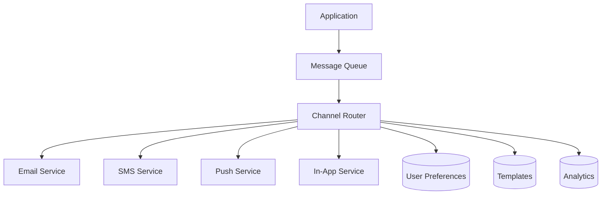

# Self-Review Process Examples

This document demonstrates the self-review process in action. Remember: self-review happens internally before presenting any artifact to the user.

## Example 1: Feature Proposal with Missing Section

### Initial Draft (Before Self-Review)

```markdown
# Feature Proposal: Add User Activity Dashboard

**Date:** 2025-07-17
**Author:** Claude
**Target Branch:** `feature/user-activity-dashboard`

## Summary
Add a dashboard showing user activity metrics including login frequency, feature usage, and engagement scores.

## Motivation
Users have requested visibility into their usage patterns to help them understand their productivity and identify areas for improvement.

## Proposed Solution
Create a new dashboard component that displays:
- Login frequency chart
- Most used features
- Time spent in different sections
- Weekly/monthly activity trends

## Success Criteria
- [ ] Dashboard loads within 2 seconds
- [ ] Data is accurate and real-time
- [ ] Users find it valuable (survey score >4/5)

## Estimated Effort
3-5 days including design, implementation, and testing.
```

### Self-Review Process

**Review Questions:**
1. ✅ Does this address the original request? Yes
2. ❌ Are all required sections complete? Missing "Risks and Mitigation"
3. ✅ Is it technically accurate? Yes
4. ❌ Any gaps? Missing data privacy considerations

**Issues Found:**
- Missing required "Risks and Mitigation" section
- No mention of data privacy or GDPR compliance
- No consideration of performance impact on database

### Final Version (After Self-Review)

```markdown
# Feature Proposal: Add User Activity Dashboard

**Date:** 2025-07-17
**Author:** Claude
**Target Branch:** `feature/user-activity-dashboard`

## Summary
Add a dashboard showing user activity metrics including login frequency, feature usage, and engagement scores.

## Motivation
Users have requested visibility into their usage patterns to help them understand their productivity and identify areas for improvement.

## Proposed Solution
Create a new dashboard component that displays:
- Login frequency chart
- Most used features
- Time spent in different sections
- Weekly/monthly activity trends

### Data Privacy Considerations
- Only show user their own data
- Implement data retention policies (90 days)
- Add option to export/delete personal data
- Ensure GDPR compliance

## Success Criteria
- [ ] Dashboard loads within 2 seconds
- [ ] Data is accurate and real-time
- [ ] Users find it valuable (survey score >4/5)
- [ ] Complies with data privacy regulations
- [ ] No performance degradation on main app

## Risks and Mitigation

| Risk | Impact | Mitigation |
|------|--------|------------|
| Database performance impact | High | Implement caching and aggregation |
| Data privacy violations | Critical | Legal review, clear consent |
| Complex queries slow dashboard | Medium | Pre-compute metrics hourly |
| Storage costs increase | Low | Implement data retention limits |

## Estimated Effort
3-5 days including design, implementation, and testing.
Additional 1 day for privacy review and compliance verification.
```

---

## Example 2: Code Implementation with Edge Cases

### Initial Implementation (Before Self-Review)

```python
class PasswordValidator:
    def validate_password(self, password: str) -> bool:
        """Validate password meets security requirements."""
        if len(password) < 12:
            return False

        has_upper = any(c.isupper() for c in password)
        has_lower = any(c.islower() for c in password)
        has_digit = any(c.isdigit() for c in password)

        return has_upper and has_lower and has_digit
```

### Self-Review Process

**Review Questions:**
1. ✅ Does this implement the requirements? Basic requirements yes
2. ❌ Are all edge cases handled? Missing several
3. ❌ Is error handling complete? No error handling
4. ❌ Any security considerations missed? Yes, several

**Issues Found:**
- No handling of None/empty input
- No special character requirement
- No check for common passwords
- No maximum length limit
- Missing password history check
- No detailed error messages

### Final Implementation (After Self-Review)

```python
from typing import List, Tuple
import re

class PasswordValidator:
    MIN_LENGTH = 12
    MAX_LENGTH = 128

    def __init__(self, common_passwords_file: str = None):
        self.common_passwords = set()
        if common_passwords_file:
            self._load_common_passwords(common_passwords_file)

    def validate_password(self, password: str, password_history: List[str] = None) -> Tuple[bool, str]:
        """
        Validate password meets security requirements.

        Args:
            password: The password to validate
            password_history: List of previous password hashes

        Returns:
            Tuple of (is_valid, error_message)
        """
        if not password:
            return False, "Password cannot be empty"

        if not isinstance(password, str):
            return False, "Password must be a string"

        # Length checks
        if len(password) < self.MIN_LENGTH:
            return False, f"Password must be at least {self.MIN_LENGTH} characters"

        if len(password) > self.MAX_LENGTH:
            return False, f"Password cannot exceed {self.MAX_LENGTH} characters"

        # Character requirements
        checks = [
            (r'[A-Z]', "Password must contain uppercase letter"),
            (r'[a-z]', "Password must contain lowercase letter"),
            (r'[0-9]', "Password must contain digit"),
            (r'[!@#$%^&*(),.?":{}|<>]', "Password must contain special character")
        ]

        for pattern, error_msg in checks:
            if not re.search(pattern, password):
                return False, error_msg

        # Common password check
        if password.lower() in self.common_passwords:
            return False, "Password is too common"

        # Sequential character check
        if self._has_sequential_chars(password):
            return False, "Password contains sequential characters"

        # Password history check
        if password_history and password in password_history:
            return False, "Password was recently used"

        return True, "Password is valid"

    def _has_sequential_chars(self, password: str, max_sequential: int = 3) -> bool:
        """Check for sequential characters like 'abc' or '123'."""
        for i in range(len(password) - max_sequential + 1):
            substr = password[i:i + max_sequential]
            if all(ord(substr[j]) == ord(substr[j-1]) + 1 for j in range(1, len(substr))):
                return True
        return False

    def _load_common_passwords(self, filename: str) -> None:
        """Load common passwords from file."""
        try:
            with open(filename, 'r') as f:
                self.common_passwords = {line.strip().lower() for line in f}
        except FileNotFoundError:
            # Log warning but don't fail
            pass
```

---

## Example 3: Design Document Review

### Initial Design (Before Self-Review)

```markdown
# User Notification System Design

## Overview
Design a system to send notifications to users.

## Implementation
```python
class NotificationService:
    def send_email(self, user_id, subject, body):
        user = db.get_user(user_id)
        email_client.send(user.email, subject, body)

    def send_sms(self, user_id, message):
        user = db.get_user(user_id)
        sms_client.send(user.phone, message)
```

## Database Schema
```sql
CREATE TABLE notifications (
    id SERIAL PRIMARY KEY,
    user_id INTEGER REFERENCES users(id),
    type VARCHAR(50),
    sent_at TIMESTAMP
);
```
```

### Self-Review Process

**Review Questions:**
1. ❌ Is this a design or implementation? Too much implementation!
2. ❌ Does it explain WHAT and WHY? No, jumps to HOW
3. ❌ Are requirements clear? Not specified
4. ❌ Any architectural decisions explained? No

**Issues Found:**
- Contains implementation code (should be design only)
- No functional requirements
- No user stories or use cases
- Missing architecture overview
- No integration considerations

### Final Design (After Self-Review)

```markdown
# User Notification System Design

## Overview
Design a flexible notification system that can deliver messages to users through multiple channels based on their preferences and notification urgency.

## Functional Requirements

### User Stories
- As a user, I want to receive important updates via my preferred channel
- As a user, I want to control which notifications I receive
- As an admin, I want to send bulk notifications efficiently
- As a developer, I want to easily add new notification types

### Notification Types
1. **System Alerts** - Critical system messages (maintenance, security)
2. **Account Updates** - Password changes, login alerts
3. **Activity Notifications** - Comments, likes, mentions
4. **Marketing** - Newsletters, promotions (opt-in only)

## Architecture Design

### High-Level Components


### Channel Selection Logic
1. Check user preferences for notification type
2. Verify channel availability (email verified, phone confirmed)
3. Apply business rules (time zones, quiet hours)
4. Fall back to next preferred channel if primary fails

## Business Rules

### Delivery Rules
- Respect user timezone (no notifications 10 PM - 8 AM local)
- Batch low-priority notifications (max 1 per hour)
- Immediate delivery for security alerts
- Marketing only to opted-in users

### Channel Constraints
- **Email**: No size limit, rich formatting
- **SMS**: 160 characters, critical only, cost per message
- **Push**: Brief message, deep linking supported
- **In-App**: Persistent until read

## Integration Requirements

### External Services
- Email: Support multiple providers (SendGrid, SES)
- SMS: Multiple gateways for reliability
- Push: FCM for Android, APNS for iOS

### Internal Systems
- User service for preferences
- Template service for message formatting
- Analytics for delivery tracking
- Audit log for compliance

## Non-Functional Requirements

### Performance
- Queue processing: <1 second per message
- Delivery SLA: 99.9% within 5 minutes
- Support 100k notifications/minute

### Reliability
- Message persistence until delivered
- Retry logic with exponential backoff
- Dead letter queue for failed messages

### Security
- Encrypt sensitive data in transit
- PII handling compliance
- Rate limiting per user

## Success Metrics
- Delivery rate >99%
- User engagement increase 20%
- Support ticket reduction 15%
- Developer onboarding <1 day
```

---

## Key Takeaways

1. **Always Complete Before Review**: Write the entire artifact first, then review
2. **Check Against Requirements**: Ensure every requirement is addressed
3. **Look for Gaps**: What questions might the user have?
4. **Verify Consistency**: No contradictions between sections
5. **Consider Edge Cases**: What could go wrong?
6. **Maintain Appropriate Detail**: Not too much, not too little
7. **Keep Reviews Internal**: User only sees the final, polished version

## Self-Review Checklist

Before presenting any artifact:
- [ ] All template sections completed
- [ ] Original requirements fully addressed
- [ ] Technical accuracy verified
- [ ] No contradictions or gaps
- [ ] Appropriate level of detail
- [ ] Follows established patterns
- [ ] Security/privacy considered
- [ ] Edge cases handled

<!-- SELF-REVIEW CHECKPOINT
Before finalizing, verify:
- All examples demonstrate the review process clearly
- Mix of different artifact types shown
- Issues and resolutions are realistic
- Final versions show clear improvements
-->