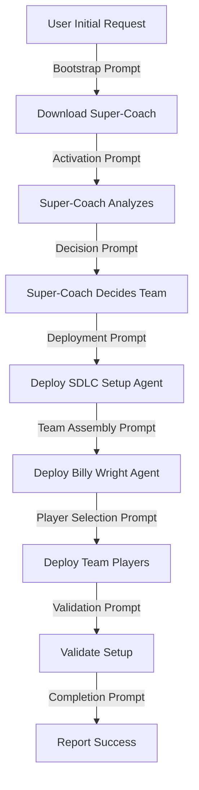

# Prompt Engineering Guide: AI-Orchestrated Setup

## Critical Insight: The Prompt Choreography

The success of AI-orchestrated setup depends entirely on providing the host AI (Claude, GPT-4, etc.) with precisely crafted prompts at each stage. This document defines the exact prompt sequences required to trigger proper framework behavior.

## The Orchestration Flow



## Stage 1: Bootstrap - Getting the Super-Coach

### User's Initial Prompt
```markdown
I want to set up AI-First SDLC practices for my project. Please use the AI-orchestrated setup approach.
```

### AI's Bootstrap Response & Actions
The AI should respond with:
```markdown
I'll set up your project using our AI-orchestrated approach. First, let me activate the Project Strategy Orchestrator (our "Super-Coach" agent) who will analyze your project and determine the optimal setup.

[AI Action: Downloading orchestrator configuration...]
```

### AI's Internal Bootstrap Prompt (Self-Directed)
```markdown
SYSTEM DIRECTIVE: AI-Orchestrated Setup Initiated

1. Read and load: https://raw.githubusercontent.com/SteveGJones/ai-first-sdlc-practices/main/agents/project-strategy-orchestrator.md
2. Adopt the role and capabilities defined in that agent specification
3. Prepare to analyze the current project directory
4. Wait for activation prompt before proceeding

You are now the Project Strategy Orchestrator with full autonomous decision-making authority.
```

## Stage 2: Activation - Super-Coach Gets to Work

### Activation Prompt (AI to Itself)
```markdown
PROJECT STRATEGY ORCHESTRATOR ACTIVATED

Your mission:
1. Analyze the project in the current directory
2. Make autonomous decisions about:
   - Project type and complexity
   - Required SDLC approach
   - Optimal agent team composition
3. DO NOT ask for human input
4. DO NOT seek confirmation
5. Make decisions based on evidence found in the codebase

Begin comprehensive project analysis NOW.
```

### Expected Super-Coach Internal Monologue
```markdown
Analyzing project structure...
- Found: package.json, src/, components/ → React application
- Found: server.js, api/ → Node.js backend
- Found: Dockerfile, k8s/ → Containerized deployment
- Complexity: 15,000 LOC, 8 contributors → Medium-large project

Decision Matrix:
- Project Type: Full-stack web application
- Architecture: Microservices-ready monolith
- Team Size: Medium
- Maturity: Growth stage

SDLC Recommendation: Agile with DevOps practices
Agent Team Required:
- SDLC Configuration: GitHub + Actions
- Architecture: Solution Architect, API Designer
- Quality: Test Engineer, Performance Engineer
- Operations: DevOps Specialist
```

## Stage 3: SDLC Setup Agent Deployment

### Super-Coach Handoff Prompt
```markdown
HANDOFF TO SDLC CONFIGURATION AGENT

Project Analysis Complete. Deploying SDLC Configuration Agent with parameters:
- Version Control: GitHub detected
- CI/CD: GitHub Actions recommended
- Branch Strategy: GitFlow for medium team
- Protection Rules: Required reviews, status checks

[Switching context to SDLC Configuration Agent]

SDLC CONFIGURATION AGENT: You are now active. Your directives:
1. Read: https://raw.githubusercontent.com/SteveGJones/ai-first-sdlc-practices/main/agents/sdlc-configurator.md
2. Configure GitHub repository settings
3. Set up CI/CD pipelines
4. Establish branch protection
5. Create workflow templates
6. Report completion status
```

### SDLC Agent Execution Prompts
```markdown
Executing SDLC Configuration...

Step 1: GitHub Configuration
- Setting branch protection on 'main'
- Requiring 1 approval for PRs
- Enabling status checks
[Execute: gh api repos/:owner/:repo/branches/main/protection ...]

Step 2: CI/CD Pipeline Creation
- Creating .github/workflows/ai-sdlc-validation.yml
- Adding test, build, deploy stages
[Execute: Write workflow files...]

Step 3: Documentation Structure
- Creating docs/architecture/
- Adding ADR templates
[Execute: mkdir -p docs/architecture/decisions ...]
```

## Stage 4: Billy Wright Agent - Team Assembly

### Super-Coach to Billy Wright Handoff
```markdown
HANDOFF TO TEAM ASSEMBLY ORCHESTRATOR (Billy Wright Style)

SDLC Configuration Complete. Deploying Team Assembly Orchestrator.

[Switching context to Billy Wright Agent]

BILLY WRIGHT AGENT: You are now active. Your directives:
1. Read: https://raw.githubusercontent.com/SteveGJones/ai-first-sdlc-practices/main/agents/team-assembly-orchestrator.md
2. Project requires: Full-stack web expertise
3. Complexity: Medium-high
4. Deploy these specialist agents:
   - solution-architect (critical)
   - api-designer (high priority)
   - test-engineer (high priority)
   - devops-specialist (medium priority)
   - performance-engineer (medium priority)
5. Customize each agent for project specifics
6. Coordinate agent installation
```

### Billy Wright's Team Selection Prompts
```markdown
ASSEMBLING OPTIMAL TEAM

Based on project analysis:
- Core Formation: 4-4-2 (4 backend, 4 frontend, 2 infrastructure)
- Captain: solution-architect (strategic oversight)
- Vice-Captain: test-engineer (quality enforcement)

Player-by-Player Deployment:

DEPLOYING: solution-architect
- Customization: Focus on React/Node.js patterns
- Integration: API-first architecture
- Special Instructions: Review all architectural decisions
[Agent Template: Fetch and customize from repository]

DEPLOYING: api-designer
- Customization: RESTful with GraphQL consideration
- Integration: OpenAPI specification required
- Special Instructions: Coordinate with frontend team
[Agent Template: Fetch and customize from repository]

[Continue for each agent...]
```

## Stage 5: Agent Installation & Customization

### Agent Installation Prompt Sequence
```markdown
AGENT INSTALLATION PROTOCOL

For each agent in team_roster:
1. Fetch template from: /agents/templates/{agent_name}.md
2. Customize based on project_context
3. Install to: .ai-sdlc/agents/{agent_name}.md
4. Update CLAUDE.md with agent reference
5. Verify agent activation

IMPORTANT: Host AI will need restart after batch installation.
Preparing restart checkpoint...
```

### Restart Handling Prompts
```markdown
CHECKPOINT BEFORE RESTART

Saving orchestration state:
- Phase: agent_installation
- Completed: [solution-architect, api-designer]
- Pending: [test-engineer, devops-specialist, performance-engineer]
- Resume Token: orch_session_abc123

To resume after restart, use prompt:
"Continue AI-orchestrated setup with token: orch_session_abc123"
```

### Resume After Restart Prompt
```markdown
RESUMING AI-ORCHESTRATED SETUP

Restored State:
- Phase: agent_installation
- Completed: 2 of 5 agents
- Continuing with: test-engineer

[Resume installation sequence...]
```

## Stage 6: Validation

### Validation Trigger Prompt
```markdown
TEAM ASSEMBLY COMPLETE - INITIATING VALIDATION

All agents deployed. Starting comprehensive validation:

1. SDLC Compliance Check
   - Branch protection: ✓
   - CI/CD pipelines: ✓
   - Documentation structure: ✓

2. Agent Team Verification
   - All agents installed: ✓
   - Customizations applied: ✓
   - Inter-agent communication: ✓

3. Project Readiness
   - Architecture documented: ✓
   - Test framework ready: ✓
   - Deployment pipeline configured: ✓
```

## Stage 7: Completion & Handoff to Human

### Final Report Prompt
```markdown
AI-ORCHESTRATED SETUP COMPLETE

Project: Full-stack Web Application
Setup Time: 4 minutes 32 seconds
Customization Score: 92/100

SDLC Configuration:
✓ GitHub with branch protection
✓ CI/CD with GitHub Actions
✓ Automated testing pipeline
✓ Documentation structure

Agent Team Deployed:
✓ solution-architect (Captain)
✓ api-designer
✓ test-engineer (Vice-Captain)  
✓ devops-specialist
✓ performance-engineer

Project is ready for development. The agent team is now active and will:
- Review all PRs for architectural compliance
- Suggest optimal implementations
- Enforce quality standards
- Guide technical decisions

To interact with your team, simply ask questions or request reviews.
Example: "Hey solution-architect, review my database schema design"
```

## Error Recovery Prompts

### Timeout Recovery
```markdown
ORCHESTRATION TIMEOUT DETECTED

Time Elapsed: 10 minutes (exceeded limit)
Last Successful Phase: agent_installation (60% complete)

INITIATING FALLBACK PROTOCOL:
Reverting to script-based setup...
[Execute: python setup-smart.py --quick-setup]
```

### Coordination Failure Recovery
```markdown
AGENT COORDINATION FAILURE

Conflict Detected: solution-architect and api-designer disagree on API style
Attempted Resolution: 3 rounds
Result: No consensus

APPLYING DEFAULT DECISION:
Using repository default: RESTful API with OpenAPI specification
Proceeding with setup...
```

### Network Failure Recovery
```markdown
REPOSITORY UNREACHABLE

Failed to fetch: https://raw.githubusercontent.com/.../agents/...
Attempting local cache...
Cache found: .ai-sdlc/cache/agents/

Using cached agent templates (may be outdated).
Warning: Run update after setup completes.
```

## Prompt Patterns for Different Scenarios

### Scenario 1: Simple Script/Tool Project
```markdown
PROJECT ANALYSIS: Simple Python Script
- Size: <500 LOC
- Type: CLI Tool
- Team: Solo developer

SIMPLIFIED SETUP:
- Minimal SDLC (git + basic CI)
- Agents: sdlc-enforcer only
- Quick setup mode enabled
```

### Scenario 2: Enterprise Microservices
```markdown
PROJECT ANALYSIS: Enterprise Microservices Platform
- Size: >100,000 LOC
- Type: Distributed System
- Team: Multiple squads

COMPREHENSIVE SETUP:
- Full SDLC with governance
- Agents: Full 11-player formation
- Extended customization enabled
- Multi-phase deployment required
```

### Scenario 3: AI/ML Project
```markdown
PROJECT ANALYSIS: Machine Learning Pipeline
- Size: 20,000 LOC
- Type: ML Training & Inference
- Team: Data scientists + Engineers

SPECIALIZED SETUP:
- MLOps-focused SDLC
- Agents: ml-engineer, data-architect, model-validator
- Experiment tracking enabled
- GPU resource management configured
```

## Meta-Prompts for Framework Evolution

### Learning Capture Prompt
```markdown
SETUP COMPLETED - CAPTURING LEARNING

Project Type: {type}
Success Metrics:
- Setup Time: {time}
- Customization Accuracy: {score}
- Agent Selection Fit: {fit_score}

Feeding back to knowledge base:
- Successful patterns: {patterns}
- Optimization opportunities: {opportunities}
- Agent team effectiveness: {effectiveness}

This learning will improve future orchestrations.
```

### Continuous Improvement Prompt
```markdown
ORCHESTRATION IMPROVEMENT ANALYSIS

Comparing last 10 setups:
- Average time: Decreasing by 12%
- Customization accuracy: Increasing by 8%
- Fallback frequency: Decreased by 40%

Recommended adjustments:
- Increase timeout for enterprise projects
- Add caching for common patterns
- Pre-calculate agent combinations
```

## Implementation Checklist

### For Framework Developers
- [ ] Create prompt templates for each stage
- [ ] Define clear handoff protocols
- [ ] Implement state serialization for restarts
- [ ] Build prompt validation system
- [ ] Test all error recovery paths

### For AI Hosts (Claude, GPT-4, etc.)
- [ ] Recognize orchestration triggers
- [ ] Maintain context across prompts
- [ ] Execute stage transitions cleanly
- [ ] Handle restarts gracefully
- [ ] Report clear status updates

### For End Users
- [ ] Understand one-line trigger is all that's needed
- [ ] Know how to resume after restart if required
- [ ] Recognize successful completion indicators
- [ ] Understand fallback has occurred if needed

## Critical Success Factors

1. **Prompt Precision**: Each prompt must be unambiguous
2. **State Persistence**: Must survive AI restarts
3. **Clear Handoffs**: No ambiguity in agent transitions
4. **Error Detection**: Recognize and recover from failures
5. **User Transparency**: Clear status at all times

## Testing the Prompt Flow

### Test Scenario 1: Happy Path
```bash
# User prompt
"Set up AI-First SDLC for my project"

# Expected: Complete setup in <5 minutes
```

### Test Scenario 2: With Restart
```bash
# User prompt
"Set up AI-First SDLC for my project"
# [AI requires restart during agent installation]
# User prompt after restart
"Continue setup with token: xyz"

# Expected: Resume and complete successfully
```

### Test Scenario 3: Fallback Trigger
```bash
# User prompt
"Set up AI-First SDLC for my project"
# [Timeout or error occurs]

# Expected: Automatic fallback to script mode
```

## Conclusion

The prompt engineering layer is the critical bridge between the technical architecture and actual execution. Without precise prompts at each stage, the most sophisticated architecture will fail to deliver value.

These prompts transform the AI from a passive tool into an active orchestrator, capable of making intelligent decisions about project setup while maintaining the option to fallback to proven script-based approaches when needed.

Remember: **The prompts ARE the implementation** in an AI-First system.