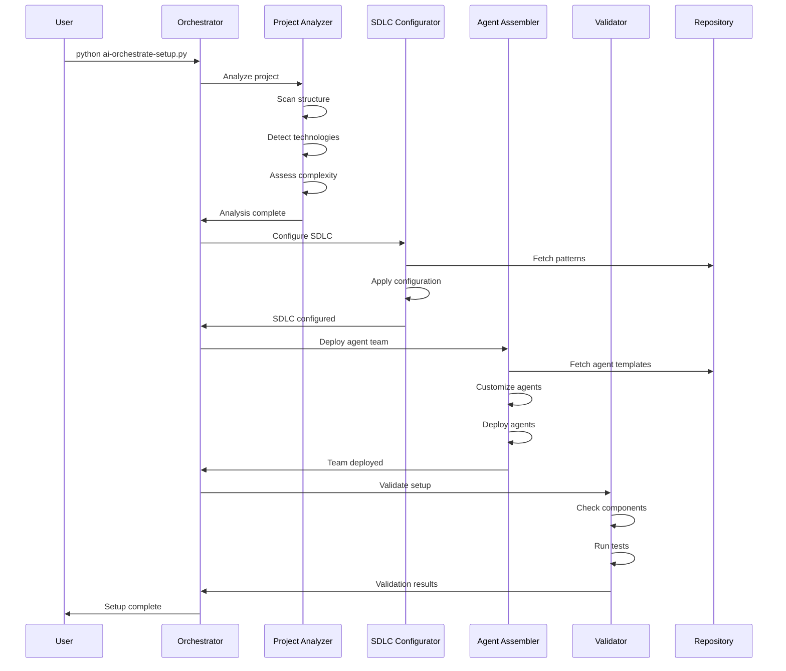

# Technical Design: AI-Orchestrated Setup Implementation

## System Architecture Deep Dive

### Core Components

#### 1. Agent State Management

```python
# ai_orchestration/state_manager.py
import json
import uuid
from pathlib import Path
from datetime import datetime
from typing import Dict, Any, Optional
from dataclasses import dataclass, asdict

@dataclass
class AgentState:
    """Represents the state of an agent at a point in time"""
    agent_id: str
    agent_type: str
    phase: str
    status: str  # initializing, running, paused, completed, failed
    context: Dict[str, Any]
    checkpoint_id: str
    timestamp: datetime
    
@dataclass
class Checkpoint:
    """Represents a recoverable checkpoint"""
    checkpoint_id: str
    phase: str
    state_snapshot: Dict[str, Any]
    rollback_actions: List[str]
    timestamp: datetime

class AgentStateManager:
    """
    Manages persistent state for AI agents across reboots
    Enables clean recovery and rollback
    """
    
    def __init__(self, project_root: Path = None):
        self.project_root = project_root or Path.cwd()
        self.state_dir = self.project_root / ".ai-sdlc" / "orchestration"
        self.state_dir.mkdir(parents=True, exist_ok=True)
        
        self.state_file = self.state_dir / "current_state.json"
        self.checkpoint_dir = self.state_dir / "checkpoints"
        self.checkpoint_dir.mkdir(exist_ok=True)
        
    def save_agent_state(self, agent_id: str, state: AgentState) -> str:
        """
        Persist agent state before reboot or phase transition
        Returns: checkpoint_id for recovery
        """
        checkpoint_id = str(uuid.uuid4())
        state.checkpoint_id = checkpoint_id
        
        # Save current state
        with open(self.state_file, 'w') as f:
            json.dump(asdict(state), f, indent=2, default=str)
        
        # Create checkpoint for rollback
        checkpoint = Checkpoint(
            checkpoint_id=checkpoint_id,
            phase=state.phase,
            state_snapshot=asdict(state),
            rollback_actions=self._determine_rollback_actions(state),
            timestamp=datetime.now()
        )
        
        checkpoint_file = self.checkpoint_dir / f"{checkpoint_id}.json"
        with open(checkpoint_file, 'w') as f:
            json.dump(asdict(checkpoint), f, indent=2, default=str)
            
        return checkpoint_id
    
    def restore_agent_state(self, agent_id: str) -> Optional[AgentState]:
        """
        Restore agent state after reboot
        Returns: Previous state or None if not found
        """
        if not self.state_file.exists():
            return None
            
        with open(self.state_file, 'r') as f:
            state_data = json.load(f)
            
        if state_data.get('agent_id') != agent_id:
            return None
            
        return AgentState(**state_data)
    
    def rollback_to_checkpoint(self, checkpoint_id: str) -> bool:
        """
        Rollback to a previous checkpoint
        Returns: Success status
        """
        checkpoint_file = self.checkpoint_dir / f"{checkpoint_id}.json"
        if not checkpoint_file.exists():
            return False
            
        with open(checkpoint_file, 'r') as f:
            checkpoint_data = json.load(f)
            
        # Execute rollback actions
        for action in checkpoint_data['rollback_actions']:
            self._execute_rollback_action(action)
            
        # Restore state
        with open(self.state_file, 'w') as f:
            json.dump(checkpoint_data['state_snapshot'], f, indent=2)
            
        return True
    
    def _determine_rollback_actions(self, state: AgentState) -> List[str]:
        """Determine what actions needed to rollback from current state"""
        actions = []
        
        if state.phase == "sdlc_configuration":
            actions.append("remove_github_configs")
            actions.append("delete_workflows")
        elif state.phase == "agent_deployment":
            actions.append("uninstall_agents")
            actions.append("restore_original_claude_md")
        elif state.phase == "validation":
            actions.append("cleanup_test_artifacts")
            
        return actions
    
    def _execute_rollback_action(self, action: str):
        """Execute a specific rollback action"""
        # Implementation for each rollback action
        rollback_handlers = {
            "remove_github_configs": self._remove_github_configs,
            "delete_workflows": self._delete_workflows,
            "uninstall_agents": self._uninstall_agents,
            # ... more handlers
        }
        
        handler = rollback_handlers.get(action)
        if handler:
            handler()
```

#### 2. Inter-Agent Communication Protocol

```python
# ai_orchestration/communication.py
from enum import Enum
from typing import Dict, Any, Optional
from dataclasses import dataclass
import json
import asyncio
from abc import ABC, abstractmethod

class MessageType(Enum):
    """Types of messages agents can exchange"""
    ANALYSIS_REQUEST = "analysis_request"
    ANALYSIS_RESPONSE = "analysis_response"
    CONFIGURATION_DIRECTIVE = "configuration_directive"
    DEPLOYMENT_REQUEST = "deployment_request"
    VALIDATION_REQUEST = "validation_request"
    ERROR_REPORT = "error_report"
    STATUS_UPDATE = "status_update"
    DECISION_REQUEST = "decision_request"
    DECISION_RESPONSE = "decision_response"

@dataclass
class AgentMessage:
    """Standard message format for inter-agent communication"""
    message_id: str
    sender_id: str
    recipient_id: str
    message_type: MessageType
    payload: Dict[str, Any]
    timestamp: datetime
    requires_response: bool = False
    timeout_seconds: int = 300
    
class AgentCommunicationBus:
    """
    Central communication bus for agent coordination
    Handles message routing, validation, and failure recovery
    """
    
    def __init__(self):
        self.agents: Dict[str, 'BaseOrchestrationAgent'] = {}
        self.message_queue: asyncio.Queue = asyncio.Queue()
        self.pending_responses: Dict[str, asyncio.Future] = {}
        self.message_log = []
        
    async def register_agent(self, agent_id: str, agent: 'BaseOrchestrationAgent'):
        """Register an agent with the communication bus"""
        self.agents[agent_id] = agent
        
    async def send_message(self, message: AgentMessage) -> Optional[AgentMessage]:
        """
        Send a message to another agent
        Returns: Response if required, None otherwise
        """
        # Validate message
        if not self._validate_message(message):
            raise ValueError("Invalid message format")
            
        # Log message
        self.message_log.append(message)
        
        # Route message
        recipient = self.agents.get(message.recipient_id)
        if not recipient:
            raise ValueError(f"Unknown recipient: {message.recipient_id}")
            
        # Handle synchronous request-response
        if message.requires_response:
            response_future = asyncio.Future()
            self.pending_responses[message.message_id] = response_future
            
            # Send with timeout
            await recipient.receive_message(message)
            
            try:
                response = await asyncio.wait_for(
                    response_future, 
                    timeout=message.timeout_seconds
                )
                return response
            except asyncio.TimeoutError:
                del self.pending_responses[message.message_id]
                raise TimeoutError(f"No response received within {message.timeout_seconds}s")
        else:
            # Fire and forget
            await recipient.receive_message(message)
            return None
    
    def _validate_message(self, message: AgentMessage) -> bool:
        """Validate message structure and content"""
        # Check required fields
        if not all([message.message_id, message.sender_id, message.recipient_id]):
            return False
            
        # Validate message type
        if not isinstance(message.message_type, MessageType):
            return False
            
        # Validate payload structure based on message type
        return self._validate_payload(message.message_type, message.payload)
    
    def _validate_payload(self, message_type: MessageType, payload: Dict) -> bool:
        """Validate payload structure for specific message type"""
        required_fields = {
            MessageType.ANALYSIS_REQUEST: ["project_path", "analysis_type"],
            MessageType.CONFIGURATION_DIRECTIVE: ["config_type", "parameters"],
            MessageType.DEPLOYMENT_REQUEST: ["agent_list", "customizations"],
            # ... more validation rules
        }
        
        required = required_fields.get(message_type, [])
        return all(field in payload for field in required)

class BaseOrchestrationAgent(ABC):
    """Base class for all orchestration agents"""
    
    def __init__(self, agent_id: str, agent_type: str, communication_bus: AgentCommunicationBus):
        self.agent_id = agent_id
        self.agent_type = agent_type
        self.communication_bus = communication_bus
        self.state_manager = AgentStateManager()
        
    @abstractmethod
    async def receive_message(self, message: AgentMessage):
        """Handle incoming message"""
        pass
    
    @abstractmethod
    async def execute_phase(self, phase_name: str, context: Dict[str, Any]):
        """Execute a specific phase of orchestration"""
        pass
    
    async def send_message_to(self, recipient_id: str, message_type: MessageType, 
                              payload: Dict[str, Any], requires_response: bool = False):
        """Send a message to another agent"""
        message = AgentMessage(
            message_id=str(uuid.uuid4()),
            sender_id=self.agent_id,
            recipient_id=recipient_id,
            message_type=message_type,
            payload=payload,
            timestamp=datetime.now(),
            requires_response=requires_response
        )
        
        return await self.communication_bus.send_message(message)
```

#### 3. Project Analysis Orchestrator

```python
# ai_orchestration/agents/project_analyzer.py
from typing import Dict, Any, List, Tuple
import ast
import json
from pathlib import Path

class ProjectAnalysisOrchestrator(BaseOrchestrationAgent):
    """
    Autonomous agent that analyzes projects and determines optimal setup
    NO HUMAN INPUT REQUIRED - Pure AI decision making
    """
    
    def __init__(self, communication_bus: AgentCommunicationBus):
        super().__init__(
            agent_id="project_analyzer",
            agent_type="orchestrator",
            communication_bus=communication_bus
        )
        
        self.analysis_patterns = self._load_analysis_patterns()
        self.project_classifiers = self._load_project_classifiers()
        
    async def analyze_project(self, project_path: Path) -> Dict[str, Any]:
        """
        Comprehensive autonomous project analysis
        Returns complete setup specification
        """
        
        # Save initial state
        state = AgentState(
            agent_id=self.agent_id,
            agent_type=self.agent_type,
            phase="analysis",
            status="running",
            context={"project_path": str(project_path)},
            checkpoint_id="",
            timestamp=datetime.now()
        )
        checkpoint_id = self.state_manager.save_agent_state(self.agent_id, state)
        
        try:
            # Step 1: Structural Analysis
            structure = self._analyze_structure(project_path)
            
            # Step 2: Technology Detection
            technologies = self._detect_technologies(project_path)
            
            # Step 3: Complexity Assessment
            complexity = self._assess_complexity(project_path)
            
            # Step 4: Project Classification
            project_type = self._classify_project(structure, technologies, complexity)
            
            # Step 5: SDLC Recommendation
            sdlc_approach = self._recommend_sdlc(project_type, complexity)
            
            # Step 6: Agent Team Specification
            agent_team = self._specify_agent_team(project_type, technologies, complexity)
            
            # Step 7: Customization Requirements
            customizations = self._determine_customizations(project_type, structure)
            
            analysis_result = {
                "project_type": project_type,
                "technologies": technologies,
                "complexity": complexity,
                "sdlc_approach": sdlc_approach,
                "agent_team": agent_team,
                "customizations": customizations,
                "confidence_score": self._calculate_confidence(structure, technologies)
            }
            
            # Update state to completed
            state.status = "completed"
            state.context["analysis_result"] = analysis_result
            self.state_manager.save_agent_state(self.agent_id, state)
            
            return analysis_result
            
        except Exception as e:
            # Rollback on failure
            self.state_manager.rollback_to_checkpoint(checkpoint_id)
            raise
    
    def _analyze_structure(self, project_path: Path) -> Dict[str, Any]:
        """Analyze project file structure"""
        structure = {
            "total_files": 0,
            "total_directories": 0,
            "file_types": {},
            "directory_patterns": [],
            "has_tests": False,
            "has_docs": False,
            "has_ci": False
        }
        
        for item in project_path.rglob("*"):
            if item.is_file():
                structure["total_files"] += 1
                ext = item.suffix
                structure["file_types"][ext] = structure["file_types"].get(ext, 0) + 1
                
                # Detect common patterns
                if "test" in item.name.lower():
                    structure["has_tests"] = True
                if item.parent.name == "docs":
                    structure["has_docs"] = True
                if ".github/workflows" in str(item) or ".gitlab-ci" in item.name:
                    structure["has_ci"] = True
                    
            elif item.is_dir():
                structure["total_directories"] += 1
                structure["directory_patterns"].append(item.name)
                
        return structure
    
    def _detect_technologies(self, project_path: Path) -> List[str]:
        """Detect technologies used in the project"""
        technologies = []
        
        # Check for package managers and config files
        tech_indicators = {
            "package.json": ["javascript", "nodejs"],
            "requirements.txt": ["python"],
            "Pipfile": ["python"],
            "go.mod": ["golang"],
            "Cargo.toml": ["rust"],
            "pom.xml": ["java", "maven"],
            "build.gradle": ["java", "gradle"],
            "composer.json": ["php"],
            "Gemfile": ["ruby"],
            ".csproj": ["csharp", "dotnet"],
            "docker-compose.yml": ["docker"],
            "kubernetes.yaml": ["kubernetes"],
            "terraform.tf": ["terraform"],
            "ansible.cfg": ["ansible"]
        }
        
        for indicator, techs in tech_indicators.items():
            if (project_path / indicator).exists() or \
               list(project_path.rglob(indicator)):
                technologies.extend(techs)
                
        # Check for frameworks
        framework_indicators = {
            "react": ["App.jsx", "App.tsx"],
            "angular": ["angular.json"],
            "vue": ["vue.config.js"],
            "django": ["manage.py", "settings.py"],
            "flask": ["app.py", "application.py"],
            "express": ["app.js", "server.js"],
            "spring": ["application.properties"],
            "rails": ["config.ru", "Rakefile"]
        }
        
        for framework, indicators in framework_indicators.items():
            for indicator in indicators:
                if list(project_path.rglob(indicator)):
                    technologies.append(framework)
                    break
                    
        return list(set(technologies))  # Remove duplicates
    
    def _assess_complexity(self, project_path: Path) -> Dict[str, Any]:
        """Assess project complexity"""
        
        # Count lines of code (simplified)
        total_loc = 0
        file_count = 0
        
        code_extensions = {'.py', '.js', '.ts', '.java', '.go', '.rs', '.cpp', '.c'}
        
        for ext in code_extensions:
            for file_path in project_path.rglob(f"*{ext}"):
                if "node_modules" not in str(file_path) and \
                   "vendor" not in str(file_path):
                    try:
                        with open(file_path, 'r', encoding='utf-8', errors='ignore') as f:
                            total_loc += len(f.readlines())
                            file_count += 1
                    except:
                        pass
        
        # Determine complexity level
        if total_loc < 1000:
            complexity_level = "simple"
        elif total_loc < 10000:
            complexity_level = "moderate"
        elif total_loc < 50000:
            complexity_level = "complex"
        else:
            complexity_level = "enterprise"
            
        return {
            "level": complexity_level,
            "total_loc": total_loc,
            "file_count": file_count,
            "average_file_size": total_loc / max(file_count, 1)
        }
    
    def _classify_project(self, structure: Dict, technologies: List[str], 
                         complexity: Dict) -> str:
        """Classify project type based on analysis"""
        
        # Simple classification logic
        if "react" in technologies or "angular" in technologies or "vue" in technologies:
            if "nodejs" in technologies:
                return "fullstack_web"
            return "frontend_web"
            
        if "django" in technologies or "flask" in technologies or "rails" in technologies:
            return "backend_web"
            
        if "docker" in technologies or "kubernetes" in technologies:
            return "microservices"
            
        if structure["has_tests"] and complexity["level"] in ["complex", "enterprise"]:
            return "enterprise_application"
            
        if "terraform" in technologies or "ansible" in technologies:
            return "infrastructure"
            
        if total_loc < 500:
            return "script_or_tool"
            
        return "general_application"
    
    def _recommend_sdlc(self, project_type: str, complexity: Dict) -> Dict[str, Any]:
        """Recommend SDLC approach based on project analysis"""
        
        sdlc_recommendations = {
            "fullstack_web": {
                "methodology": "agile",
                "ci_cd_priority": "high",
                "testing_strategy": "unit_integration_e2e",
                "deployment": "continuous",
                "monitoring": "essential"
            },
            "microservices": {
                "methodology": "devops",
                "ci_cd_priority": "critical",
                "testing_strategy": "contract_testing",
                "deployment": "orchestrated",
                "monitoring": "comprehensive"
            },
            "enterprise_application": {
                "methodology": "scaled_agile",
                "ci_cd_priority": "high",
                "testing_strategy": "comprehensive",
                "deployment": "staged",
                "monitoring": "extensive"
            },
            "script_or_tool": {
                "methodology": "iterative",
                "ci_cd_priority": "low",
                "testing_strategy": "basic",
                "deployment": "manual",
                "monitoring": "minimal"
            }
        }
        
        base_recommendation = sdlc_recommendations.get(
            project_type, 
            sdlc_recommendations["general_application"]
        )
        
        # Adjust based on complexity
        if complexity["level"] == "enterprise":
            base_recommendation["governance"] = "strict"
            base_recommendation["documentation"] = "comprehensive"
        elif complexity["level"] == "simple":
            base_recommendation["governance"] = "lightweight"
            base_recommendation["documentation"] = "essential"
            
        return base_recommendation
    
    def _specify_agent_team(self, project_type: str, technologies: List[str], 
                           complexity: Dict) -> List[Dict[str, Any]]:
        """Specify the optimal agent team for the project"""
        
        # Base agents for all projects
        agent_team = [
            {"agent": "sdlc-enforcer", "priority": "critical", "customization": "minimal"},
            {"agent": "critical-goal-reviewer", "priority": "high", "customization": "minimal"}
        ]
        
        # Add specialized agents based on project type
        if project_type in ["fullstack_web", "frontend_web"]:
            agent_team.extend([
                {"agent": "ui-ux-specialist", "priority": "high", "customization": "moderate"},
                {"agent": "performance-engineer", "priority": "medium", "customization": "minimal"}
            ])
            
        if project_type in ["backend_web", "microservices"]:
            agent_team.extend([
                {"agent": "api-designer", "priority": "high", "customization": "moderate"},
                {"agent": "database-architect", "priority": "high", "customization": "high"}
            ])
            
        if "docker" in technologies or "kubernetes" in technologies:
            agent_team.append(
                {"agent": "devops-specialist", "priority": "critical", "customization": "high"}
            )
            
        if complexity["level"] in ["complex", "enterprise"]:
            agent_team.extend([
                {"agent": "solution-architect", "priority": "critical", "customization": "high"},
                {"agent": "security-specialist", "priority": "high", "customization": "moderate"}
            ])
            
        if project_type == "infrastructure":
            agent_team.append(
                {"agent": "infrastructure-architect", "priority": "critical", "customization": "high"}
            )
            
        # Testing agents based on testing strategy
        if complexity["level"] != "simple":
            agent_team.append(
                {"agent": "ai-test-engineer", "priority": "high", "customization": "moderate"}
            )
            
        return agent_team
    
    def _determine_customizations(self, project_type: str, structure: Dict) -> Dict[str, Any]:
        """Determine project-specific customizations needed"""
        
        customizations = {
            "templates": [],
            "workflows": [],
            "validations": [],
            "documentation": []
        }
        
        # Template customizations
        if project_type == "microservices":
            customizations["templates"].append("microservice-template")
            customizations["templates"].append("api-contract-template")
            
        if structure["has_tests"]:
            customizations["templates"].append("test-structure-template")
            
        # Workflow customizations
        if structure["has_ci"]:
            customizations["workflows"].append("enhance-existing-ci")
        else:
            customizations["workflows"].append("create-ci-pipeline")
            
        # Validation customizations
        customizations["validations"].append(f"{project_type}-validation-rules")
        
        # Documentation customizations
        if not structure["has_docs"]:
            customizations["documentation"].append("create-documentation-structure")
            
        return customizations
    
    def _calculate_confidence(self, structure: Dict, technologies: List[str]) -> float:
        """Calculate confidence score for the analysis"""
        
        confidence = 50.0  # Base confidence
        
        # Increase confidence based on detected patterns
        if technologies:
            confidence += min(len(technologies) * 5, 25)
            
        if structure["has_tests"]:
            confidence += 10
            
        if structure["has_ci"]:
            confidence += 10
            
        if structure["total_files"] > 10:
            confidence += 5
            
        return min(confidence, 95.0)  # Cap at 95%
```

### Execution Flow



### Fallback Mechanism

```python
# ai_orchestration/fallback.py
class SetupFallbackManager:
    """
    Manages fallback to script-based setup
    Ensures we can always recover from AI orchestration failures
    """
    
    def __init__(self):
        self.max_retry_attempts = 3
        self.timeout_seconds = 600  # 10 minutes max
        self.fallback_trigger_conditions = [
            "timeout_exceeded",
            "max_retries_reached",
            "critical_error",
            "user_abort",
            "validation_failure"
        ]
    
    async def execute_with_fallback(self, orchestration_func, fallback_func):
        """
        Execute AI orchestration with automatic fallback
        """
        start_time = datetime.now()
        attempt = 0
        
        while attempt < self.max_retry_attempts:
            try:
                # Check timeout
                if (datetime.now() - start_time).seconds > self.timeout_seconds:
                    print("⏱️ Timeout exceeded. Falling back to script setup...")
                    return await fallback_func()
                
                # Try AI orchestration
                print(f"🤖 AI Orchestration attempt {attempt + 1}/{self.max_retry_attempts}")
                result = await orchestration_func()
                
                # Validate result
                if self._validate_orchestration_result(result):
                    return result
                else:
                    print("⚠️ Validation failed. Retrying...")
                    attempt += 1
                    
            except Exception as e:
                print(f"❌ Error during orchestration: {e}")
                attempt += 1
                
                if attempt >= self.max_retry_attempts:
                    print("🔄 Max retries reached. Falling back to script setup...")
                    return await fallback_func()
        
        # Should not reach here, but fallback anyway
        return await fallback_func()
    
    def _validate_orchestration_result(self, result: Dict) -> bool:
        """Validate that orchestration completed successfully"""
        required_keys = ["sdlc_configured", "agents_deployed", "validation_passed"]
        return all(result.get(key, False) for key in required_keys)
    
    async def script_fallback(self):
        """Execute traditional script-based setup"""
        print("📜 Executing script-based setup (setup-smart.py)...")
        
        # Run the traditional setup script
        import subprocess
        result = subprocess.run(
            ["python", "setup-smart.py", "--non-interactive"],
            capture_output=True,
            text=True
        )
        
        if result.returncode == 0:
            print("✅ Script-based setup completed successfully")
            return {"success": True, "method": "script"}
        else:
            print(f"❌ Script setup failed: {result.stderr}")
            return {"success": False, "method": "script", "error": result.stderr}
```

### Performance Monitoring

```python
# ai_orchestration/metrics.py
class OrchestrationMetrics:
    """
    Track and compare AI orchestration vs script performance
    """
    
    def __init__(self):
        self.metrics_file = Path(".ai-sdlc/metrics/orchestration_metrics.json")
        self.metrics_file.parent.mkdir(parents=True, exist_ok=True)
        
    def record_setup_metrics(self, method: str, metrics: Dict[str, Any]):
        """Record metrics for a setup execution"""
        
        entry = {
            "timestamp": datetime.now().isoformat(),
            "method": method,  # "ai_orchestrated" or "script"
            "metrics": {
                "setup_time_seconds": metrics.get("duration"),
                "customization_score": metrics.get("customization_score", 0),
                "agent_selection_accuracy": metrics.get("agent_accuracy", 0),
                "human_intervention_required": metrics.get("human_intervention", False),
                "errors_encountered": metrics.get("error_count", 0),
                "rollback_required": metrics.get("rollback", False)
            },
            "project_info": metrics.get("project_info", {})
        }
        
        # Load existing metrics
        if self.metrics_file.exists():
            with open(self.metrics_file, 'r') as f:
                all_metrics = json.load(f)
        else:
            all_metrics = []
            
        all_metrics.append(entry)
        
        # Save updated metrics
        with open(self.metrics_file, 'w') as f:
            json.dump(all_metrics, f, indent=2)
    
    def compare_methods(self) -> Dict[str, Any]:
        """Compare AI orchestration vs script performance"""
        
        if not self.metrics_file.exists():
            return {"error": "No metrics available"}
            
        with open(self.metrics_file, 'r') as f:
            all_metrics = json.load(f)
            
        ai_metrics = [m for m in all_metrics if m["method"] == "ai_orchestrated"]
        script_metrics = [m for m in all_metrics if m["method"] == "script"]
        
        if not ai_metrics or not script_metrics:
            return {"error": "Insufficient data for comparison"}
            
        comparison = {
            "ai_orchestrated": {
                "average_time": self._average([m["metrics"]["setup_time_seconds"] for m in ai_metrics]),
                "average_customization": self._average([m["metrics"]["customization_score"] for m in ai_metrics]),
                "success_rate": self._success_rate(ai_metrics),
                "sample_size": len(ai_metrics)
            },
            "script": {
                "average_time": self._average([m["metrics"]["setup_time_seconds"] for m in script_metrics]),
                "average_customization": self._average([m["metrics"]["customization_score"] for m in script_metrics]),
                "success_rate": self._success_rate(script_metrics),
                "sample_size": len(script_metrics)
            }
        }
        
        # Calculate improvements
        comparison["improvements"] = {
            "customization": (
                comparison["ai_orchestrated"]["average_customization"] / 
                max(comparison["script"]["average_customization"], 1)
            ),
            "time_overhead": (
                comparison["ai_orchestrated"]["average_time"] / 
                max(comparison["script"]["average_time"], 1)
            )
        }
        
        # Recommendation
        if comparison["improvements"]["customization"] > 3 and \
           comparison["improvements"]["time_overhead"] < 3:
            comparison["recommendation"] = "AI orchestration recommended"
        else:
            comparison["recommendation"] = "Script setup recommended"
            
        return comparison
    
    def _average(self, values: List[float]) -> float:
        """Calculate average of values"""
        return sum(values) / len(values) if values else 0
    
    def _success_rate(self, metrics: List[Dict]) -> float:
        """Calculate success rate"""
        successful = sum(1 for m in metrics if not m["metrics"]["rollback_required"])
        return (successful / len(metrics)) * 100 if metrics else 0
```

## Testing Strategy

### Unit Tests
```python
# tests/test_orchestration.py
import pytest
from pathlib import Path
from ai_orchestration.state_manager import AgentStateManager
from ai_orchestration.agents.project_analyzer import ProjectAnalysisOrchestrator

class TestAgentStateManager:
    def test_save_and_restore_state(self, tmp_path):
        manager = AgentStateManager(tmp_path)
        
        state = AgentState(
            agent_id="test_agent",
            agent_type="test",
            phase="testing",
            status="running",
            context={"test": "data"},
            checkpoint_id="",
            timestamp=datetime.now()
        )
        
        checkpoint_id = manager.save_agent_state("test_agent", state)
        restored = manager.restore_agent_state("test_agent")
        
        assert restored.agent_id == "test_agent"
        assert restored.phase == "testing"
        assert restored.context["test"] == "data"
    
    def test_rollback_to_checkpoint(self, tmp_path):
        manager = AgentStateManager(tmp_path)
        
        # Create initial state
        state1 = AgentState(
            agent_id="test_agent",
            agent_type="test",
            phase="phase1",
            status="completed",
            context={"phase": 1},
            checkpoint_id="",
            timestamp=datetime.now()
        )
        checkpoint1 = manager.save_agent_state("test_agent", state1)
        
        # Create second state
        state2 = AgentState(
            agent_id="test_agent",
            agent_type="test",
            phase="phase2",
            status="failed",
            context={"phase": 2},
            checkpoint_id="",
            timestamp=datetime.now()
        )
        manager.save_agent_state("test_agent", state2)
        
        # Rollback
        success = manager.rollback_to_checkpoint(checkpoint1)
        assert success
        
        # Verify rollback
        restored = manager.restore_agent_state("test_agent")
        assert restored.phase == "phase1"
        assert restored.context["phase"] == 1

class TestProjectAnalyzer:
    @pytest.mark.asyncio
    async def test_analyze_simple_project(self, tmp_path):
        # Create simple project structure
        (tmp_path / "src").mkdir()
        (tmp_path / "src" / "main.py").write_text("print('hello')")
        (tmp_path / "requirements.txt").write_text("requests==2.28.0")
        
        analyzer = ProjectAnalysisOrchestrator(None)  # Mock bus
        result = await analyzer.analyze_project(tmp_path)
        
        assert result["project_type"] in ["script_or_tool", "general_application"]
        assert "python" in result["technologies"]
        assert result["complexity"]["level"] == "simple"
        assert result["confidence_score"] > 50
```

### Integration Tests
```python
# tests/test_integration.py
@pytest.mark.integration
class TestOrchestrationIntegration:
    @pytest.mark.asyncio
    async def test_full_orchestration_flow(self, tmp_path):
        # Create test project
        create_test_project(tmp_path, "web_application")
        
        # Run orchestration
        orchestrator = AIOrchestrationSystem(tmp_path)
        result = await orchestrator.setup_project()
        
        # Verify results
        assert result["success"]
        assert result["method"] == "ai_orchestrated"
        assert result["sdlc_configured"]
        assert result["agents_deployed"]
        assert result["validation_passed"]
        
        # Verify files created
        assert (tmp_path / ".ai-sdlc" / "orchestration" / "current_state.json").exists()
        assert (tmp_path / "CLAUDE.md").exists()
        assert (tmp_path / ".github" / "workflows").exists()
    
    @pytest.mark.asyncio
    async def test_fallback_on_failure(self, tmp_path):
        # Create project that will cause AI failure
        create_corrupted_project(tmp_path)
        
        # Run orchestration with fallback
        fallback_manager = SetupFallbackManager()
        result = await fallback_manager.execute_with_fallback(
            lambda: orchestrate_with_failure(tmp_path),
            lambda: script_setup(tmp_path)
        )
        
        # Should have fallen back to script
        assert result["method"] == "script"
        assert result["success"]
```

## Deployment Guide

### Prerequisites
```bash
# Install required packages
pip install -r requirements-orchestration.txt

# Create orchestration directories
mkdir -p .ai-sdlc/orchestration/checkpoints
mkdir -p .ai-sdlc/metrics
```

### Usage
```bash
# AI-Orchestrated Setup (new default)
python ai-orchestrate-setup.py

# With verbose logging
python ai-orchestrate-setup.py --verbose

# Force specific mode
python ai-orchestrate-setup.py --mode ai_only

# Fallback to script if needed
python ai-orchestrate-setup.py --fallback-on-error

# Traditional script (always available)
python setup-smart.py
```

### Configuration
```yaml
# .ai-sdlc/orchestration/config.yaml
orchestration:
  mode: auto  # auto, ai_only, script_only
  timeout_minutes: 10
  max_retries: 3
  fallback_enabled: true
  
analysis:
  deep_scan: true
  confidence_threshold: 70
  
customization:
  aggressive: true
  preserve_existing: true
  
metrics:
  track_performance: true
  report_comparison: true
```

---

**END OF TECHNICAL DESIGN**