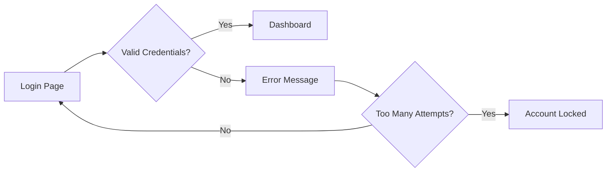
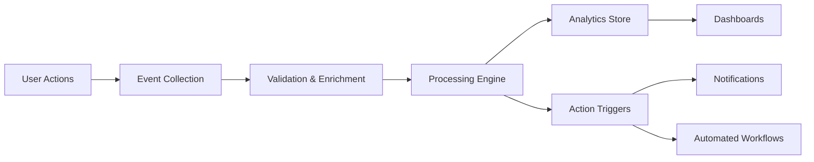

# Design vs Implementation: A Clear Distinction

## Overview

One of the most common mistakes in software development is mixing design (WHAT and WHY) with implementation (HOW). This guide provides clear examples and guidelines to maintain proper separation.

---

## Core Principles

### Design Documentation Answers:
- **WHAT** needs to be built
- **WHY** it needs to be built
- **WHO** will use it
- **WHEN** it will be used

### Implementation Documentation Answers:
- **HOW** it will be built
- **WHERE** code will live
- **WHICH** technologies to use

---

## Side-by-Side Comparisons

### Example 1: User Authentication

#### ❌ Bad Design (Too Much Implementation)

```markdown
## User Authentication Design

The authentication system will use JWT tokens with RS256 signing:

```javascript
const jwt = require('jsonwebtoken');
const bcrypt = require('bcrypt');

class AuthService {
  async login(email, password) {
    const user = await User.findOne({ email });
    const valid = await bcrypt.compare(password, user.passwordHash);
    if (valid) {
      return jwt.sign({ userId: user.id }, privateKey, { algorithm: 'RS256' });
    }
  }
}
```

Database schema:
```sql
CREATE TABLE users (
  id UUID PRIMARY KEY,
  email VARCHAR(255) UNIQUE,
  password_hash VARCHAR(60),
  created_at TIMESTAMP
);
```
```

#### ✅ Good Design (Focused on Requirements)

```markdown
## User Authentication Design

### Functional Requirements

**Authentication Methods:**
- Email/password login
- Social OAuth (Google, GitHub)
- Two-factor authentication (optional)

**Security Requirements:**
- Passwords never stored in plain text
- Session timeout after 30 minutes of inactivity
- Account lockout after 5 failed attempts
- Secure password reset via email

### User Flow



### Business Rules

1. **Password Requirements**
   - Minimum 12 characters
   - Must include upper, lower, number, special character
   - Cannot match last 5 passwords

2. **Session Management**
   - Active sessions displayed to user
   - Ability to revoke sessions remotely
   - Single sign-on for related services
```

---

### Example 2: Data Processing Pipeline

#### ❌ Bad Design (Implementation Details)

```markdown
## Data Pipeline Design

We'll use Apache Kafka for message streaming with Spark for processing:

```python
from pyspark.sql import SparkSession
from kafka import KafkaConsumer

consumer = KafkaConsumer('events', 
                        bootstrap_servers=['localhost:9092'],
                        value_deserializer=lambda m: json.loads(m.decode('utf-8')))

spark = SparkSession.builder.appName("EventProcessor").getOrCreate()

for message in consumer:
    df = spark.read.json(message.value)
    processed = df.filter(df.status == "active").groupBy("user_id").count()
    processed.write.parquet("s3://bucket/output/")
```

Infrastructure:
- 3 Kafka brokers on m5.large instances
- Spark cluster with 10 executors
- PostgreSQL RDS for metadata
```

#### ✅ Good Design (Business Requirements)

```markdown
## Data Pipeline Design

### Purpose
Process user activity events in near real-time to provide analytics and trigger automated actions based on user behavior patterns.

### Data Flow Overview



### Functional Requirements

**Data Sources:**
- Web application events (clicks, page views)
- Mobile app events (taps, screen time)
- API calls (frequency, endpoints)

**Processing Requirements:**
- Latency: < 5 seconds end-to-end
- Volume: 10M events/day, peak 1000/second
- Retention: Raw data 30 days, aggregated 2 years

**Output Requirements:**
- Real-time user activity dashboards
- Hourly aggregate reports
- Anomaly alerts within 1 minute

### Business Rules

1. **Event Validation**
   - Discard events older than 24 hours
   - Reject malformed events
   - De-duplicate within 1-hour window

2. **Privacy Compliance**
   - Anonymize PII in analytics
   - Honor user data deletion requests
   - Geo-restrictions for data storage
```

---

### Example 3: API Design

#### ❌ Bad Design (Too Technical)

```markdown
## REST API Design

Endpoints will use Express.js with middleware:

```javascript
app.get('/api/v1/users/:id', authenticateToken, async (req, res) => {
  try {
    const user = await db.query('SELECT * FROM users WHERE id = $1', [req.params.id]);
    res.json(user.rows[0]);
  } catch (err) {
    res.status(500).json({ error: err.message });
  }
});

app.post('/api/v1/users', validateInput, async (req, res) => {
  const { email, name } = req.body;
  const result = await db.query(
    'INSERT INTO users (email, name) VALUES ($1, $2) RETURNING *',
    [email, name]
  );
  res.status(201).json(result.rows[0]);
});
```
```

#### ✅ Good Design (Interface Specification)

```markdown
## API Design

### Resource Model

**User Resource:**
- Represents system users
- Unique identifier: email address
- Supports CRUD operations
- Relationships: owns Posts, member of Groups

### Endpoint Specifications

| Method | Endpoint | Purpose | Request | Response |
|--------|----------|---------|---------|----------|
| GET | /users/{id} | Retrieve user | - | User object |
| GET | /users | List users | Filters, pagination | User array |
| POST | /users | Create user | User data | Created user |
| PUT | /users/{id} | Update user | User data | Updated user |
| DELETE | /users/{id} | Delete user | - | Success status |

### Request/Response Examples

**GET /users/123**
```json
{
  "id": "123",
  "email": "user@example.com",
  "name": "John Doe",
  "created_at": "2024-01-15T10:00:00Z",
  "status": "active"
}
```

### Business Rules

1. **Access Control**
   - Users can view own profile
   - Admins can view all profiles
   - Profile updates restricted to owner or admin

2. **Validation**
   - Email must be unique
   - Name required, 2-100 characters
   - Status transitions follow state machine

### Error Handling

| Status | Meaning | Example |
|--------|---------|---------|
| 400 | Invalid request | Missing required field |
| 401 | Not authenticated | No valid token |
| 403 | Not authorized | Accessing other's data |
| 404 | Not found | User doesn't exist |
| 409 | Conflict | Email already exists |
```

---

## When Code IS Appropriate in Design

### ✅ Acceptable Code in Design Docs

1. **API Contract Examples** (showing data structure, not implementation)
   ```json
   {
     "user": {
       "id": "123",
       "name": "John Doe"
     }
   }
   ```

2. **Configuration Examples** (showing required settings)
   ```yaml
   feature_flags:
     new_dashboard: enabled
     beta_features: disabled
   ```

3. **Business Rule Formulas** (showing calculations)
   ```
   discount = base_price * discount_percentage
   final_price = base_price - discount + tax
   ```

### ❌ Unacceptable Code in Design Docs

1. **Implementation Logic**
   - Class definitions
   - Function implementations
   - Database queries
   - Framework-specific code

2. **Technical Details**
   - Library imports
   - Dependency versions
   - Deployment scripts
   - Infrastructure as Code

---

## Quick Reference Guide

### Design Document Should Include:
- ✅ User stories and use cases
- ✅ Business rules and constraints
- ✅ Data flow diagrams
- ✅ State diagrams
- ✅ Wireframes and mockups
- ✅ API contracts (structure only)
- ✅ Integration points
- ✅ Success criteria

### Design Document Should NOT Include:
- ❌ Source code
- ❌ Class/function implementations
- ❌ Database schemas (SQL)
- ❌ Technology stack details
- ❌ Library/framework code
- ❌ Deployment configurations
- ❌ Performance optimizations
- ❌ Algorithm implementations

---

## Best Practices

1. **Start with Why**
   - Always explain the business need first
   - Technical solutions come during implementation

2. **Use Diagrams Liberally**
   - Visual representations often clearer than text
   - Mermaid, PlantUML, ASCII art all acceptable

3. **Focus on Behavior**
   - Describe what the system does
   - Not how it does it internally

4. **Think Like a User**
   - User flows and journeys
   - Error states and edge cases
   - Success scenarios

5. **Leave Room for Implementation**
   - Design constrains the problem
   - Implementation solves within constraints

---

## Common Pitfalls to Avoid

### 1. **Technology-First Thinking**
❌ "We'll use PostgreSQL with Redis caching"
✅ "System requires persistent storage with sub-second response times"

### 2. **Premature Optimization**
❌ "Use B-trees for optimal O(log n) lookups"
✅ "Search must return results within 2 seconds for 1M records"

### 3. **Implementation Constraints**
❌ "Must use React hooks for state management"
✅ "UI must maintain state across page refreshes"

### 4. **Over-Specification**
❌ Detailed class hierarchies and methods
✅ Component responsibilities and interactions

---

## Self-Check Questions

Before finalizing any design document, ask:

1. **Could a different team implement this?**
   - Without asking about technologies
   - Without seeing existing code

2. **Are success criteria measurable?**
   - Not "fast" but "<2 seconds"
   - Not "user-friendly" but "complete in 3 clicks"

3. **Is it platform agnostic?**
   - Could work on cloud or on-premise
   - No vendor lock-in assumptions

4. **Does it tell a story?**
   - Problem → Solution → Benefits
   - Clear narrative flow

---

## Conclusion

Remember: Design documents are contracts between stakeholders and implementers. They should be clear enough for business people to validate requirements and technical enough for developers to build solutions. The implementation details belong in technical documentation, code comments, and architecture decision records (ADRs).

When in doubt, ask yourself: "Am I describing WHAT and WHY, or HOW?" If it's HOW, it probably belongs in implementation documentation.

<!-- SELF-REVIEW CHECKPOINT
Before finalizing, verify:
- All examples clearly show the distinction
- Guidelines are actionable and clear
- Common pitfalls are addressed
- No contradictions with other documentation
-->