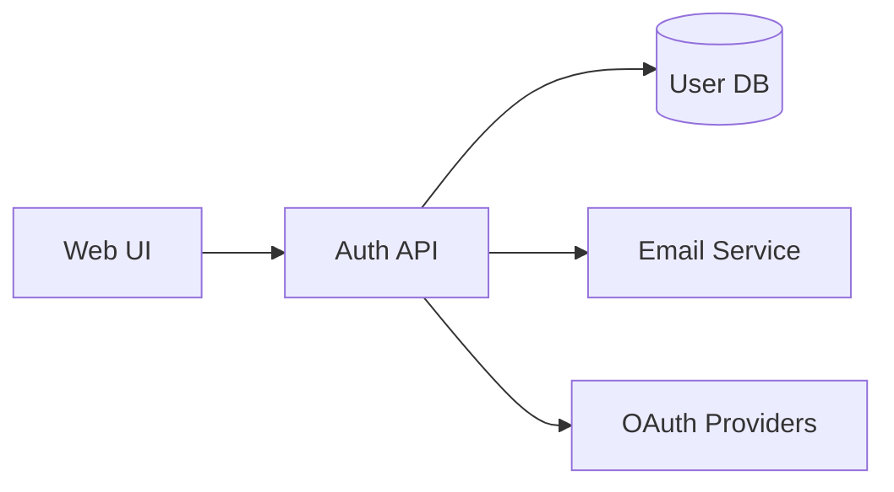

# Release Notes: v1.5.0 - Self-Review Process and Design Documentation Standards

**Release Date:** [Pending]  
**Type:** Major Enhancement  
**Breaking Changes:** No  
**Migration Required:** Yes (Recommended)

---

## Overview

This release introduces two critical improvements based on real-world project experiences:

1. **Mandatory Self-Review Process**: AI agents must review their work against requirements before presenting
2. **Design Documentation Standards**: Clear separation between design (WHAT/WHY) and implementation (HOW)

These changes significantly improve artifact quality and prevent the common problem of AI agents writing implementation code when design specifications are needed.

---

## What's New

### 1. 🔄 Self-Review Process (MANDATORY)

All AI agents must now internally review artifacts before presenting them:
- Review happens after creating the complete artifact
- Check against original requirements for gaps
- Revise if needed (may take multiple cycles)
- Users only see the final, reviewed version

### 2. 📐 Design Documentation Standards

Clear guidelines and templates for design documentation:
- New design documentation template
- Validation warnings for code-heavy design docs
- Examples of proper design vs implementation
- Focus on WHAT and WHY, not HOW

### 3. 🔍 Enhanced Validation

New validation check for design documentation:
- Warns if design docs contain >20% code
- Helps maintain proper separation of concerns
- Provides actionable feedback

---

## Migration Guide for Existing Projects

### Step 1: Update Your CLAUDE.md

Add this new section after "Development Workflow":

```markdown
## Self-Review Process (MANDATORY)

For ALL artifact creation (proposals, plans, designs, code, tests):

1. **Create Complete Artifact**: Write the entire document/code/test
2. **Self-Review Against Requirements**: 
   - Does this fully address the original request?
   - Are all requirements covered?
   - Is it consistent and clear?
   - Is the level of detail appropriate?
3. **Revise if Needed**: If gaps found, revise the artifact
4. **Iterate**: Repeat steps 2-3 until confident
5. **Present Final Version**: Only show the user the reviewed version

Note: This review process is internal - do not show review comments to the user.
```

### Step 2: Add Review Checkpoints to Templates

Add this comment to the end of all your templates (proposals, plans, retrospectives):

```markdown
<!-- SELF-REVIEW CHECKPOINT
Before finalizing, verify:
- All required sections are complete
- Content addresses original requirements
- Technical accuracy and consistency
- No gaps or contradictions
-->
```

### Step 3: Create Design Documentation Standards

Add this new section to your CLAUDE.md:

```markdown
## Design Documentation Guidelines

When creating design documentation:

### ✅ DO Include:
- Functional specifications and user stories
- Business rules and constraints
- High-level architecture diagrams
- Data flow diagrams
- Integration points and APIs
- Behavioral specifications
- Acceptance criteria

### ❌ DO NOT Include:
- Source code implementations
- Framework-specific code
- Detailed algorithms
- Package configurations
- Unit test code

### Use Diagrams Liberally:
- Mermaid for flow diagrams
- PlantUML for architecture
- ASCII art for simple illustrations
- Any markup-visible format

Remember: Design docs describe WHAT and WHY, not HOW.
```

### Step 4: Download New Templates

Get the new design documentation template:

```bash
# Download design documentation template
curl -sSL https://raw.githubusercontent.com/SteveGJones/ai-first-sdlc-practices/main/templates/design-documentation.md > templates/design-documentation.md
```

### Step 5: Update Validation Pipeline (Optional)

If using the validation pipeline, update to get design doc checking:

```bash
# Update validation script
curl -sSL https://raw.githubusercontent.com/SteveGJones/ai-first-sdlc-practices/main/tools/validation/validate-pipeline.py > tools/validation/validate-pipeline.py
```

---

## Examples

### Self-Review in Action

When asked to create a feature proposal, the AI agent:
1. Writes the complete proposal
2. Reviews it: "Does this cover all aspects requested?"
3. Finds gap: "Missing risk mitigation section"
4. Revises to add the section
5. Reviews again: "Now complete"
6. Presents the final version to user

### Design Documentation Example

**Good Design Documentation:**
```markdown
## User Authentication Design

### Functional Requirements
- Users can register with email/password
- Support OAuth2 providers (Google, GitHub)
- Password reset via email

### Architecture Overview


### Business Rules
- Passwords must be 12+ characters
- Account lockout after 5 failed attempts
- Session timeout after 30 minutes
```

**Bad Design Documentation:**
```typescript
// DON'T DO THIS IN DESIGN DOCS!
export class AuthService {
  async register(email: string, password: string) {
    const hashedPassword = await bcrypt.hash(password, 10);
    // ... implementation details
  }
}
```

---

## Best Practices

### For Self-Review
1. **Take it seriously**: Quality improvement is significant
2. **Be thorough**: Check all requirements, not just main ones
3. **Iterate quickly**: 2-3 quick reviews better than 1 long one
4. **Stay invisible**: User doesn't need to know about reviews

### For Design Documentation
1. **Start with user needs**: What problem are we solving?
2. **Use diagrams**: Visual representations often clearer than text
3. **Stay high-level**: Implementation details belong elsewhere
4. **Think audience**: Who will read this and what do they need?

---

## Rollback Instructions

If you need to disable these features:

1. **Self-Review**: Can be made optional by changing "MANDATORY" to "RECOMMENDED"
2. **Design Validation**: Comment out the check in validate-pipeline.py
3. **Templates**: Continue using your existing templates

---

## FAQ

**Q: How long should self-review take?**
A: Typically 2-5 minutes. If longer, you might be over-thinking.

**Q: What if some code is needed in design docs?**
A: Small examples for clarity are fine. The validation warns at >20% code.

**Q: Do I need to review simple updates?**
A: Yes, but simple updates have simple reviews. It becomes habit quickly.

**Q: Should I document what I found in review?**
A: No, the review process is internal. Users only see final artifacts.

---

## Known Improvements

These features are already showing benefits in projects:
- Fewer revision cycles with users
- Clearer design documents
- Better requirement coverage
- Reduced implementation rework

---

## Feedback

Your experience with these features is valuable. Please report:
- How the self-review process affects your workflow
- Examples where design standards helped or hindered
- Suggestions for improvement

Report at: https://github.com/SteveGJones/ai-first-sdlc-practices/issues

---

**Note**: This release emphasizes quality over speed. The small time investment in self-review pays dividends in reduced rework and clearer communication.