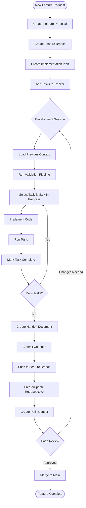
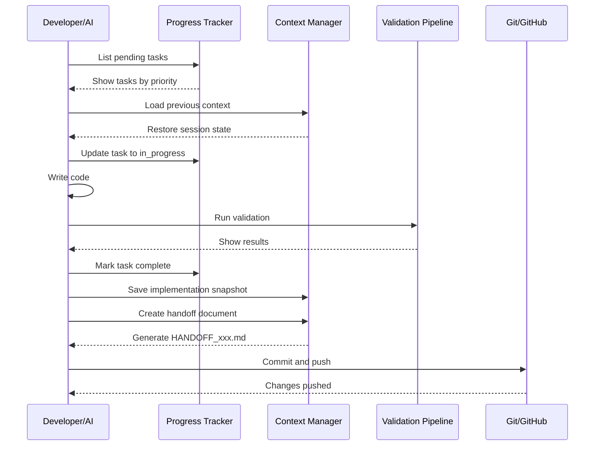
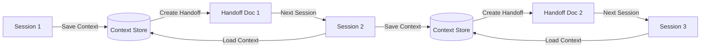
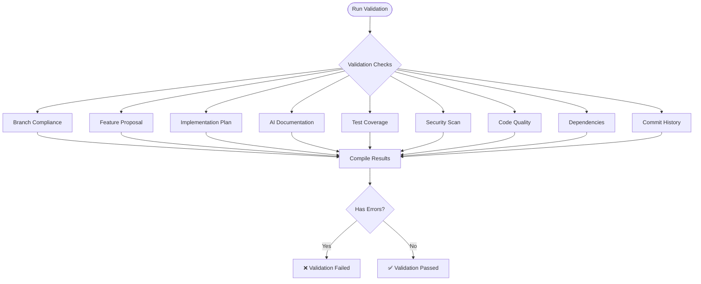
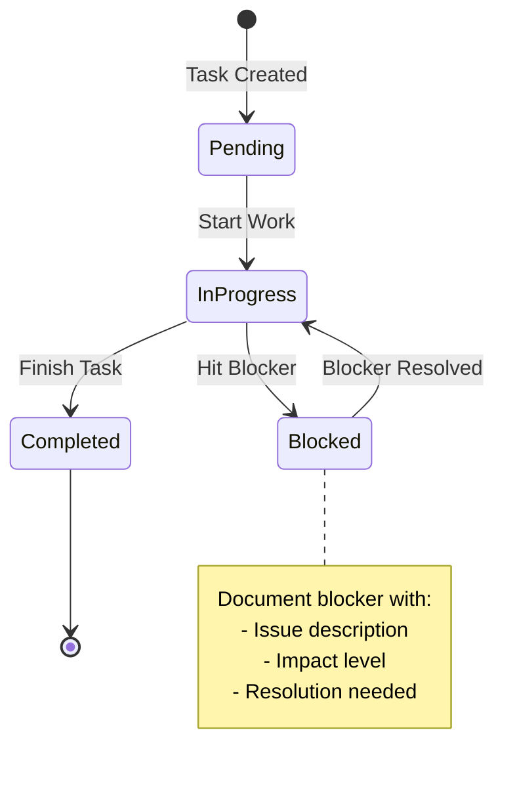
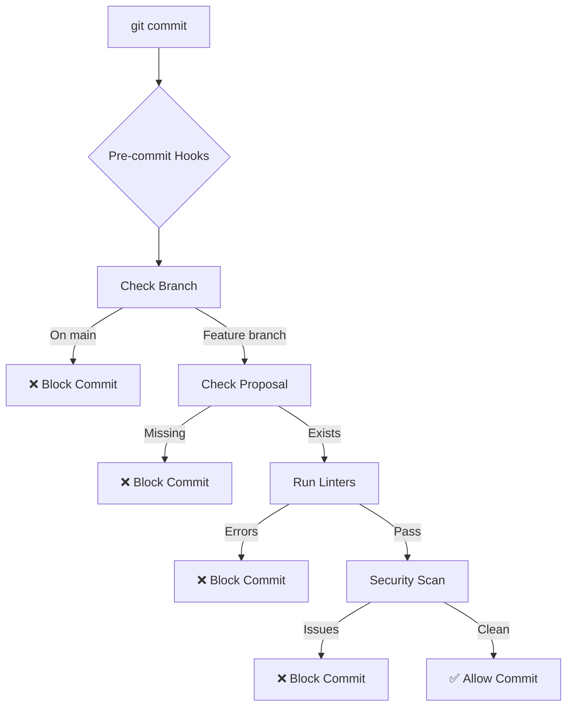
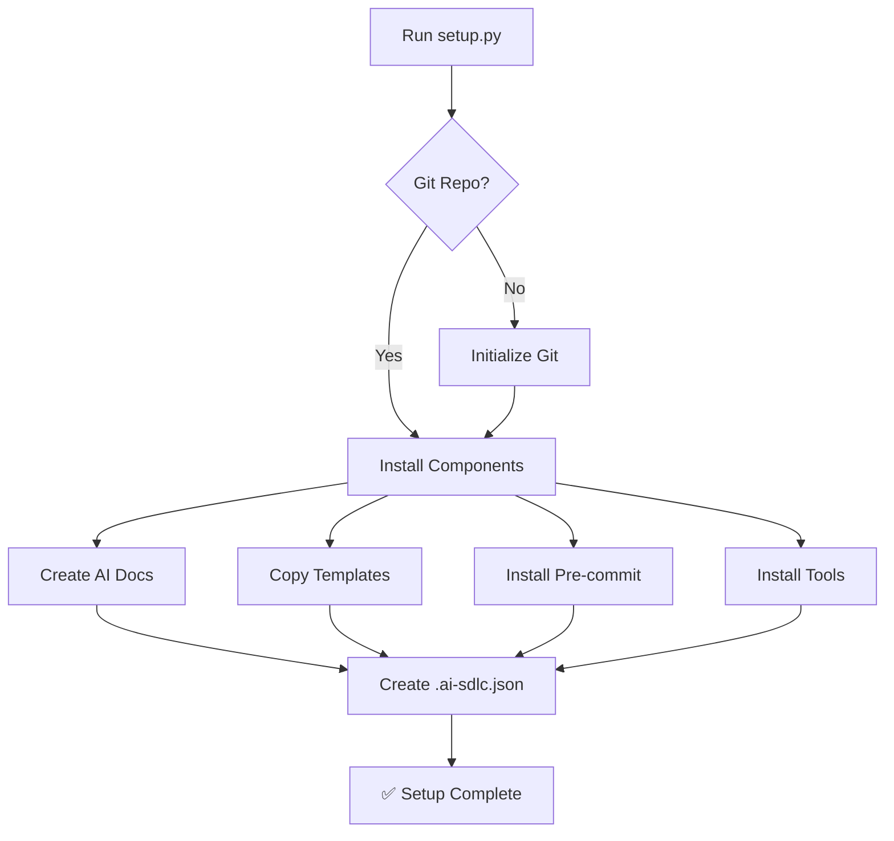
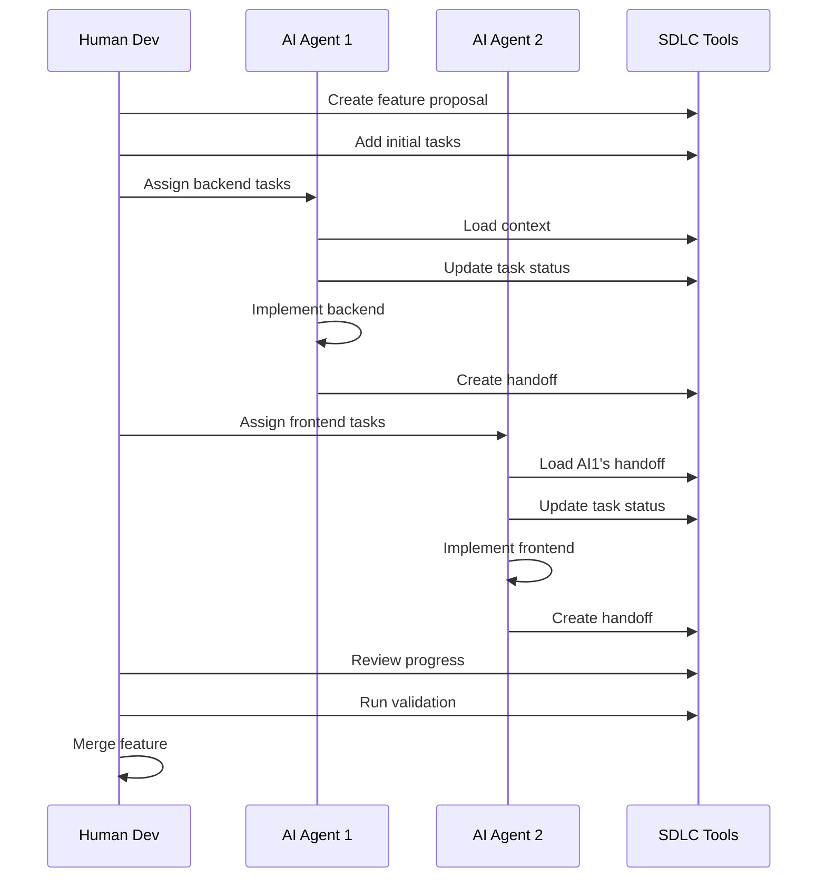
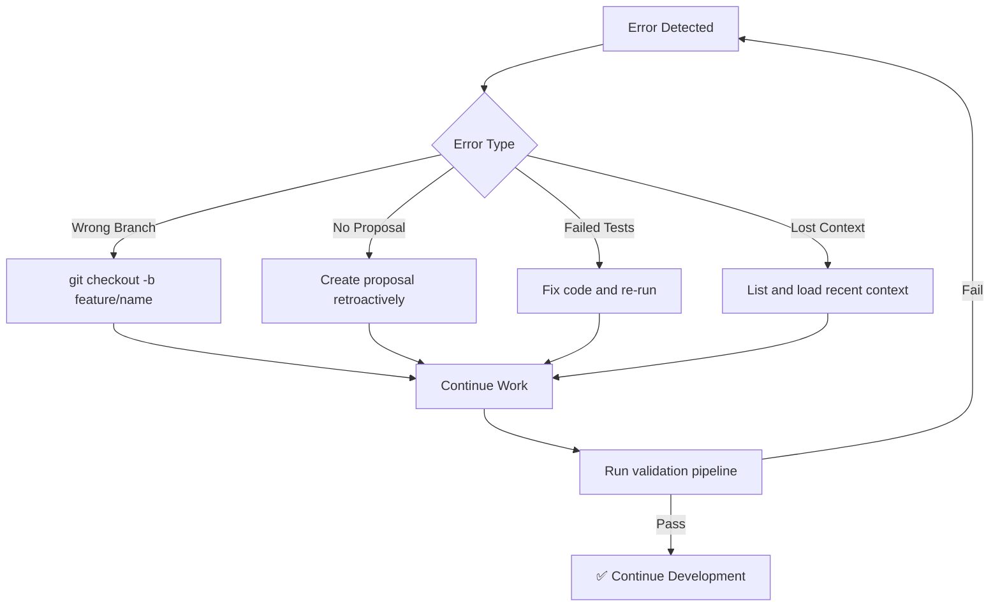

<!-- START doctoc generated TOC please keep comment here to allow auto update -->
<!-- DON'T EDIT THIS SECTION, INSTEAD RE-RUN doctoc TO UPDATE -->
**Table of Contents**

- [AI-First SDLC Workflow Diagram](#ai-first-sdlc-workflow-diagram)
  - [Complete Development Flow](#complete-development-flow)
  - [Tool Interaction Flow](#tool-interaction-flow)
  - [Context Preservation Lifecycle](#context-preservation-lifecycle)
  - [Validation Pipeline Checks](#validation-pipeline-checks)
  - [Task State Machine](#task-state-machine)
  - [Pre-commit Hook Flow](#pre-commit-hook-flow)
  - [Setup Process Flow](#setup-process-flow)
  - [Multi-Agent Collaboration](#multi-agent-collaboration)
  - [Error Recovery Flow](#error-recovery-flow)

<!-- END doctoc generated TOC please keep comment here to allow auto update -->

# AI-First SDLC Workflow Diagram

## Complete Development Flow

## Tool Interaction Flow

## Context Preservation Lifecycle

## Validation Pipeline Checks

## Task State Machine

## Pre-commit Hook Flow

## Setup Process Flow

## Multi-Agent Collaboration

## Error Recovery Flow

