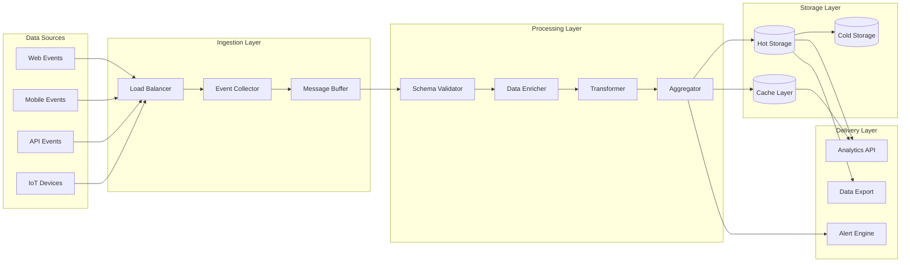
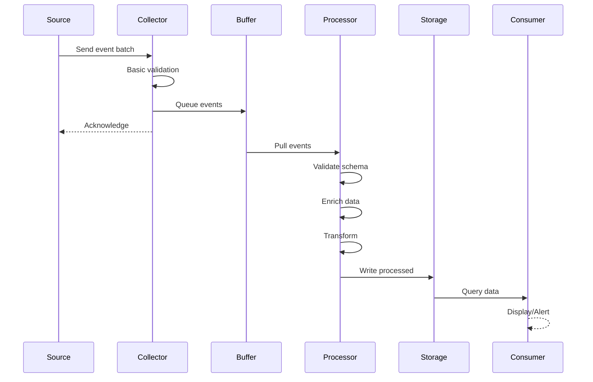
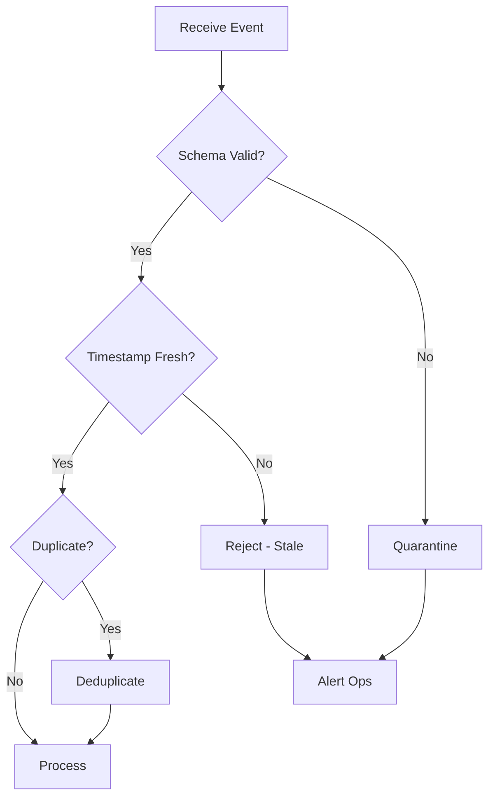

# Design Documentation: Real-Time Data Processing Pipeline

**Date:** 2025-07-17
**Author:** AI-First SDLC Team
**Status:** In Review
**Version:** 1.0

---

## Executive Summary

Design a scalable data processing pipeline that ingests, validates, transforms, and delivers real-time event data for analytics and automated actions. The system must handle millions of events daily while maintaining sub-second processing latency.

---

## Background and Context

### Problem Statement
Current batch processing system creates delays of up to 24 hours between user actions and insights. This prevents:
- Real-time fraud detection
- Immediate personalization
- Timely alerting on anomalies
- Dynamic pricing adjustments

### Current State
- Nightly batch ETL processes
- 6-24 hour data lag
- Limited scalability (failing at peak loads)
- No real-time dashboards

### Stakeholders
- **Primary Users:** Data analysts, Product managers
- **Business Owners:** Analytics team, Revenue optimization
- **Technical Teams:** Data engineering, Platform team

---

## Functional Specifications

### User Stories

```
As a data analyst
I want to see user behavior within 5 seconds
So that I can identify and respond to trends immediately

As a product manager
I want real-time conversion funnel metrics
So that I can quickly identify and fix drop-off points

As a security analyst
I want immediate alerts on suspicious patterns
So that I can prevent fraud before it completes

As a marketing manager
I want to trigger campaigns based on user actions
So that I can engage users at the right moment
```

### Business Rules

1. **Data Freshness**
   - Events visible in dashboards within 5 seconds
   - Aggregations updated every 30 seconds
   - Historical data available for 90 days
   - Archived data accessible within 24 hours

2. **Data Quality**
   - Events older than 24 hours rejected
   - Duplicate events detected and removed
   - Schema validation on all events
   - Quarantine malformed events for review

3. **Privacy Compliance**
   - PII automatically detected and masked
   - User consent verified before processing
   - Right to deletion honored within 72 hours
   - Geographic restrictions enforced

### Acceptance Criteria

- [ ] End-to-end latency < 5 seconds for 95% of events
- [ ] System handles 1000 events/second sustained
- [ ] Zero data loss during normal operations
- [ ] Automated recovery from component failures
- [ ] GDPR and CCPA compliant

---

## Architecture Design

### System Overview



### Component Descriptions

#### Event Collector
- **Purpose**: Receive and acknowledge events from all sources
- **Responsibilities**: Basic validation, buffering, acknowledgment
- **Interfaces**: HTTP/HTTPS endpoints, WebSocket for streaming
- **Constraints**: Must handle 10k requests/second per instance

#### Schema Validator
- **Purpose**: Ensure events conform to expected structure
- **Responsibilities**: Schema validation, versioning, error reporting
- **Interfaces**: Consumes from message buffer
- **Constraints**: Must not block pipeline, quarantine bad events

#### Data Enricher
- **Purpose**: Add context and derived data to events
- **Responsibilities**: User profile lookup, geolocation, device info
- **Interfaces**: External APIs, internal databases
- **Constraints**: Cache heavily, fail gracefully

### Data Flow



---

## Data Specifications

### Event Schema

```
Event Structure:
├── metadata
│   ├── event_id (UUID)
│   ├── timestamp (ISO 8601)
│   ├── version (semver)
│   └── source (string)
├── user
│   ├── id (hashed)
│   ├── session_id
│   └── attributes (map)
├── context
│   ├── device_type
│   ├── os_version
│   ├── app_version
│   └── location (country/region only)
└── payload
    ├── event_type
    ├── properties (map)
    └── custom_data (json)
```

### Data Retention

| Data Type | Hot Storage | Cold Storage | Deletion |
|-----------|-------------|--------------|----------|
| Raw Events | 7 days | 90 days | Automatic |
| Aggregations | 30 days | 2 years | Automatic |
| User Data | While active | 90 days after | On request |
| Audit Logs | 90 days | 7 years | Policy-based |

---

## Processing Rules

### Event Validation



### Aggregation Rules

1. **Time Windows**
   - Real-time: 1-minute tumbling windows
   - Near real-time: 5-minute sliding windows
   - Batch: Hourly aggregations

2. **Metrics**
   - Count by event type
   - Unique users per window
   - Conversion funnel stages
   - Revenue attribution

### Alert Conditions

| Alert Type | Condition | Action | SLA |
|------------|-----------|--------|-----|
| Anomaly | >3 std dev from baseline | Notify analyst | <1 min |
| Threshold | Metric exceeds limit | Trigger workflow | <30 sec |
| Pattern | Fraud signature detected | Block + alert | <5 sec |
| System | Component failure | Page on-call | Immediate |

---

## User Experience

### Analytics Dashboard

```
┌────────────────────────────────────────────┐
│ Real-Time Analytics      [Last 5 minutes] │
├────────────────────────────────────────────┤
│                                            │
│ Active Users: 45,234 ▲ 12%                │
│ Events/sec: 1,247                          │
│                                            │
│ ┌─────────────┐ ┌─────────────┐           │
│ │ Conversion  │ │   Revenue   │           │
│ │    3.4%     │ │  $124,532  │           │
│ │  ▼ 0.2%     │ │   ▲ 8.7%   │           │
│ └─────────────┘ └─────────────┘           │
│                                            │
│ Event Stream                               │
│ ┌────────────────────────────────────┐    │
│ │ [11:23:45] User 123 - page_view    │    │
│ │ [11:23:46] User 456 - add_to_cart  │    │
│ │ [11:23:46] User 789 - checkout     │    │
│ │ [11:23:47] User 123 - purchase     │    │
│ └────────────────────────────────────┘    │
│                                            │
│ [Configure Alerts] [Export Data]           │
└────────────────────────────────────────────┘
```

---

## Non-Functional Requirements

### Performance
- **Ingestion Rate**: 1M events/minute sustained
- **Processing Latency**: p95 < 5 seconds
- **Query Response**: p95 < 2 seconds
- **Data Availability**: Within 10 seconds of event

### Scalability
- **Horizontal Scaling**: All components stateless
- **Auto-scaling**: Based on queue depth and CPU
- **Multi-region**: Active-active deployment
- **Burst Capacity**: Handle 5x normal load

### Reliability
- **Availability**: 99.95% uptime SLA
- **Durability**: No data loss (99.999999%)
- **Recovery Time**: < 5 minutes
- **Backup Strategy**: Cross-region replication

### Security
- **Encryption**: At-rest and in-transit
- **Access Control**: Role-based permissions
- **Audit Trail**: All data access logged
- **Compliance**: SOC2, GDPR, CCPA certified

---

## Migration Strategy

### Phase 1: Parallel Run (Month 1)
- Deploy new pipeline alongside existing
- Mirror 10% of traffic for validation
- Compare outputs, tune processing

### Phase 2: Gradual Migration (Month 2-3)
- Increase traffic percentage weekly
- Migrate dashboards to new data
- Train users on real-time features

### Phase 3: Cutover (Month 4)
- Full traffic to new pipeline
- Decommission old batch system
- Archive historical data

---

## Success Metrics

### Technical KPIs
- **Latency**: p95 < 5 seconds achieved
- **Throughput**: 1M events/minute capacity
- **Availability**: >99.95% monthly uptime
- **Data Quality**: <0.1% validation failures

### Business KPIs
- **Time to Insight**: From 24 hours to 5 seconds
- **Fraud Detection**: 50% reduction in losses
- **Campaign Performance**: 25% better targeting
- **Operational Cost**: 30% reduction per event

---

## Open Questions

- [ ] Should we support custom event schemas per tenant?
- [ ] What machine learning capabilities should we embed?
- [ ] How long should we retain PII for inactive users?
- [ ] Should we offer SQL query interface for analysts?

---

## References

- Lambda Architecture principles
- GDPR Article 17 (Right to Erasure)
- Apache Beam processing patterns
- Company Data Governance Policy

<!-- SELF-REVIEW CHECKPOINT
Before finalizing, verify:
- All required sections are complete
- Content addresses original requirements
- Technical accuracy and consistency
- No gaps or contradictions
-->