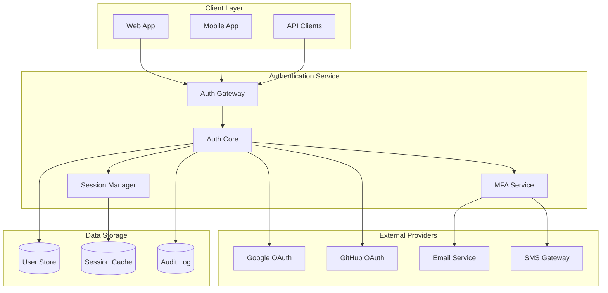
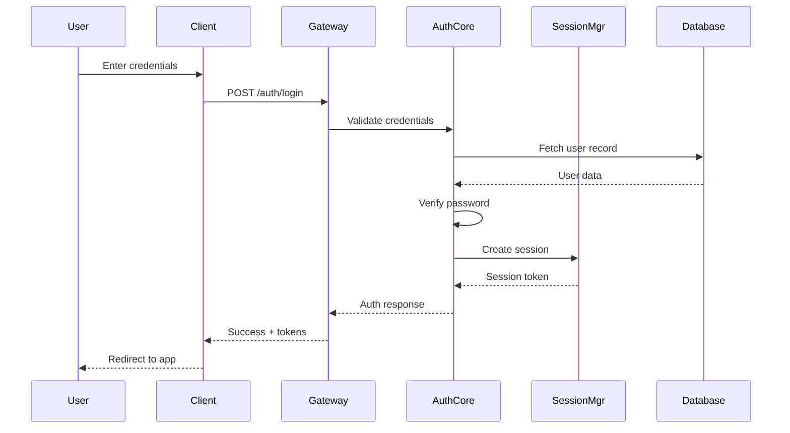
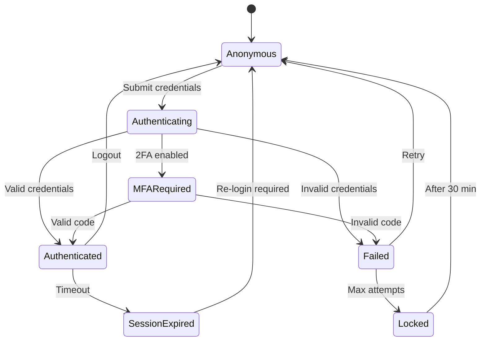

# Design Documentation: User Authentication System

**Date:** 2025-07-17
**Author:** AI-First SDLC Team
**Status:** Approved
**Version:** 1.0

---

## Executive Summary

Design a comprehensive user authentication system that provides secure, flexible authentication options while maintaining excellent user experience. The system will support multiple authentication methods and integrate with existing identity providers.

---

## Background and Context

### Problem Statement
Current system lacks centralized authentication, leading to:
- Inconsistent user experience across services
- Security vulnerabilities from custom implementations
- No single sign-on capability
- Poor password practices

### Current State
- Each service implements its own authentication
- No standardized session management
- Passwords stored with varying security levels
- No multi-factor authentication support

### Stakeholders
- **Primary Users:** End users accessing the platform
- **Business Owners:** Security team, Product management
- **Technical Teams:** Platform team, Service developers

---

## Functional Specifications

### User Stories

```
As a new user
I want to register with email and password
So that I can access the platform services

As an existing user
I want to sign in with Google/GitHub
So that I can avoid managing another password

As a security-conscious user
I want to enable two-factor authentication
So that my account is more secure

As a user who forgot my password
I want to reset it via email
So that I can regain access to my account
```

### Business Rules

1. **Password Requirements**
   - Minimum 12 characters
   - Must contain: uppercase, lowercase, number, special character
   - Cannot match previous 5 passwords
   - Must not contain user's name or email

2. **Account Security**
   - Lock account after 5 failed login attempts
   - Unlock after 30 minutes or via email verification
   - Require email verification for new accounts
   - Force password change if compromised

3. **Session Management**
   - Sessions expire after 30 minutes of inactivity
   - Maximum session duration: 8 hours
   - Single device login for free tier users
   - Multiple device support for premium users

### Acceptance Criteria

- [ ] User can register in under 2 minutes
- [ ] Login process completes in <3 seconds
- [ ] Password reset email arrives within 1 minute
- [ ] 2FA setup process is clear and simple
- [ ] Session handling is transparent to user
- [ ] All error messages are helpful and actionable

---

## Architecture Design

### System Overview



### Component Descriptions

#### Auth Gateway
- **Purpose**: Single entry point for all authentication requests
- **Responsibilities**: Rate limiting, request validation, routing
- **Interfaces**: REST API, GraphQL endpoint
- **Constraints**: Must handle 10k requests/second

#### Auth Core
- **Purpose**: Business logic for authentication operations
- **Responsibilities**: User validation, token generation, provider integration
- **Interfaces**: Internal service APIs
- **Constraints**: Stateless, horizontally scalable

#### Session Manager
- **Purpose**: Manage user sessions across services
- **Responsibilities**: Create, validate, revoke sessions
- **Interfaces**: Redis protocol for cache
- **Constraints**: Sub-millisecond response time

### Data Flow



---

## User Experience Design

### User Flow

#### Registration Flow
1. User clicks "Sign Up"
2. Choose registration method (email/social)
3. Enter required information
4. Verify email (if email registration)
5. Complete profile (optional)
6. Land on dashboard

#### Login Flow
```
┌─────────────┐     ┌─────────────┐     ┌─────────────┐
│   Login     │ ──> │  Validate   │ ──> │ Check MFA   │
│   Page      │     │ Credentials │     │  Required?  │
└─────────────┘     └─────────────┘     └─────┬───────┘
                                              │ Yes
                                              ▼
┌─────────────┐     ┌─────────────┐     ┌─────────────┐
│ Dashboard   │ <── │   Create    │ <── │  MFA Code   │
│             │     │   Session   │     │   Entry     │
└─────────────┘     └─────────────┘     └─────────────┘
```

### Wireframes

```
┌─────────────────────────────────────┐
│            Login Page               │
│                                     │
│  ┌─────────────────────────────┐   │
│  │  Email/Username             │   │
│  └─────────────────────────────┘   │
│                                     │
│  ┌─────────────────────────────┐   │
│  │  Password                   │   │
│  └─────────────────────────────┘   │
│                                     │
│  □ Remember me for 30 days         │
│                                     │
│  ┌──────────────┐ ┌─────────────┐  │
│  │    LOGIN     │ │   SIGN UP   │  │
│  └──────────────┘ └─────────────┘  │
│                                     │
│  ─────────── OR ───────────        │
│                                     │
│  ┌─────────────────────────────┐   │
│  │  Continue with Google  🔍   │   │
│  └─────────────────────────────┘   │
│                                     │
│  ┌─────────────────────────────┐   │
│  │  Continue with GitHub  🐙   │   │
│  └─────────────────────────────┘   │
│                                     │
│  Forgot password?                   │
└─────────────────────────────────────┘
```

---

## Behavioral Specifications

### State Management



### Validation Rules

| Field | Validation | Error Message |
|-------|------------|---------------|
| Email | Valid format, exists in system | "Enter a valid email address" |
| Password | Meets complexity requirements | "Password must be 12+ characters with mixed case, number, and symbol" |
| MFA Code | 6 digits, valid window | "Invalid code. Please try again" |
| OAuth Token | Valid signature, not expired | "Authentication failed. Please try again" |

---

## Non-Functional Requirements

### Performance
- **Login Response**: 95th percentile < 3 seconds
- **Token Validation**: < 50ms
- **Concurrent Users**: Support 100k active sessions

### Security
- **Encryption**: All passwords bcrypt with cost factor 12+
- **Transport**: TLS 1.3 only
- **Token Security**: JWT with RS256, 15-minute expiry
- **Audit**: All auth events logged with IP, timestamp, outcome

### Scalability
- **Horizontal Scaling**: Stateless services
- **Session Storage**: Redis cluster with replication
- **Database**: Read replicas for auth queries

### Reliability
- **Availability**: 99.99% uptime
- **Failover**: Automatic with <30 second switchover
- **Backup Auth**: Fallback to backup providers

---

## Success Metrics

### KPIs
- **Registration Conversion**: >80% completion rate
- **Login Success Rate**: >95% on first attempt
- **Password Reset**: <5% of users monthly
- **MFA Adoption**: >30% within 6 months

### Monitoring
- Failed login attempts per user
- Average session duration
- Auth service response times
- Provider availability

---

## Open Questions

- [ ] Should we support passwordless authentication?
- [ ] What is the business requirement for session duration?
- [ ] Do we need to support enterprise SSO (SAML)?
- [ ] Should MFA be mandatory for admin users?

---

## References

- OWASP Authentication Cheat Sheet
- NIST Digital Identity Guidelines
- OAuth 2.0 Security Best Practices
- Company Security Policy v2.1

<!-- SELF-REVIEW CHECKPOINT
Before finalizing, verify:
- All required sections are complete
- Content addresses original requirements
- Technical accuracy and consistency
- No gaps or contradictions
-->
