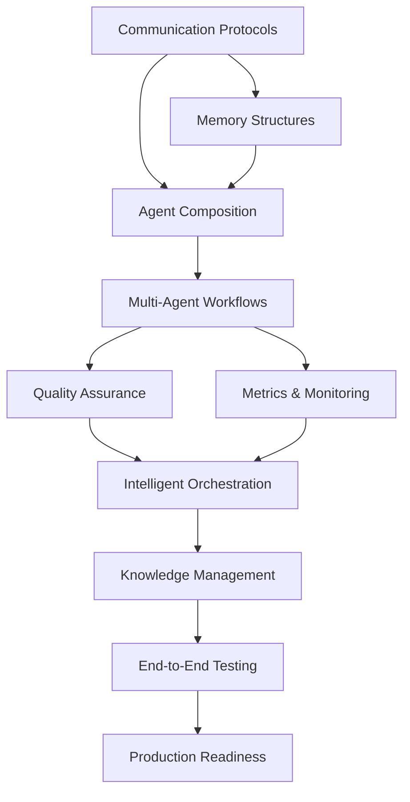

# Agent Collaboration Enhancement Implementation Plan

**Project**: Agent Collaboration Enhancements
**Phase**: Implementation Planning and Progress Tracking
**Status**: In Progress
**Owner**: project-plan-tracker agent
**Date**: 2025-08-08

## Executive Summary

This plan establishes comprehensive progress tracking for agent collaboration enhancements, implementing systematic monitoring of deliverables, dependencies, and validation gates to ensure successful collaborative development practices.

## Task Breakdown with Dependencies

### Phase 1: Foundation Enhancement (Weeks 1-2)

#### Task 1.1: Agent Communication Protocol Validation
**Owner**: sdlc-enforcer + framework-validator
**Duration**: 3 days
**Dependencies**: None (foundational)
**Deliverables**:
- Communication protocol compliance audit
- Message format standardization verification
- Escalation path validation report

**Acceptance Criteria**:
- All agent communication follows standardized protocols
- Message formats are consistent across agent types
- Escalation chains are functional and tested

#### Task 1.2: Collaborative Memory Structure Implementation
**Owner**: context-engineer + orchestration-architect
**Duration**: 5 days
**Dependencies**: Task 1.1 (communication standards)
**Deliverables**:
- Enhanced collaborative memory system
- Knowledge building pattern implementation
- Cross-agent validation chain automation

**Acceptance Criteria**:
- Agents can build on each other's knowledge
- Memory structures prevent information loss during handoffs
- Progressive expertise building is documented and functional

#### Task 1.3: Agent Composition Optimization
**Owner**: ai-solution-architect + solution-architect
**Duration**: 4 days
**Dependencies**: Task 1.1, Task 1.2 (foundation complete)
**Deliverables**:
- Optimized agent formation strategies
- Enhanced Billy Wright 4-3-3 tactical implementation
- Role specialization refinements

**Acceptance Criteria**:
- Agent roles are clearly defined and non-overlapping
- Formation strategy improves collaboration efficiency
- Specialization reduces redundant work

### Phase 2: Integration and Validation (Weeks 3-4)

#### Task 2.1: Multi-Agent Workflow Implementation
**Owner**: delivery-manager + agile-coach + orchestration-architect
**Duration**: 7 days
**Dependencies**: Phase 1 complete
**Deliverables**:
- Implemented multi-agent workflows for common scenarios
- Feature development flow with agent coordination
- Issue resolution flow with proper escalation

**Acceptance Criteria**:
- Workflows complete without manual intervention
- Handoffs preserve context and decisions
- Quality gates are enforced by appropriate agents

#### Task 2.2: Collaborative Quality Assurance System
**Owner**: critical-goal-reviewer + test-manager + ai-test-engineer
**Duration**: 6 days
**Dependencies**: Task 2.1 (workflows established)
**Deliverables**:
- Multi-agent validation processes
- Quality gate automation
- Cross-agent review mechanisms

**Acceptance Criteria**:
- Multiple agents validate critical decisions
- Quality is maintained throughout collaboration
- Review processes catch integration issues

#### Task 2.3: Performance Metrics and Monitoring
**Owner**: performance-engineer + sre-specialist
**Duration**: 5 days
**Dependencies**: Task 2.1, Task 2.2 (systems operational)
**Deliverables**:
- Collaboration performance metrics
- Agent team efficiency monitoring
- Communication effectiveness tracking

**Acceptance Criteria**:
- Metrics show collaboration efficiency improvements
- Monitoring identifies bottlenecks in real-time
- Performance data drives optimization decisions

### Phase 3: Advanced Collaboration Features (Weeks 5-6)

#### Task 3.1: Intelligent Agent Orchestration
**Owner**: orchestration-architect + mcp-server-architect
**Duration**: 8 days
**Dependencies**: Phase 2 complete
**Deliverables**:
- Automated agent selection and routing
- Dynamic collaboration formation
- Context-aware agent recommendations

**Acceptance Criteria**:
- System selects optimal agents for tasks automatically
- Collaboration patterns adapt to project requirements
- Recommendations improve decision quality

#### Task 3.2: Knowledge Management Integration
**Owner**: context-engineer + documentation-architect
**Duration**: 6 days
**Dependencies**: Task 3.1 (orchestration active)
**Deliverables**:
- Integrated knowledge management system
- Collaborative learning mechanisms
- Cross-project knowledge sharing

**Acceptance Criteria**:
- Agents learn from previous collaborations
- Knowledge is preserved across project boundaries
- Learning accelerates future collaboration effectiveness

### Phase 4: Validation and Optimization (Weeks 7-8)

#### Task 4.1: End-to-End Collaboration Testing
**Owner**: integration-orchestrator + critical-goal-reviewer
**Duration**: 10 days
**Dependencies**: Phase 3 complete
**Deliverables**:
- Comprehensive collaboration test suite
- End-to-end scenario validation
- Performance benchmarking results

**Acceptance Criteria**:
- All collaboration scenarios pass validation
- Performance meets or exceeds targets
- Test coverage includes edge cases and failure modes

#### Task 4.2: Production Readiness Assessment
**Owner**: sre-specialist + compliance-auditor
**Duration**: 5 days
**Dependencies**: Task 4.1 (testing complete)
**Deliverables**:
- Production readiness checklist completion
- Compliance audit results
- Deployment authorization

**Acceptance Criteria**:
- System meets production quality standards
- Compliance requirements are satisfied
- Deployment risks are identified and mitigated

## Dependency Matrix



## Risk Assessment

### High-Risk Dependencies
1. **Task 1.2 → Task 2.1**: Memory structure implementation must be robust before workflows
2. **Task 2.1 → Task 3.1**: Workflow validation required before advanced orchestration
3. **Task 3.2 → Task 4.1**: Knowledge management integration affects all testing scenarios

### Mitigation Strategies
- **Daily dependency reviews** by delivery-manager
- **Parallel development tracks** where possible
- **Fallback plans** for critical path failures
- **Early integration testing** to catch dependency issues

## Success Validation Gates

### Gate 1: Foundation Complete (End of Week 2)
**Criteria**:
- All agent communication protocols validated ✓
- Collaborative memory structures functional ✓
- Agent composition optimized ✓

**Validation Method**: Multi-agent collaboration scenario test
**Responsible**: critical-goal-reviewer + framework-validator

### Gate 2: Integration Successful (End of Week 4)
**Criteria**:
- Multi-agent workflows operational ✓
- Quality assurance system active ✓
- Performance metrics collecting data ✓

**Validation Method**: End-to-end feature development test
**Responsible**: integration-orchestrator + performance-engineer

### Gate 3: Advanced Features Ready (End of Week 6)
**Criteria**:
- Intelligent orchestration operational ✓
- Knowledge management integrated ✓
- System learning from collaborations ✓

**Validation Method**: Complex multi-phase project simulation
**Responsible**: orchestration-architect + critical-goal-reviewer

### Gate 4: Production Ready (End of Week 8)
**Criteria**:
- All tests passing ✓
- Production readiness validated ✓
- Compliance requirements met ✓

**Validation Method**: Full system acceptance test
**Responsible**: sre-specialist + compliance-auditor

## Progress Monitoring Framework

### Daily Tracking
- **Stand-up Format**: Agent → Task → Status → Blockers → Next 24h
- **Automated Metrics**: Task completion %, dependency health, quality gates
- **Risk Dashboard**: Red/Yellow/Green status by phase and task

### Weekly Reviews
- **Milestone Assessment**: Progress against plan
- **Dependency Validation**: Critical path health check
- **Quality Metrics**: Collaboration effectiveness trends
- **Risk Mitigation**: Action plan updates

### Bi-weekly Retrospectives
- **What's Working**: Successful collaboration patterns
- **What's Challenging**: Identified friction points
- **Process Improvements**: Optimization opportunities
- **Knowledge Capture**: Lessons learned documentation

## Communication Protocols

### Status Reporting Format
```
📊 COLLABORATION_STATUS: [Phase X.Y] | Progress: [X%] | Health: [GREEN/YELLOW/RED]
📋 Completed: [Task List]
🔄 In Progress: [Task List with % complete]
⏳ Upcoming: [Task List with dependencies]
🚨 Blockers: [Issue List with mitigation plans]
📈 Metrics: [Key performance indicators]
```

### Escalation Triggers
- **Task > 20% behind schedule** → delivery-manager intervention
- **Dependency blocker > 48 hours** → solution-architect escalation
- **Quality gate failure** → critical-goal-reviewer review
- **Risk level = HIGH** → immediate stakeholder notification

## Tools and Automation

### Progress Tracking Tools
- **Primary**: `progress-tracker.py` for task management
- **Metrics**: Custom collaboration efficiency calculator
- **Reporting**: Automated daily/weekly status generation
- **Integration**: Git commit tracking for deliverable validation

### Validation Automation
- **Quality Gates**: Automated agent collaboration tests
- **Dependency Checks**: Daily dependency health validation
- **Performance Monitoring**: Real-time collaboration metrics
- **Compliance Auditing**: Automated framework adherence checking

This comprehensive plan ensures systematic tracking, validation, and optimization of agent collaboration enhancements while maintaining the high standards expected in AI-First SDLC practices.
