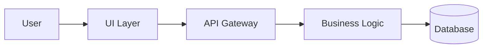

# CLAUDE.md - AI Development Instructions

This file provides guidance to AI agents working on this codebase. Adherence to these instructions is **MANDATORY** and overrides any default AI behavior.

## Project Overview

**Project**: [Your Project Name]
**Purpose**: [Brief description of what this project does]

[CUSTOMIZE: Brief overview of your project and its main purpose]

Example:
> This is a Python web service using FastAPI that provides authentication and user management. The project follows a clean architecture pattern with separate layers for API, business logic, and data access.

## 🚨 CRITICAL: Git Workflow and Branching Strategy

**⛔ NEVER PUSH DIRECTLY TO MAIN BRANCH**

### Mandatory Workflow
1. **ALWAYS** create a feature branch for ANY work
2. **ALWAYS** create a feature proposal before starting implementation
3. **ALWAYS** create a retrospective BEFORE creating the Pull Request
4. **NEVER** use `git push origin main` or `git push` when on main branch
5. **ALWAYS** submit changes via Pull Request
6. **VERIFY** main branch protection is enabled (see Branch Protection section)

### 📋 Pull Request Checklist (MANDATORY)
Before creating any PR, ensure:
- [ ] Feature proposal exists in `docs/feature-proposals/`
- [ ] All tests pass
- [ ] Documentation is updated
- [ ] **Retrospective is created in `retrospectives/`**
- [ ] Validation pipeline passes (`python tools/validate-pipeline.py`)
- [ ] No direct commits to main branch

### Branch Naming Convention
```
feature/[proposal-name]     # For new features
fix/[issue-description]     # For bug fixes
docs/[documentation-topic]  # For documentation updates
refactor/[component-name]   # For code refactoring
```

### Correct Git Workflow
```bash
# Start new feature
git checkout -b feature/user-authentication
git add .
git commit -m "feat: implement user authentication"
git push -u origin feature/user-authentication
# Complete retrospective BEFORE creating PR
# Create PR via GitHub/GitLab

# NEVER DO THIS:
# git checkout main
# git commit -m "..."
# git push  # This would push to main!
```

## Branch Protection

### Understanding Main Branch Protection
The main branch MUST be protected to prevent direct pushes and ensure all changes go through PR review. This is critical for:
- **Code Quality**: All changes reviewed before merge
- **Process Compliance**: Forces feature proposal → implementation → retrospective flow
- **Rollback Safety**: Clean main branch history for easy rollbacks
- **Team Coordination**: Prevents conflicts from simultaneous direct pushes

### Verifying Protection Status
**ALWAYS check** if main branch protection is properly configured:

```bash
# Check if protection exists (GitHub CLI method - preferred)
gh api repos/:owner/:repo/branches/main/protection --jq '.required_status_checks.contexts'

# Expected output: ["validate", "test-framework-tools (3.8)"]
# If command fails or returns empty, protection is NOT enabled
```

### Setting Up Protection (for New Repositories)
If you discover main branch is not protected, run:

```bash
# Using secure GitHub CLI method
python tools/setup-branch-protection-gh.py

# This will:
# 1. Check if gh CLI is authenticated (prompt if not)
# 2. Configure protection with required status checks
# 3. Require PR reviews (1 approval minimum)
# 4. Prevent direct pushes to main
```

### What Happens When Protection Fails
If you try to push directly to main with protection enabled:
```bash
# This will be BLOCKED:
git push origin main

# Error: "required status checks have not succeeded"
# Error: "branch is protected"
```

**Correct response**: Always use feature branches and PRs.

### Troubleshooting Protection Issues
1. **"Protection not found"**: Run setup script to enable protection
2. **"Permission denied"**: Need admin access to repository
3. **"Required checks failing"**: Fix validation/test issues before merge
4. **"Authentication failed"**: Run `gh auth login` to authenticate

### Quick Repository Health Check
Before starting any work, run this verification:

```bash
# 1. Verify you're not on main branch
git branch --show-current
# Should NOT show "main"

# 2. Verify main branch protection exists
gh api repos/:owner/:repo/branches/main/protection --jq '.required_status_checks.contexts' 2>/dev/null
# Should show: ["validate", "test-framework-tools (3.8)"]

# 3. Check if framework tools are present
ls tools/setup-branch-protection-gh.py tools/validate-pipeline.py 2>/dev/null
# Should list both files without errors

# If any check fails, inform the user and request setup completion
```

## 🚨 Zero Technical Debt Policy

**MANDATORY**: This project enforces a strict Zero Technical Debt policy. Read [ZERO-TECHNICAL-DEBT.md](ZERO-TECHNICAL-DEBT.md) for full details.

### Core Principles
1. **Never defer fixes** - Security vulnerabilities, deprecations, and type errors must be fixed immediately
2. **Continuous validation** - Run ALL checks after EVERY change
3. **Quality gates** - No task is complete until all checks pass with zero warnings
4. **Production-ready always** - Every commit must be deployable

### Required Checks Before ANY Commit

```bash
# Python projects
flake8 . && mypy . && pytest && safety check

# Node.js/TypeScript projects
npm run lint && npm run typecheck && npm test && npm audit

# Go projects
go fmt ./... && go vet ./... && go test ./... && go mod verify

# Rust projects
cargo fmt -- --check && cargo clippy -- -D warnings && cargo test && cargo audit

# Ruby projects
rubocop && ruby -c **/*.rb && rspec && bundle audit

# Java projects
mvn clean compile && mvn checkstyle:check && mvn test && mvn dependency-check:check
```

### Definition of "Done"
A task is ONLY complete when:
- ✅ All code is written with proper types (no `any` types)
- ✅ All linting passes with zero warnings
- ✅ All tests pass with appropriate coverage
- ✅ Security audit shows zero vulnerabilities
- ✅ No deprecation warnings exist
- ✅ Documentation is updated
- ✅ Code is production-ready

**Remember**: Build quality in, don't add it later. Act like a senior engineer who would never ship code with known issues.

## 🏗️ MANDATORY: Architecture-First Development

**CRITICAL**: NO CODE may be written until ALL architectural documents are completed. This is MANDATORY with ZERO exceptions.

### Required Architecture Documents (BEFORE ANY CODE)

1. **Requirements Traceability Matrix (RTM)**
   - Location: `docs/architecture/requirements-matrix.md`
   - Template: `templates/architecture/requirements-traceability-matrix.md`
   - MUST map EVERY requirement to design, implementation, and tests
   - NO orphaned requirements allowed
   - NO untraceable implementations allowed

2. **What-If Analysis**
   - Location: `docs/architecture/what-if-analysis.md`
   - Template: `templates/architecture/what-if-analysis.md`
   - MUST document ALL edge cases and failure scenarios
   - EVERY "What if..." question must have a mitigation strategy
   - Think like a chaos engineer - assume everything will fail

3. **Architecture Decision Records (ADRs)**
   - Location: `docs/architecture/decisions/`
   - Template: `templates/architecture/architecture-decision-record.md`
   - EVERY architectural choice needs documented reasoning
   - MUST include alternatives considered and trade-offs
   - Number sequentially: ADR-001, ADR-002, etc.

4. **System Invariants**
   - Location: `docs/architecture/system-invariants.md`
   - Template: `templates/architecture/system-invariants.md`
   - Define conditions that must ALWAYS be true
   - Include verification methods for each invariant
   - These are non-negotiable system constraints

5. **Integration Design**
   - Location: `docs/architecture/integration-design.md`
   - Template: `templates/architecture/integration-design.md`
   - Start with the HARDEST integrations first
   - Document all external dependencies and APIs
   - Include failure modes and fallback strategies

6. **Failure Mode Analysis (FMEA)**
   - Location: `docs/architecture/failure-analysis.md`
   - Template: `templates/architecture/failure-mode-analysis.md`
   - Calculate Risk Priority Numbers (RPN) for each failure
   - Identify mitigation strategies for high-risk items
   - Include detection methods and recovery procedures

### Architecture Validation Command

```bash
# Run BEFORE writing any code
python tools/validation/validate-architecture.py

# This checks:
# - All 6 architecture documents exist
# - Requirements are fully traced
# - All edge cases are considered
# - System invariants are defined
# - Integration points are documented
# - Failure modes are analyzed

# You CANNOT proceed if this fails
```

### Architectural Thinking Principles

1. **Design the Whole System First**
   - Consider ALL requirements, not just the immediate task
   - Think about interactions between components
   - Plan for scale, security, and failure from day one

2. **Start with the Hard Parts**
   - Design integrations before internal logic
   - Solve distributed system challenges first
   - Address security and compliance upfront

3. **Document Every Decision**
   - If you're choosing between options, write an ADR
   - If you're making assumptions, document them
   - If you're accepting trade-offs, make them explicit

4. **Think Like an Architect**
   - What would happen at 10x scale?
   - How would this work across multiple regions?
   - What if every dependency failed simultaneously?
   - How would we migrate away from this decision?

### Example Architecture Workflow

```bash
# 1. Create architecture directory structure
mkdir -p docs/architecture/decisions

# 2. Copy templates
cp templates/architecture/*.md docs/architecture/

# 3. Fill out each document completely
# Start with requirements-matrix.md
# Then what-if-analysis.md
# Continue through all 6 documents

# 4. Validate architecture
python tools/validation/validate-architecture.py

# 5. ONLY NOW can you write code
git checkout -b feature/your-feature
```

### Red Flags - STOP if you're thinking:
- ❌ "I'll document the architecture after coding"
- ❌ "This is a simple feature, I don't need all these docs"
- ❌ "I can figure out the edge cases as I code"
- ❌ "The architecture is obvious"
- ❌ "We can refactor the design later"

### Remember for AI Agents
You have UNIQUE advantages over human developers:
- Perfect memory to track all requirements
- Ability to consider every edge case systematically
- No time pressure to skip architecture
- Can analyze all failure modes exhaustively

USE these advantages. Your architecture documents should be so thorough that implementation becomes trivial.

## Development Workflow

### 📊 Workflow Visualization
```
┌─────────────────┐     ┌─────────────────┐     ┌──────────────┐     ┌───────────────┐     ┌──────────────┐     ┌─────────┐
│ Feature Proposal│ ──► │  Architecture   │ ──► │Implementation│ ──► │ Retrospective │ ──► │ Pull Request │ ──► │  Merge  │
│   (REQUIRED)    │     │  (MANDATORY)    │     │  (on branch) │     │  (REQUIRED)   │     │   (Review)   │     │ (main)  │
└─────────────────┘     └─────────────────┘     └──────────────┘     └───────────────┘     └──────────────┘     └─────────┘
                               ↑                                              ↑
                               │                                              │
                        ALL 6 DOCS REQUIRED                      MUST happen BEFORE PR ───┘
                        BEFORE ANY CODE!
```

### Required Documentation Flow

1. **Feature Proposal** (REQUIRED)
   - Create in `docs/feature-proposals/`
   - Include target branch name
   - Define success criteria

2. **Architecture Documents** (MANDATORY - ALL 6)
   - Requirements Traceability Matrix
   - What-If Analysis
   - Architecture Decision Records
   - System Invariants
   - Integration Design
   - Failure Mode Analysis

3. **Implementation Plan** (For complex features)
   - Create in `plan/`
   - Break down into phases
   - Identify dependencies

4. **Implementation**
   - Use TODO tracking for progress
   - Commit frequently with clear messages
   - Run tests after each change
   - Follow Zero Technical Debt policy

5. **Retrospective** (REQUIRED BEFORE PR)
   - Create in `retrospectives/`
   - Document what went well/poorly
   - Capture lessons learned
   - **MUST be completed before creating Pull Request**

## Self-Review Process (MANDATORY)

For ALL artifact creation (proposals, plans, designs, code, tests):

1. **Create Complete Artifact**: Write the entire document/code/test
2. **Self-Review Against Requirements**:
   - Does this fully address the original request?
   - Are all requirements covered?
   - Is it consistent and clear?
   - Is the level of detail appropriate?
3. **Revise if Needed**: If gaps found, revise the artifact
4. **Iterate**: Repeat steps 2-3 until confident
5. **Present Final Version**: Only show the user the reviewed version

**Note**: This review process is internal - do not show review comments to the user.

### Self-Review Examples

**When creating a feature proposal:**
1. Write complete proposal
2. Review: "Does this cover all aspects requested?"
3. Find gap: "Missing risk mitigation section"
4. Revise to add the section
5. Review again: "Now complete"
6. Present final version to user

**When writing code:**
1. Implement the feature
2. Review: "Does this handle all edge cases?"
3. Find issue: "No error handling for network timeout"
4. Add timeout handling
5. Review again: "Implementation complete"
6. Present final code to user

### Why Self-Review Matters

- **Quality**: Catches gaps before user sees them
- **Efficiency**: Reduces back-and-forth iterations
- **Professionalism**: Shows attention to detail
- **Learning**: Helps identify patterns to improve

## Code Style and Conventions

[CUSTOMIZE: Add your project's specific conventions]

### File Organization
```
src/
├── api/        # API endpoints
├── services/   # Business logic
├── models/     # Data models
├── utils/      # Utility functions
└── tests/      # Test files
```

### Naming Conventions
- **Files**: `lowercase_with_underscores.py`
- **Classes**: `PascalCase`
- **Functions**: `snake_case`
- **Constants**: `UPPER_CASE_WITH_UNDERSCORES`

### Code Quality Standards
- Maximum line length: 88 characters
- All functions must have docstrings
- Type hints required for function parameters
- Test coverage must remain above 80%

## Build and Test Commands

[CUSTOMIZE: Add your project's specific commands]

```bash
# Install dependencies
pip install -r requirements.txt

# Run tests
pytest

# Run linter
flake8 src/

# Run type checker
mypy src/

# Run formatter
black src/

# Run all checks (REQUIRED before committing)
make lint test

# Start development server
python -m uvicorn app.main:app --reload
```

## Common Patterns and Anti-Patterns

### ✅ DO
- Read existing code before modifying
- Run tests after every change
- Update documentation with code changes
- Use descriptive commit messages
- Ask for clarification when requirements are unclear
- Validate context before bulk updates (e.g., distinguish ```mermaid from ```json blocks)
- Create validation scripts before making widespread changes
- Test one file first before bulk operations

### ❌ DON'T
- Make assumptions about requirements
- Skip tests "just this once"
- Commit large, unrelated changes together
- Modify core architecture without discussion
- Add dependencies without justification
- Apply patterns across different content types without context awareness
- Use broad pattern matching without understanding file structure

## Error Handling

[CUSTOMIZE: Add your project's error handling patterns]

```python
# Good error handling
try:
    result = risky_operation()
except SpecificException as e:
    logger.error(f"Operation failed: {e}")
    raise ServiceException("User-friendly message")

# Bad error handling
try:
    result = risky_operation()
except Exception:  # Too broad
    pass  # Silently failing
```

## Security Considerations

### Never Do
- Store secrets in code
- Log sensitive information
- Trust user input without validation
- Use string concatenation for SQL queries
- Implement custom cryptography

### Always Do
- Use environment variables for configuration
- Validate and sanitize all inputs
- Use parameterized queries
- Use established security libraries
- Follow OWASP guidelines

## Testing Requirements

### Test Structure
```python
def test_function_name_describes_behavior():
    # Arrange
    input_data = create_test_data()

    # Act
    result = function_under_test(input_data)

    # Assert
    assert result == expected_value
```

### Test Coverage
- New features must have tests
- Bug fixes must include regression tests
- Maintain minimum 80% coverage
- Test both happy path and edge cases

## Documentation Standards

### Code Documentation
```python
def calculate_discount(price: float, discount_percent: float) -> float:
    """
    Calculate the discounted price.

    Args:
        price: Original price in dollars
        discount_percent: Discount percentage (0-100)

    Returns:
        Discounted price

    Raises:
        ValueError: If discount_percent is not between 0 and 100
    """
```

### README Updates
Update README.md when:
- Adding new features
- Changing setup instructions
- Modifying API contracts
- Adding dependencies

## Design Documentation Guidelines

When creating design documentation:

### ✅ DO Include:
- Functional specifications and user stories
- Business rules and constraints
- High-level architecture diagrams
- Data flow diagrams
- Integration points and APIs
- Behavioral specifications
- Acceptance criteria
- Mockups and wireframes

### ❌ DO NOT Include:
- Source code implementations
- Framework-specific code
- Detailed algorithms
- Package configurations
- Unit test code
- Implementation details

### Use Diagrams Liberally:


### Example: Good Design vs Bad Design

**✅ Good Design Documentation:**
```markdown
## User Authentication Design

### Functional Requirements
- Users can register with email/password
- Support OAuth2 providers (Google, GitHub)
- Password reset via email
- Two-factor authentication optional

### Business Rules
- Passwords must be 12+ characters
- Account lockout after 5 failed attempts
- Session timeout after 30 minutes
- Email verification required
```

**❌ Bad Design Documentation:**
```typescript
// DON'T DO THIS IN DESIGN DOCS!
export class AuthService {
  async register(email: string, password: string) {
    const hashedPassword = await bcrypt.hash(password, 10);
    // ... implementation details
  }
}
```

### Remember: Design Describes WHAT and WHY, Not HOW

## Working with Mixed Content (CRITICAL)

### Context Awareness for Bulk Updates
When updating files with mixed content types (e.g., Mermaid diagrams + code examples):

1. **Identify Content Types First**
   ```bash
   # List all code block types in files
   grep -h '```[a-z]*' docs/*.md | sort | uniq
   ```

2. **Be Explicit About Scope**
   - ❌ "Update all diagrams to use blue colors"
   - ✅ "Update ONLY ```mermaid blocks to use blue colors, do NOT modify ```json or ```yaml blocks"

3. **Create Validation Before Changes**
   ```python
   # Example: Validate Mermaid syntax
   def validate_mermaid_blocks(content):
       # Extract only mermaid blocks
       # Check syntax validity
       # Ensure no mermaid syntax in other code blocks
   ```

4. **Test Incrementally**
   - Update ONE file first
   - Validate the changes work correctly
   - Only then apply to multiple files

### Example Safe Bulk Update Request
```
I need to update Mermaid diagrams across multiple documentation files.

Context:
- Files contain both Mermaid diagrams (```mermaid) and code examples (```json, ```yaml)
- Mermaid syntax must NEVER appear in code example blocks

Requirements:
1. ONLY modify content within ```mermaid blocks
2. Do NOT touch ```json, ```yaml, or other code blocks
3. Create a validation script first that checks:
   - All Mermaid blocks have valid syntax
   - No Mermaid syntax appears in non-Mermaid blocks
4. Show me changes on ONE file first for review
5. Include rollback capability in case of errors

Changes needed:
- Update lineColor from #oldcolor to #newcolor
- Add any new directives ONLY at the end of Mermaid blocks
```

## Dependency Management

[CUSTOMIZE: Add your dependency management approach]

### Before Adding Dependencies
1. Check if existing libraries can solve the problem
2. Evaluate security and maintenance status
3. Consider bundle size impact
4. Document why the dependency is needed

### Adding Dependencies
```bash
# Python
pip install package-name
pip freeze > requirements.txt

# Node.js
npm install package-name
# package-lock.json is automatically updated

# Go
go get package-name
go mod tidy
```

## API Design Principles

[CUSTOMIZE: Add your API design principles if applicable]

### RESTful Endpoints
```
GET    /api/users      # List users
GET    /api/users/{id} # Get specific user
POST   /api/users      # Create user
PUT    /api/users/{id} # Update user
DELETE /api/users/{id} # Delete user
```

### Response Format
```json
{
  "status": "success|error",
  "data": {},
  "message": "Human readable message",
  "timestamp": "2024-01-01T00:00:00Z"
}
```

## Performance Considerations

### Optimization Guidelines
- Profile before optimizing
- Focus on algorithmic improvements first
- Cache expensive operations
- Use appropriate data structures
- Avoid premature optimization

### Database Queries
- Use indexes for frequently queried fields
- Avoid N+1 query problems
- Batch operations when possible
- Use pagination for large datasets

## Deployment and Environment

[CUSTOMIZE: Add your deployment process]

### Environment Variables
```bash
# Required environment variables
DATABASE_URL=postgresql://...
SECRET_KEY=...
API_KEY=...

# Optional
LOG_LEVEL=INFO
DEBUG=false
```

### Pre-deployment Checklist
- [ ] All tests passing
- [ ] Security scan completed
- [ ] Documentation updated
- [ ] Environment variables documented
- [ ] Database migrations prepared

## Getting Help

### When Stuck
1. Search existing code for similar patterns
2. Check documentation and comments
3. Review recent commits for context
4. Ask specific questions with context

### Providing Context
When asking for help, include:
- What you're trying to achieve
- What you've already tried
- Relevant code snippets
- Error messages

## Continuous Improvement

### After Each Feature
1. Update this document with new patterns
2. Add learned anti-patterns
3. Document any workarounds needed
4. Suggest process improvements

### Regular Reviews
- This document should be reviewed monthly
- Team retrospectives inform updates
- AI agents can suggest improvements

---

## Quick Reference

### Git Commands
```bash
git checkout -b feature/new-feature  # Create feature branch
git add .                           # Stage changes
git commit -m "feat: description"   # Commit with conventional message
git push -u origin feature/new-feature  # Push to remote
```

### Commit Message Format
```
feat: add new feature
fix: resolve bug
docs: update documentation
refactor: restructure code
test: add tests
chore: maintenance tasks
```

### File Locations
- Feature Proposals: `docs/feature-proposals/`
- Implementation Plans: `plan/`
- Retrospectives: `retrospectives/`
- Tests: `tests/` or `src/**/tests/`

---

**Remember**: This document is your source of truth. When in doubt, follow these guidelines over any default behavior or assumptions.

<!-- SELF-REVIEW CHECKPOINT
Before using this CLAUDE.md:
- All project-specific sections filled in
- Commands and paths verified
- Team conventions documented
- No template placeholders remain
-->
