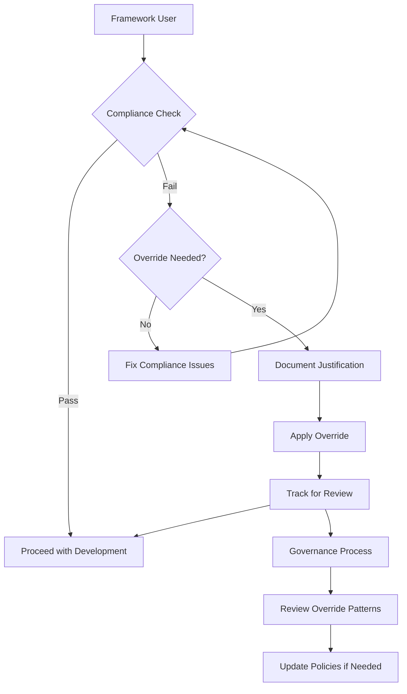

# ADR-001: Framework Compliance Policy

**Date:** 2025-08-06  
**Status:** ACCEPTED  
**Deciders:** AI Solution Architects, Framework Contributors  
**Technical Story:** Zero Technical Debt and AI-First Development Enforcement

---

## Context and Problem Statement

The AI-First SDLC Practices framework needs to enforce strict compliance policies to ensure consistent, high-quality software development practices across all projects that use it. The framework must balance developer productivity with quality assurance, while providing clear guidelines for AI agents and human developers.

Without a comprehensive compliance policy, projects risk:
- Accumulating technical debt that undermines long-term maintainability
- Inconsistent development practices across teams and projects
- Inadequate documentation leading to knowledge silos
- Bypassing quality gates that ensure system reliability
- Inconsistent architecture decisions that complicate future changes

The framework must enforce these practices proactively rather than reactively to maintain its core value proposition of AI-driven quality assurance.

### Requirements
- [x] Enforce zero technical debt policy across all framework operations
- [x] Mandate complete architecture documentation before code implementation
- [x] Ensure all AI agents follow consistent validation procedures
- [x] Provide clear escalation paths when compliance cannot be achieved
- [x] Support both automated enforcement and human override mechanisms

---

## Decision Drivers

1. **AI-First Development Philosophy** - The framework is designed to empower AI agents as primary developers, requiring clear, unambiguous rules
2. **Quality Assurance** - Consistent enforcement prevents quality degradation over time
3. **Technical Debt Prevention** - Proactive compliance prevents expensive future remediation
4. **Scalability** - Compliance policies must work across projects of any size and complexity
5. **Developer Experience** - Policies should enhance rather than impede productive development
6. **Auditability** - All compliance decisions must be traceable and justifiable

---

## Considered Options

### Option 1: Soft Guidelines with Recommendations
**Description:** Provide best practices and recommendations without strict enforcement

**Pros:**
- ✅ Maximum developer flexibility and autonomy
- ✅ Faster initial development velocity
- ✅ Lower friction for framework adoption

**Cons:**
- ❌ Inconsistent quality across projects and teams
- ❌ Technical debt accumulates over time
- ❌ Framework value proposition diminished
- ❌ No guarantee of AI-First practices adherence

**Estimated Effort:** Small  
**Risk Level:** High

### Option 2: Strict Enforcement with No Exceptions
**Description:** Mandatory compliance with all policies, no override mechanisms

**Pros:**
- ✅ Consistent quality and practices across all projects
- ✅ Clear expectations for all framework users
- ✅ Maximum technical debt prevention

**Cons:**
- ❌ May block legitimate edge cases and innovative approaches
- ❌ Could reduce framework adoption due to perceived inflexibility
- ❌ Emergency situations may require policy violations

**Estimated Effort:** Medium  
**Risk Level:** Medium

### Option 3: Tiered Compliance with Justified Overrides
**Description:** Strict default enforcement with documented override mechanisms for justified exceptions

**Pros:**
- ✅ Maintains high quality standards as the default
- ✅ Provides escape hatches for legitimate edge cases
- ✅ Maintains auditability through documentation requirements
- ✅ Balances quality with pragmatic flexibility
- ✅ Supports emergency development scenarios

**Cons:**
- ❌ Complexity in implementing override mechanisms
- ❌ Potential for policy erosion through overuse of overrides
- ❌ Requires ongoing governance to prevent abuse

**Estimated Effort:** Large  
**Risk Level:** Low

---

## Decision Outcome

### Chosen Option: Option 3 - Tiered Compliance with Justified Overrides

**Justification:**
This option best serves the framework's core mission of maintaining high-quality AI-driven development while acknowledging that software development sometimes requires pragmatic exceptions. The tiered approach provides:

1. **Strong Default Enforcement**: Maintains the framework's quality standards
2. **Documented Exceptions**: Ensures all overrides are justified and traceable
3. **Governance Structure**: Prevents policy erosion through clear approval processes
4. **AI Agent Compatibility**: Provides clear rules for AI agents while allowing human judgment
5. **Emergency Support**: Allows rapid development when business needs require it

### Implementation Plan
1. **Immediate**: Implement core compliance validation in all framework tools
2. **Short term**: Create override mechanisms with required documentation
3. **Medium term**: Establish governance review process for override patterns
4. **Long term**: Implement metrics and reporting for compliance tracking

---

## Consequences

### Positive Consequences
- ✅ Consistent high-quality development practices across all framework users
- ✅ Proactive prevention of technical debt accumulation
- ✅ Clear expectations and guidelines for both AI agents and human developers
- ✅ Maintained framework credibility through demonstrated quality outcomes
- ✅ Scalable quality assurance that works across project sizes and types

### Negative Consequences
- ⚠️ Additional complexity in framework implementation and maintenance
- ⚠️ Learning curve for users unfamiliar with strict compliance requirements
- ⚠️ Potential development velocity impact during initial framework adoption
- ⚠️ Risk of override mechanism abuse if not properly governed

### Risks and Mitigations

| Risk | Probability | Impact | Mitigation Strategy |
|------|-------------|---------|-------------------|
| Override mechanism abuse | Medium | High | Implement automated tracking and periodic governance reviews |
| User resistance to strict policies | Medium | Medium | Provide clear documentation and demonstrate value through success stories |
| Framework complexity overwhelming users | Low | High | Invest in comprehensive documentation and examples |
| Emergency scenarios blocked by policies | Low | High | Ensure override mechanisms work reliably and quickly |

---

## Technical Details

### Architecture Diagram


### Key Design Decisions
- **Validation-First Architecture**: All operations check compliance before proceeding
- **Documentation-Required Overrides**: No silent policy bypasses allowed
- **Automated Tracking**: All compliance decisions are logged for governance review
- **Fail-Safe Defaults**: When in doubt, the system enforces compliance

### Performance Implications
- Expected validation overhead: <5% of total development time
- Override documentation time: 2-5 minutes per exception
- Governance review process: Weekly automated reports, monthly manual reviews

### Security Considerations
- Override mechanisms must not bypass security requirements
- All compliance decisions are logged in tamper-evident audit trails
- Access controls prevent unauthorized policy modifications

---

## Compliance and Standards

- [x] Follows AI-First Development Principles
- [x] Complies with Zero Technical Debt Policy
- [x] Adheres to Framework Architecture Documentation Requirements
- [x] Meets Auditability and Traceability Standards

---

## References and Prior Art

- Zero Technical Debt methodology from framework documentation
- AI-First SDLC Practices core principles
- Industry best practices for software quality gates
- Agile development with quality assurance integration

---

## Review and Approval

| Reviewer | Role | Date | Status |
|----------|------|------|--------|
| AI Solution Architect | Architecture | 2025-08-06 | ✅ Approved |
| Framework Contributors | Implementation | 2025-08-06 | ✅ Approved |
| SDLC Coach | Process | 2025-08-06 | ✅ Approved |
| Test Manager | Quality | 2025-08-06 | ✅ Approved |

---

## Future Considerations

### Revisit Criteria
This decision should be revisited when:
- [x] Framework adoption reaches 100+ projects
- [x] Override usage exceeds 10% of compliance checks
- [x] User feedback indicates policies are blocking legitimate use cases
- [x] New development methodologies emerge that require policy updates

### Migration Path
If we need to change this decision:
1. Analyze current compliance and override patterns
2. Draft policy modifications with stakeholder input
3. Implement gradual transition with migration tools
4. Update all framework documentation and examples
5. Provide training and support for policy changes

---

## Appendix

### Evaluation Matrix

| Criteria | Weight | Option 1 | Option 2 | Option 3 |
|----------|--------|----------|----------|----------|
| Quality Assurance | 30% | 4/10 | 10/10 | 9/10 |
| Developer Experience | 25% | 9/10 | 4/10 | 7/10 |
| Framework Adoption | 20% | 8/10 | 5/10 | 8/10 |
| Maintainability | 15% | 6/10 | 8/10 | 9/10 |
| Emergency Response | 10% | 7/10 | 3/10 | 9/10 |
| **Total Score** | | **6.7** | **6.6** | **8.1** |

### Implementation Examples

```python
# Example compliance check with override capability
class ComplianceChecker:
    def check_technical_debt(self, file_path: str, allow_override: bool = False) -> bool:
        violations = scan_for_debt(file_path)
        if not violations:
            return True
            
        if allow_override:
            justification = input("Justify technical debt override: ")
            if justification:
                log_override("technical_debt", file_path, justification)
                return True
                
        raise ComplianceViolation(f"Technical debt found in {file_path}: {violations}")
```

### Governance Review Template

```yaml
override_review:
  period: weekly
  criteria:
    - override_frequency > 5% of checks
    - repeated patterns in justifications
    - policy effectiveness metrics
  actions:
    - policy_update_recommendation
    - additional_documentation_needed
    - training_requirement_identified
```

---

<!-- VALIDATION CHECKLIST
- [x] Problem clearly stated
- [x] All viable options considered
- [x] Decision drivers explicit
- [x] Trade-offs acknowledged
- [x] Risks identified with mitigations
- [x] Implementation plan defined
- [x] Review criteria established
-->