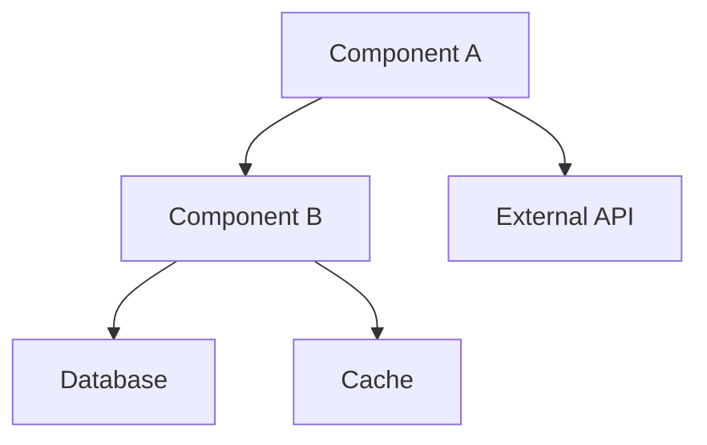

# ADR-[NUMBER]: [Title of Decision]

**Date:** [YYYY-MM-DD]  
**Status:** PROPOSED | ACCEPTED | DEPRECATED | SUPERSEDED  
**Deciders:** [List of people involved in decision]  
**Technical Story:** [Ticket/Issue reference]

---

## Context and Problem Statement

[Describe the context and problem that needs to be solved. 2-3 paragraphs explaining:
- What is the current situation?
- Why do we need to make a decision?
- What are the forces at play (technical, business, organizational)?]

### Requirements
- [ ] [Specific requirement this decision must satisfy]
- [ ] [Another requirement]
- [ ] [Performance/Security/Scalability requirement]

---

## Decision Drivers

1. **[Driver 1]** - [Explanation of why this matters]
2. **[Driver 2]** - [Explanation]
3. **[Driver 3]** - [Explanation]
4. **[Driver 4]** - [Explanation]

---

## Considered Options

### Option 1: [Option Name]
**Description:** [Brief description of the approach]

**Pros:**
- ✅ [Advantage 1]
- ✅ [Advantage 2]
- ✅ [Advantage 3]

**Cons:**
- ❌ [Disadvantage 1]
- ❌ [Disadvantage 2]
- ❌ [Disadvantage 3]

**Estimated Effort:** [Small/Medium/Large]
**Risk Level:** [Low/Medium/High]

### Option 2: [Option Name]
**Description:** [Brief description of the approach]

**Pros:**
- ✅ [Advantage 1]
- ✅ [Advantage 2]
- ✅ [Advantage 3]

**Cons:**
- ❌ [Disadvantage 1]
- ❌ [Disadvantage 2]
- ❌ [Disadvantage 3]

**Estimated Effort:** [Small/Medium/Large]
**Risk Level:** [Low/Medium/High]

### Option 3: [Option Name]
**Description:** [Brief description of the approach]

**Pros:**
- ✅ [Advantage 1]
- ✅ [Advantage 2]
- ✅ [Advantage 3]

**Cons:**
- ❌ [Disadvantage 1]
- ❌ [Disadvantage 2]
- ❌ [Disadvantage 3]

**Estimated Effort:** [Small/Medium/Large]
**Risk Level:** [Low/Medium/High]

---

## Decision Outcome

### Chosen Option: [Option X - Name]

**Justification:**
[Explain why this option was chosen, relating back to the decision drivers and requirements. Be specific about trade-offs accepted.]

### Implementation Plan
1. [Step 1 - Immediate action]
2. [Step 2 - Short term]
3. [Step 3 - Medium term]
4. [Step 4 - Long term]

---

## Consequences

### Positive Consequences
- ✅ [Expected benefit 1]
- ✅ [Expected benefit 2]
- ✅ [Expected benefit 3]

### Negative Consequences
- ⚠️ [Accepted trade-off 1]
- ⚠️ [Accepted trade-off 2]
- ⚠️ [Technical debt created]

### Risks and Mitigations
| Risk | Probability | Impact | Mitigation Strategy |
|------|-------------|---------|-------------------|
| [Risk 1] | Low/Med/High | Low/Med/High | [How to handle] |
| [Risk 2] | | | |
| [Risk 3] | | | |

---

## Technical Details

### Architecture Diagram

### Key Design Decisions
- **[Technical choice 1]:** [Rationale]
- **[Technical choice 2]:** [Rationale]
- **[Technical choice 3]:** [Rationale]

### Performance Implications
- [Expected latency impact]
- [Expected throughput impact]
- [Resource usage expectations]

### Security Considerations
- [Security implication 1]
- [Security implication 2]
- [Required security measures]

---

## Compliance and Standards

- [ ] Follows [Standard/Framework 1]
- [ ] Complies with [Regulation 1]
- [ ] Adheres to [Internal Policy 1]
- [ ] Meets [Performance Standard]

---

## References and Prior Art

- [Link to similar decisions in other systems]
- [Link to relevant documentation]
- [Link to research/articles that informed decision]
- [Link to vendor documentation]

---

## Review and Approval

| Reviewer | Role | Date | Status |
|----------|------|------|--------|
| [Name] | Tech Lead | | ⬜ Pending |
| [Name] | Architect | | ⬜ Pending |
| [Name] | Security | | ⬜ Pending |
| [Name] | Product | | ⬜ Pending |

---

## Future Considerations

### Revisit Criteria
This decision should be revisited when:
- [ ] [Condition 1 - e.g., "User base exceeds 1M"]
- [ ] [Condition 2 - e.g., "Technology X reaches v2.0"]
- [ ] [Condition 3 - e.g., "Performance degrades below SLA"]

### Migration Path
If we need to change this decision:
1. [Migration step 1]
2. [Migration step 2]
3. [Rollback procedure]

---

## Appendix

### Evaluation Matrix

| Criteria | Weight | Option 1 | Option 2 | Option 3 |
|----------|--------|----------|----------|----------|
| Performance | 30% | 8/10 | 6/10 | 9/10 |
| Maintainability | 25% | 7/10 | 9/10 | 6/10 |
| Cost | 20% | 6/10 | 8/10 | 5/10 |
| Security | 15% | 9/10 | 8/10 | 9/10 |
| Scalability | 10% | 8/10 | 7/10 | 10/10 |
| **Total Score** | | **7.4** | **7.6** | **7.7** |

### Proof of Concept Results
[If POCs were conducted, summarize findings]

### Team Discussion Notes
[Key points from team discussions]

---

<!-- VALIDATION CHECKLIST
- [ ] Problem clearly stated
- [ ] All viable options considered
- [ ] Decision drivers explicit
- [ ] Trade-offs acknowledged
- [ ] Risks identified with mitigations
- [ ] Implementation plan defined
- [ ] Review criteria established
-->