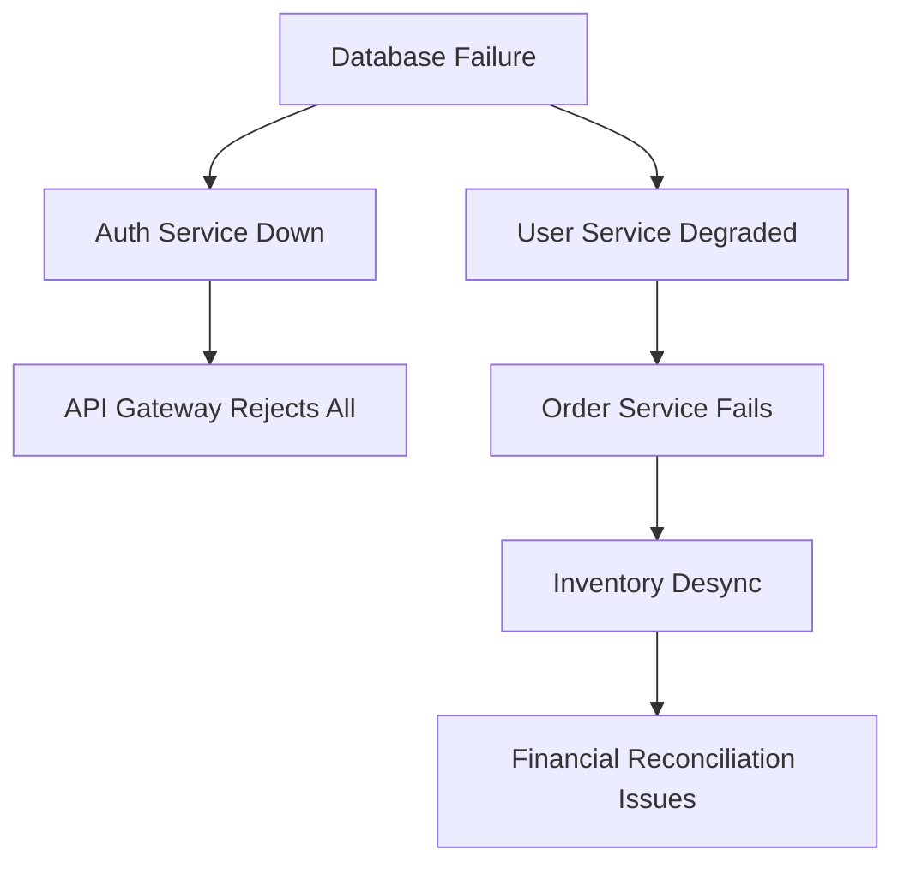

# Failure Mode and Effects Analysis (FMEA)

**Project/Feature:** [Feature Name]
**Date:** [YYYY-MM-DD]
**Version:** 1.0
**Analysis Team:** [Names/Roles]

---

## Overview

This document analyzes ALL potential failure modes for each system component. For every component, we identify what can fail, how it can fail, and what happens when it fails. This analysis is MANDATORY before implementation.

---

## 🎯 Analysis Methodology

### Risk Priority Number (RPN) Calculation
**RPN = Severity × Occurrence × Detection**

#### Severity Scale (1-10)
- **10**: Catastrophic - Complete system failure, data loss
- **8-9**: Critical - Major feature unavailable, security breach
- **6-7**: High - Significant degradation, data corruption risk
- **4-5**: Moderate - Feature degraded, workaround available
- **2-3**: Low - Minor inconvenience
- **1**: Negligible - No user impact

#### Occurrence Scale (1-10)
- **10**: Very High - Multiple times per day
- **8-9**: High - Daily
- **6-7**: Moderate - Weekly
- **4-5**: Low - Monthly
- **2-3**: Very Low - Quarterly
- **1**: Remote - Yearly or less

#### Detection Scale (1-10)
- **10**: Undetectable - No current detection method
- **8-9**: Very Low - Manual checking required
- **6-7**: Low - Detected by periodic monitoring
- **4-5**: Moderate - Detected by alerts (>5 min delay)
- **2-3**: High - Detected by real-time monitoring
- **1**: Very High - Prevented before occurrence

---

## 🔧 Component Analysis

### Component: Authentication Service

#### Failure Mode 1: Database Connection Lost
| Aspect | Details |
|--------|---------|
| **Failure Mode** | Primary database becomes unreachable |
| **Root Causes** | Network partition, DB crash, connection pool exhaustion |
| **Local Effects** | Cannot validate credentials, new logins fail |
| **System Effects** | All authenticated operations fail, cascade to dependent services |
| **Detection Method** | Connection pool monitoring, health checks |
| **Current Controls** | Connection retry logic, timeout handling |
| **Severity** | 9 |
| **Occurrence** | 3 |
| **Detection** | 2 |
| **RPN** | 54 |

**Mitigation Actions:**
1. Implement read replica failover
2. Add connection pool circuit breaker
3. Cache session data in Redis
4. Create offline authentication mode

#### Failure Mode 2: JWT Signing Key Compromised
| Aspect | Details |
|--------|---------|
| **Failure Mode** | Private key exposed or leaked |
| **Root Causes** | Misconfiguration, insider threat, vulnerable key storage |
| **Local Effects** | Attackers can forge valid tokens |
| **System Effects** | Complete authentication bypass possible |
| **Detection Method** | Key usage anomaly detection, audit logs |
| **Current Controls** | Key rotation schedule, HSM storage |
| **Severity** | 10 |
| **Occurrence** | 1 |
| **Detection** | 7 |
| **RPN** | 70 |

**Mitigation Actions:**
1. Implement immediate key rotation API
2. Add token fingerprinting
3. Monitor for unusual token patterns
4. Implement token revocation list

#### Failure Mode 3: Rate Limiter Failure
| Aspect | Details |
|--------|---------|
| **Failure Mode** | Rate limiting service crashes or misconfigured |
| **Root Causes** | Redis failure, configuration error, memory leak |
| **Local Effects** | Brute force attacks possible |
| **System Effects** | Account takeover risk, resource exhaustion |
| **Detection Method** | Login attempt monitoring, rate limiter health checks |
| **Current Controls** | Default deny on limiter failure |
| **Severity** | 7 |
| **Occurrence** | 2 |
| **Detection** | 3 |
| **RPN** | 42 |

---

### Component: Payment Processing

#### Failure Mode 1: Double Charge
| Aspect | Details |
|--------|---------|
| **Failure Mode** | Same payment processed multiple times |
| **Root Causes** | Missing idempotency, retry without dedup, race condition |
| **Local Effects** | Customer charged multiple times |
| **System Effects** | Trust damage, refund processing overhead |
| **Detection Method** | Duplicate transaction monitoring |
| **Current Controls** | Idempotency keys |
| **Severity** | 8 |
| **Occurrence** | 2 |
| **Detection** | 4 |
| **RPN** | 64 |

**Mitigation Actions:**
1. Enforce idempotency at gateway level
2. Add duplicate detection window
3. Implement automatic refund for duplicates
4. Add real-time alerting

---

### Component: Data Storage Layer

#### Failure Mode Matrix

| Failure Mode | Severity | Occurrence | Detection | RPN | Priority |
|--------------|----------|------------|-----------|-----|----------|
| Primary DB crash | 9 | 2 | 2 | 36 | Medium |
| Replication lag > 5s | 6 | 4 | 3 | 72 | High |
| Backup corruption | 10 | 1 | 8 | 80 | High |
| Query deadlock | 5 | 6 | 4 | 120 | Critical |
| Disk space exhaustion | 8 | 3 | 2 | 48 | Medium |
| Index corruption | 7 | 2 | 6 | 84 | High |

---

## 🌐 System-Level Failure Modes

### Cascading Failures



### Critical Failure Chains
1. **Authentication Cascade**
   - JWT validation fails → All services reject requests → Complete outage
   - **Prevention**: Local token validation, grace period

2. **Payment Processing Chain**
   - Payment gateway timeout → Retry storm → Rate limit → Customer can't pay
   - **Prevention**: Circuit breaker, exponential backoff

3. **Data Consistency Chain**
   - Replication lag → Read stale data → Business logic error → Data corruption
   - **Prevention**: Read-after-write consistency, version checks

---

## 📊 Risk Assessment Matrix

### High-Priority Risks (RPN > 100)

| Component | Failure Mode | RPN | Mitigation Status |
|-----------|--------------|-----|-------------------|
| Database | Query deadlock | 120 | 🟡 In Progress |
| API Gateway | DDoS attack | 108 | 🔴 Not Started |
| Message Queue | Message loss | 105 | 🟡 In Progress |
| Cache | Cache poisoning | 102 | 🔴 Not Started |

### Risk Distribution
```
Critical (RPN > 100):  ████ 15%
High (RPN 70-100):     ████████ 25%
Medium (RPN 40-70):    ████████████ 35%
Low (RPN < 40):        ████████ 25%
```

---

## 🛠️ Mitigation Strategies

### Immediate Actions (This Sprint)
1. [ ] Implement circuit breakers on all external calls
2. [ ] Add comprehensive health checks
3. [ ] Set up real-time alerting for critical paths
4. [ ] Create runbooks for top 10 failure modes

### Short-term (Next Month)
1. [ ] Implement chaos engineering tests
2. [ ] Add automatic failover for critical services
3. [ ] Enhance monitoring coverage
4. [ ] Conduct failure mode drills

### Long-term (Next Quarter)
1. [ ] Redesign to eliminate single points of failure
2. [ ] Implement predictive failure detection
3. [ ] Add self-healing capabilities
4. [ ] Create failure simulation environment

---

## 🔍 Detection & Monitoring

### Key Metrics to Monitor

| Metric | Normal Range | Warning | Critical | Alert Channel |
|--------|--------------|---------|----------|---------------|
| Error rate | < 0.1% | > 1% | > 5% | PagerDuty |
| Response time (p99) | < 200ms | > 500ms | > 1s | Slack |
| Queue depth | < 1000 | > 5000 | > 10000 | PagerDuty |
| DB connections | < 80% | > 90% | > 95% | Email |
| Memory usage | < 70% | > 85% | > 95% | PagerDuty |

### Failure Detection Patterns
```yaml
patterns:
  - name: "Cascading timeout"
    condition: "response_time > 5s AND error_rate > 10%"
    action: "Enable circuit breaker"

  - name: "Database overload"
    condition: "db_connections > 90% AND query_time > 1s"
    action: "Redirect to read replica"

  - name: "Memory leak suspected"
    condition: "memory_usage increasing 5% per hour"
    action: "Schedule restart, investigate"
```

---

## 🚨 Incident Response Procedures

### For Each Critical Failure Mode

#### Failure: Complete Authentication Service Outage
**Runbook ID:** RB-AUTH-001

1. **Immediate Actions** (< 5 minutes)
   - [ ] Verify failure across all regions
   - [ ] Activate incident response team
   - [ ] Switch to cache-based auth (1hr tokens)
   - [ ] Post status page update

2. **Diagnosis** (5-15 minutes)
   - [ ] Check database connectivity
   - [ ] Verify JWT signing service
   - [ ] Review recent deployments
   - [ ] Check for security incidents

3. **Recovery** (15-30 minutes)
   - [ ] Failover to secondary region
   - [ ] Restore from snapshot if needed
   - [ ] Validate service health
   - [ ] Monitor for stability

4. **Post-Incident**
   - [ ] Root cause analysis
   - [ ] Update runbooks
   - [ ] Implement prevention measures
   - [ ] Stakeholder communication

---

## 📈 Continuous Improvement

### FMEA Review Schedule
- **Weekly**: Review new failure occurrences
- **Monthly**: Update RPN scores based on data
- **Quarterly**: Comprehensive FMEA review
- **Annually**: Architecture review for failure modes

### Success Metrics
- Reduction in high-RPN failure modes
- Decrease in actual failures
- Improved detection time
- Faster recovery time

---

## ✅ Sign-off and Review

### FMEA Completion Checklist
- [ ] All components analyzed
- [ ] All failure modes identified
- [ ] RPN calculated for each mode
- [ ] Mitigation strategies defined
- [ ] Detection methods specified
- [ ] Runbooks created for critical failures

### Approvals
| Role | Name | Date | Signature |
|------|------|------|-----------|
| Tech Lead | | | |
| SRE Lead | | | |
| Security Lead | | | |
| Product Owner | | | |

---

<!-- VALIDATION NOTES
- Ensure all RPN calculations are accurate
- Verify mitigation strategies are actionable
- Confirm detection methods are implemented
- Check that runbooks are tested
-->