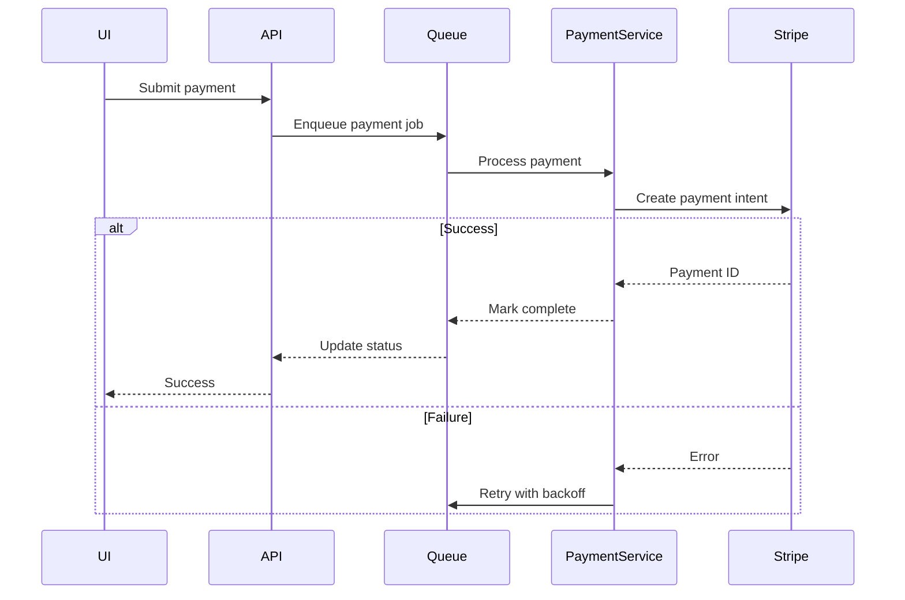
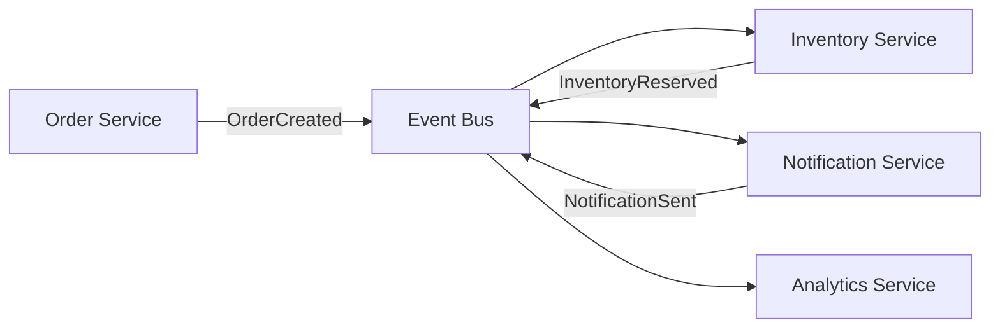
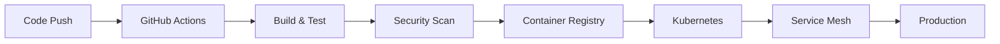

# Integration Design Document

**Project/Feature:** [Feature Name]
**Date:** [YYYY-MM-DD]
**Version:** 1.0
**Architect:** [Name/Role]

---

## Overview

This document defines ALL integration points for the system, starting with the HARDEST integrations first. Every external dependency, API, service, and system boundary must be designed BEFORE implementing internal logic.

---

## 🌐 External Service Integrations

### Payment Gateway Integration
**Service:** [Stripe/PayPal/etc]
**Criticality:** HIGH
**Complexity:** HIGH

#### API Specifications
- **Base URL:** `https://api.payment-provider.com/v1`
- **Authentication:** Bearer token (OAuth2)
- **Rate Limits:** 100 requests/minute
- **Timeout:** 30 seconds
- **Retry Policy:** Exponential backoff (3 attempts)

#### Key Endpoints
| Operation | Method | Endpoint | Idempotency | Compensation |
|-----------|---------|----------|-------------|--------------|
| Create Payment | POST | /payments | Required (key) | Refund API |
| Capture Payment | POST | /payments/{id}/capture | Built-in | Release auth |
| Refund | POST | /refunds | Required (key) | Manual review |

#### Failure Modes & Handling
| Failure Mode | Detection | Fallback Strategy | User Experience |
|--------------|-----------|-------------------|-----------------|
| Service down | HTTP 503 | Queue for retry | "Processing payment..." |
| Rate limited | HTTP 429 | Backoff & queue | "High volume, please wait" |
| Network timeout | 30s elapsed | Idempotent retry | "Verifying payment..." |
| Invalid response | Schema validation | Log & alert | "Technical issue" |

#### Integration Architecture


---

### Email Service Integration
**Service:** [SendGrid/AWS SES/etc]
**Criticality:** MEDIUM
**Complexity:** MEDIUM

#### API Specifications
- **Base URL:** `https://api.email-service.com/v3`
- **Authentication:** API Key
- **Rate Limits:** 1000 emails/hour
- **Timeout:** 10 seconds
- **Retry Policy:** Linear backoff (5 attempts)

#### Key Operations
| Operation | Limits | Fallback | Priority |
|-----------|--------|----------|----------|
| Transactional | 100/second | Queue | P0 |
| Bulk | 1000/hour | Batch & delay | P2 |
| Templates | N/A | Cache locally | P1 |

#### Failure Handling
```typescript
interface EmailFailureStrategy {
    // Transient failures (retry)
    onRateLimit: () => queueWithDelay(60_000);
    onTimeout: () => retryWithBackoff(attempts: 3);
    onNetworkError: () => fallbackProvider();

    // Permanent failures (don't retry)
    onInvalidEmail: () => logAndSkip();
    onBlockedDomain: () => notifyAdmin();
    onTemplateError: () => useDefaultTemplate();
}
```

---

### Authentication Provider Integration
**Service:** [Auth0/Okta/etc]
**Criticality:** CRITICAL
**Complexity:** HIGH

#### Integration Points
- **SSO Endpoint:** `https://auth.provider.com/authorize`
- **Token Endpoint:** `https://auth.provider.com/token`
- **JWKS URL:** `https://auth.provider.com/.well-known/jwks.json`
- **User Info:** `https://auth.provider.com/userinfo`

#### Availability Requirements
- **Uptime SLA:** 99.9%
- **Cache Strategy:** JWKS cached 24h, tokens cached until expiry
- **Fallback:** Local session management for 1 hour

---

## 🔗 Internal Service Boundaries

### Service Communication Matrix

| From Service | To Service | Protocol | Pattern | Auth Method |
|--------------|------------|----------|---------|-------------|
| API Gateway | User Service | gRPC | Request/Response | mTLS |
| User Service | Notification | AMQP | Event-driven | Service token |
| Order Service | Inventory | HTTP/REST | Request/Response | JWT |
| All Services | Audit Service | Kafka | Event streaming | API key |

### API Gateway → Microservices
```yaml
routing_rules:
  - path: /api/users/*
    service: user-service
    timeout: 5s
    retries: 2
    circuit_breaker:
      threshold: 50%
      timeout: 30s

  - path: /api/orders/*
    service: order-service
    timeout: 10s
    retries: 1
    circuit_breaker:
      threshold: 30%
      timeout: 60s
```

### Event-Driven Integration


---

## 📊 Data Integration

### Database Connections
| Service | Database | Connection Pool | Timeout | Retry |
|---------|----------|----------------|---------|-------|
| User Service | PostgreSQL | Min: 5, Max: 20 | 5s | 3x |
| Order Service | PostgreSQL | Min: 10, Max: 30 | 5s | 3x |
| Analytics | ClickHouse | Min: 2, Max: 10 | 30s | 1x |

### Cache Layer Integration
**Technology:** Redis Cluster
**Architecture:** Master-Slave with Sentinel

```typescript
interface CacheStrategy {
    user_profiles: {
        ttl: 3600,        // 1 hour
        pattern: "user:{id}",
        invalidation: ["user.updated", "user.deleted"]
    },
    session_data: {
        ttl: 1800,        // 30 minutes
        pattern: "session:{token}",
        invalidation: ["logout", "session.expired"]
    }
}
```

---

## 🔄 Message Queue Integration

### Queue Configuration
**Technology:** RabbitMQ / Kafka
**Deployment:** Clustered with 3 nodes

#### Queue Definitions
| Queue Name | Type | Durability | TTL | DLQ | Purpose |
|------------|------|------------|-----|-----|---------|
| payment.process | Topic | Durable | 24h | Yes | Payment processing |
| email.send | Direct | Durable | 1h | Yes | Email delivery |
| audit.log | Fanout | Durable | ∞ | No | Audit trail |

#### Consumer Configuration
```yaml
consumers:
  payment_processor:
    queue: payment.process
    prefetch: 10
    concurrency: 5
    timeout: 300s
    retry:
      max_attempts: 3
      backoff: exponential
      dead_letter_after: 5
```

---

## 🛡️ Security Integration

### API Security Layers
1. **Edge Security** (CloudFlare/AWS WAF)
   - DDoS protection
   - Rate limiting
   - Geo-blocking

2. **API Gateway**
   - Authentication
   - Authorization
   - Request validation

3. **Service Mesh** (Istio/Linkerd)
   - mTLS between services
   - Circuit breaking
   - Load balancing

### Secret Management
**Service:** [Vault/AWS Secrets Manager]
```yaml
secrets:
  database:
    path: /prod/database/credentials
    rotation: 90d

  api_keys:
    path: /prod/external/api-keys
    rotation: 180d

  certificates:
    path: /prod/tls/certs
    rotation: 365d
```

---

## 📈 Monitoring Integration

### Metrics Collection
**Platform:** Prometheus + Grafana

```yaml
metrics:
  - name: integration_latency_ms
    type: histogram
    labels: [service, endpoint, status]

  - name: integration_errors_total
    type: counter
    labels: [service, error_type]

  - name: circuit_breaker_state
    type: gauge
    labels: [service, state]
```

### Distributed Tracing
**Platform:** Jaeger/Zipkin

```typescript
// Trace context propagation
interface TraceHeaders {
    'x-trace-id': string;
    'x-parent-span-id': string;
    'x-span-id': string;
    'x-sampled': boolean;
}
```

---

## 🚀 Deployment Integration

### CI/CD Pipeline Integration


### Service Discovery
**Method:** Kubernetes DNS + Consul
```yaml
services:
  user-service:
    dns: user-service.prod.svc.cluster.local
    consul: prod/services/user
    health_check: /health

  order-service:
    dns: order-service.prod.svc.cluster.local
    consul: prod/services/order
    health_check: /health
```

---

## 📋 Integration Testing Strategy

### Contract Testing
```typescript
// Provider contract
@ProviderContract("user-service")
class UserServiceContract {
    @Pact
    getUserById() {
        return {
            id: match.type("string"),
            email: match.email(),
            created: match.iso8601DateTime()
        };
    }
}
```

### End-to-End Testing
| Test Scenario | Services Involved | External Mocks | Success Criteria |
|---------------|-------------------|----------------|------------------|
| User Registration | API, User, Email | Email provider | User created + email sent |
| Order Placement | API, Order, Inventory, Payment | Payment gateway | Order confirmed |
| Password Reset | API, User, Email | Email provider | Token valid + email sent |

---

## 🔍 Integration Maintenance

### Health Checks
```yaml
health_checks:
  external_apis:
    - url: https://api.payment.com/health
      interval: 30s
      timeout: 5s

  internal_services:
    - service: user-service
      endpoint: /health
      interval: 10s

  message_queues:
    - queue: payment.process
      check: queue_depth < 1000
      interval: 60s
```

### SLA Monitoring
| Integration | Availability Target | Latency Target (p99) | Error Rate Target |
|-------------|-------------------|---------------------|-------------------|
| Payment Gateway | 99.9% | < 2s | < 0.1% |
| Email Service | 99.5% | < 5s | < 1% |
| Auth Provider | 99.95% | < 500ms | < 0.01% |

---

## 📝 Integration Documentation

### Required Documentation
- [ ] API specifications (OpenAPI/AsyncAPI)
- [ ] Sequence diagrams for critical flows
- [ ] Error handling runbooks
- [ ] Performance benchmarks
- [ ] Security assessment
- [ ] Disaster recovery procedures

### Review & Sign-off
| Reviewer | Role | Date | Approved |
|----------|------|------|----------|
| | Integration Architect | | ⬜ |
| | Security Lead | | ⬜ |
| | DevOps Lead | | ⬜ |
| | Product Owner | | ⬜ |

---

<!-- COMPLETION CHECKLIST
- [ ] All external services documented
- [ ] All failure modes identified
- [ ] Fallback strategies defined
- [ ] Security measures specified
- [ ] Monitoring configured
- [ ] Testing strategy complete
-->