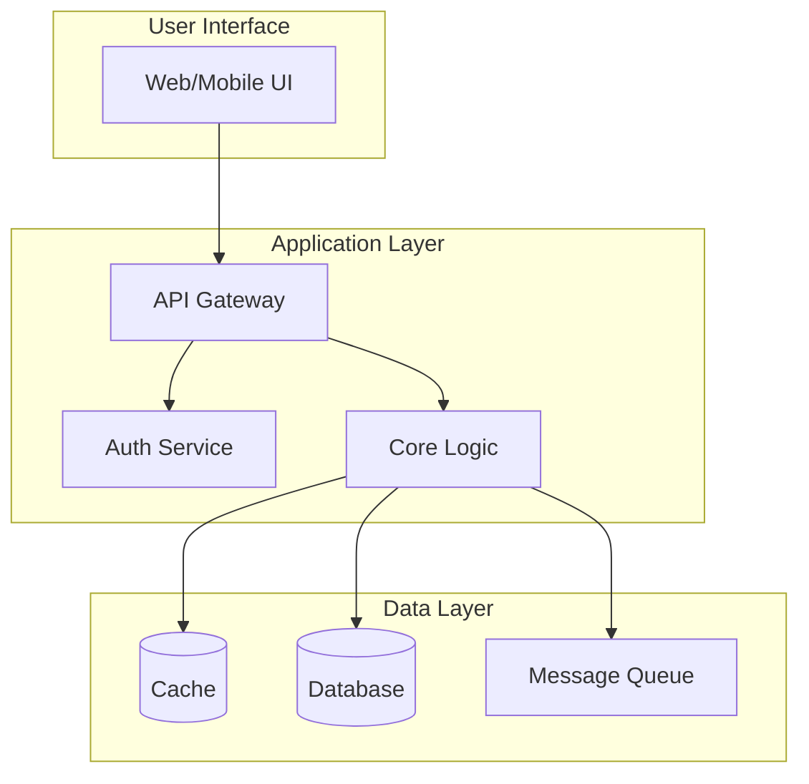
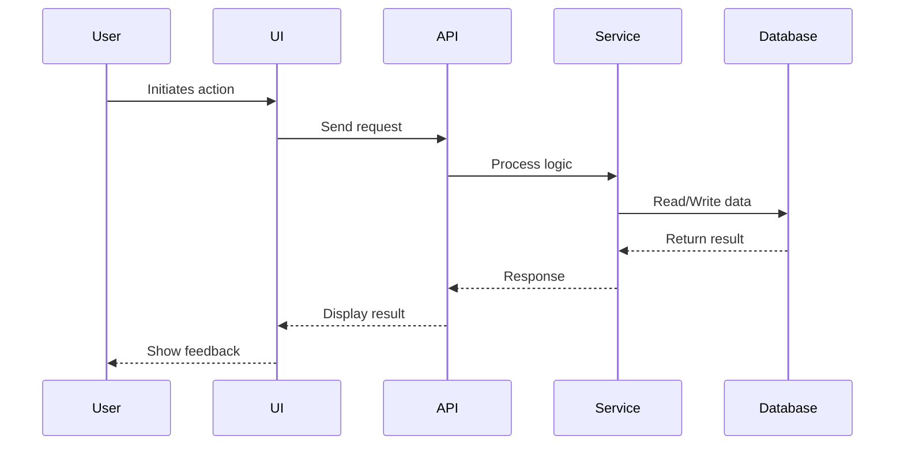
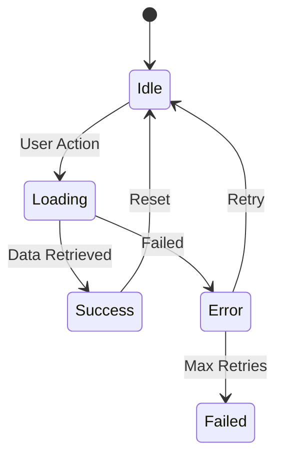

# Design Documentation: [Feature Name]

**Date:** [YYYY-MM-DD]
**Author:** [Your Name]
**Status:** Draft | In Review | Approved
**Version:** 1.0

---

## Executive Summary

[2-3 sentence overview of what is being designed and its business value]

---

## Background and Context

### Problem Statement
[What problem are we solving? Why is this important?]

### Current State
[How do things work today? What are the pain points?]

### Stakeholders
- **Primary Users:** [Who will use this?]
- **Business Owners:** [Who owns this feature?]
- **Technical Teams:** [Who will implement/maintain?]

---

## Functional Specifications

### User Stories

```
As a [type of user]
I want [goal/desire]
So that [benefit/value]
```

Example:
```
As a content creator
I want to schedule posts in advance
So that I can maintain consistent engagement without manual work
```

### Business Rules

1. **Rule Name**: [Clear description and rationale]
   - Condition: [When this applies]
   - Action: [What happens]
   - Exception: [Special cases]

### Acceptance Criteria

- [ ] [Specific, measurable criteria for success]
- [ ] [User can accomplish X in Y steps]
- [ ] [Performance meets Z threshold]
- [ ] [Error handling provides clear feedback]

---

## Architecture Design

### System Overview



### Component Descriptions

#### [Component Name]
- **Purpose**: What this component does
- **Responsibilities**: Key functions
- **Interfaces**: How it connects to other components
- **Constraints**: Limitations or requirements

### Data Flow



### Integration Points

| System | Purpose | Protocol | Data Format |
|--------|---------|----------|-------------|
| [External API] | [Why integrate] | REST/GraphQL/gRPC | JSON/XML |
| [Internal Service] | [Purpose] | [Protocol] | [Format] |

---

## User Experience Design

### User Flow

1. **Entry Point**: How users discover/access this feature
2. **Main Path**: Step-by-step primary workflow
3. **Alternative Paths**: Other ways to accomplish goals
4. **Exit Points**: How users complete or leave

### Wireframes/Mockups

[Include visual representations - can be ASCII art, diagrams, or references to design files]

```
+----------------------------------+
|  Header                    [X]   |
+----------------------------------+
|  Navigation Menu                 |
+--------+-------------------------+
|        |                         |
| Sidebar|     Main Content       |
|        |                         |
|  - Item|  [Input Field____]     |
|  - Item|                         |
|  - Item|  [Submit Button]       |
|        |                         |
+--------+-------------------------+
```

### Interaction Patterns

- **Loading States**: How to show progress
- **Error States**: How to communicate problems
- **Empty States**: What to show when no data
- **Success Feedback**: How to confirm actions

---

## Behavioral Specifications

### State Management



### Validation Rules

| Field | Validation | Error Message |
|-------|------------|---------------|
| Email | Valid format, unique | "Please enter a valid email" |
| Password | Min 12 chars, complexity | "Password must be 12+ characters" |

### Business Logic Flows

1. **Scenario**: [Name]
   - **Given**: Initial conditions
   - **When**: Action taken
   - **Then**: Expected outcome

---

## Non-Functional Requirements

### Performance

- **Response Time**: 95th percentile < 2 seconds
- **Throughput**: Support X concurrent users
- **Data Volume**: Handle Y records efficiently

### Security

- **Authentication**: Method required
- **Authorization**: Permission model
- **Data Protection**: Encryption requirements
- **Audit**: What to log and retain

### Scalability

- **Growth Projections**: Expected usage over time
- **Scaling Strategy**: Horizontal/vertical approach
- **Bottlenecks**: Potential limitations

### Reliability

- **Availability**: Target uptime (e.g., 99.9%)
- **Recovery**: RTO/RPO requirements
- **Failover**: Redundancy approach

---

## Constraints and Assumptions

### Technical Constraints
- [Platform limitations]
- [Technology requirements]
- [Integration restrictions]

### Business Constraints
- [Budget limitations]
- [Timeline requirements]
- [Regulatory compliance]

### Assumptions
- [What we're assuming to be true]
- [Dependencies on other systems]
- [User behavior expectations]

---

## Migration Strategy

[If replacing existing functionality]

### Transition Plan
1. Phase 1: [What moves first]
2. Phase 2: [Next steps]
3. Phase 3: [Final migration]

### Rollback Plan
- [How to revert if needed]
- [Data preservation approach]

---

## Success Metrics

### KPIs
- **Metric 1**: [What to measure] - Target: [Goal]
- **Metric 2**: [What to measure] - Target: [Goal]

### Monitoring
- [What to track post-launch]
- [Alert thresholds]
- [Dashboard requirements]

---

## Open Questions

- [ ] [Question needing clarification]
- [ ] [Decision pending stakeholder input]
- [ ] [Technical investigation required]

---

## References

- [Link to related documents]
- [API documentation]
- [Design system guidelines]
- [Compliance requirements]

---

## Appendix

### Glossary
- **Term**: Definition
- **Acronym**: Full meaning

### Change Log
| Version | Date | Author | Changes |
|---------|------|--------|---------|
| 1.0 | YYYY-MM-DD | Name | Initial draft |

---

<!-- WARNING: This is DESIGN documentation
- DO NOT include source code implementations
- DO NOT detail specific algorithms or code logic
- DO NOT specify framework-specific patterns
- DO NOT include package/dependency details
Focus on WHAT the system does and WHY, not HOW it's implemented
-->

<!-- SELF-REVIEW CHECKPOINT
Before finalizing, verify:
- All required sections are complete
- Content addresses original requirements
- Technical accuracy and consistency
- No gaps or contradictions
-->
